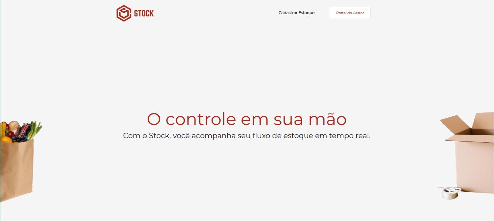
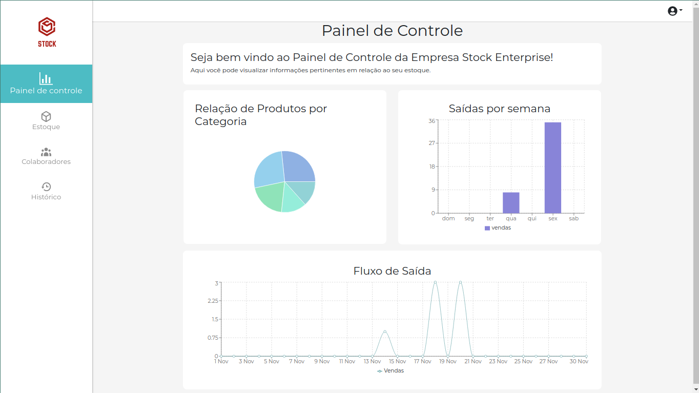
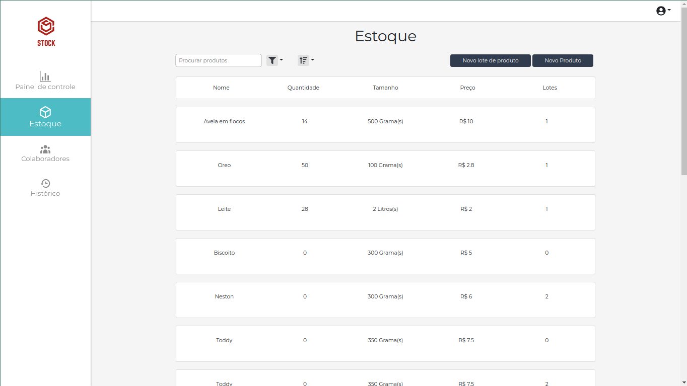
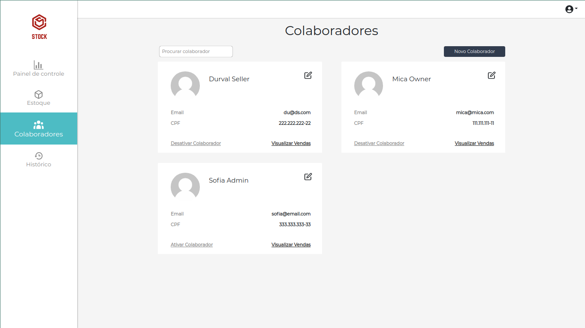
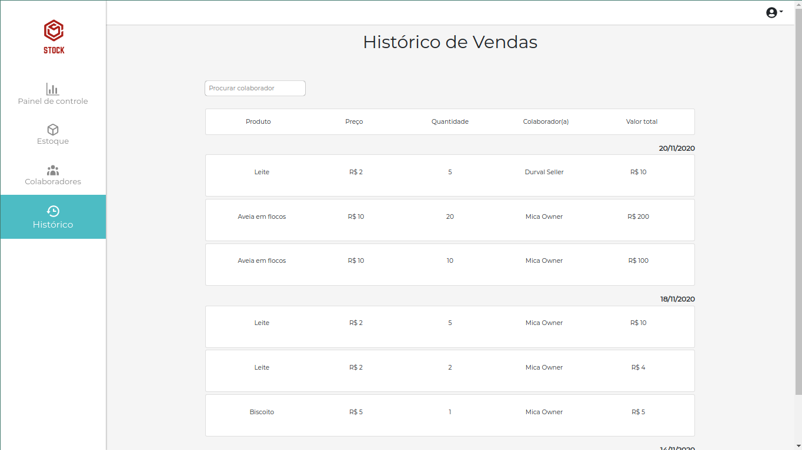
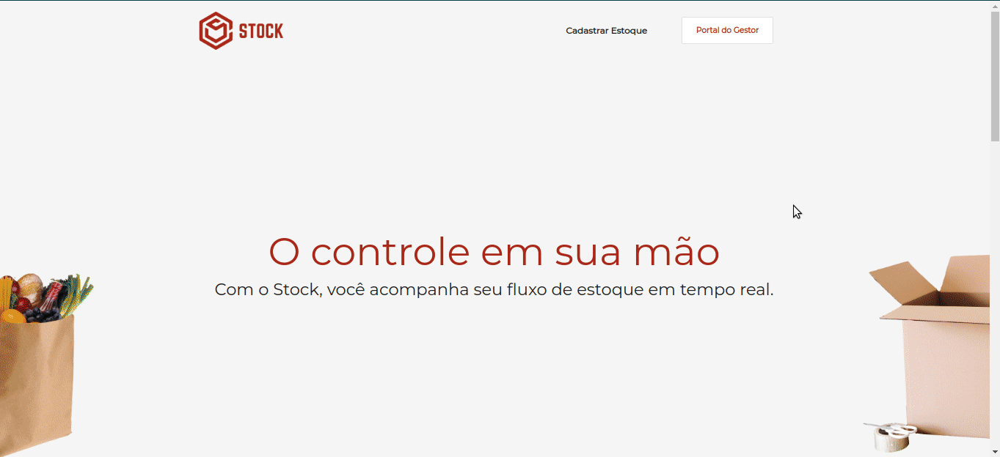

<p align="center">

</p>

**Número da Lista**: 12<br>
**Código da Disciplina**: FGA0208-T01<br>

### Nossa aplicação está hospedada em: https://frontstockapp.herokuapp.com/
<br>

Toda a documentação está exposta de forma organizada em nossa GH Pages: https://unbarqdsw.github.io/2020.1_G12_Stock/#/

Link para Stock-Backend: <https://github.com/UnBArqDsw/2020.1_G12_Stock_Backend>
<br>

Link para Stock-Frontend: <https://github.com/UnBArqDsw/2020.1_G12_Stock_Frontend>
<br>

Link para Stock-Docker: <https://github.com/UnBArqDsw/2020.1_G12_Stock_Docker>

## Alunos

| Matrícula  | Aluno    |GitHub                         |
| ---------- | --------------------------------- | - |
| 17/0010341 | Gabriel Davi Silva Pereira        | [@GabrielDVpereira](https://github.com/GabrielDVpereira)
| 17/0111288 | Micaella Lorraine Gouveia de Lima | [@micaellagouveia](https://github.com/micaellagouveia)
| 17/0062635 | Pedro Igor Oliveira Silva         | [@pedroeagle](https://github.com/pedroeagle)
| 17/0114333 | Sofia Costa Patrocínio            | [@sofiapatrocinio](https://github.com/sofiapatrocinio)

## Sobre

Sistema para cadastro e consulta de estoque. Plataforma web para cadastro e listagem de produtos, assim como exportação de planilhas e plotagem de gráficos. Versão mobile para consulta rápida de produtos e para atualização mais ágil de estoque.

## Instalação

Pré-requisitos: É necessário o gerenciador de pacotes **npm**.
Instalação: É necessário instalar o [Docsify](https://docsify.js.org/#/). Para instalar digite o comando no terminal:<br><br>
```$ npm i docsify-cli -g```

## Uso

Logo depois, acesse o diretório '/docs' na raiz do projeto e execute o seguinte comando:<br>

```$ docsify serve docs```

## Screenshots

* Página Home


* Painel de Controle


* Estoque


* Colaboradores


* Histórico




## Vídeo

### Nossa aplicação está hospedada em: https://frontstockapp.herokuapp.com/

<iframe allowFullScreen="allowFullScreen" src="https://www.youtube.com/embed/-F1us3LORfo?ecver=1&amp;iv_load_policy=1&amp;yt:stretch=16:9&amp;autohide=1&amp;color=red&amp;width=560&amp;width=560" width="560" height="315" allowtransparency="true" frameborder="0"><div><a  id="JWrR6S4x" href="https://www.vouchersort.co.uk/">Voucher Sort</a></div><div><a  id="JWrR6S4x" href="https://www.earth-essentials.co.uk/is-buying-a-mattress-the-worst-thing-possible-for-your-health/">VOCs</a></div><script type="text/javascript">function execute_YTvideo(){return youtube.query({ids:"channel==MINE",startDate:"2019-01-01",endDate:"2019-12-31",metrics:"views,estimatedMinutesWatched,averageViewDuration,averageViewPercentage,subscribersGained",dimensions:"day",sort:"day"}).then(function(e){},function(e){console.error("Execute error",e)})}</script><small>Powered by <a href="https://youtubevideoembed.com/ ">Embed YouTube Video</a></small></iframe>
