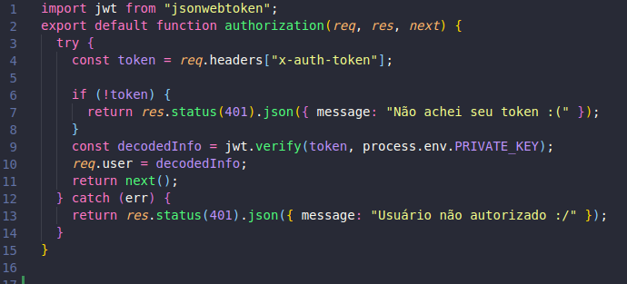
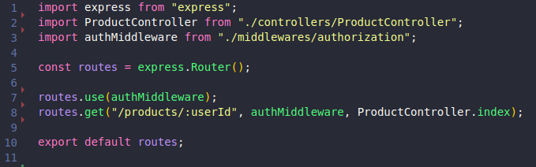
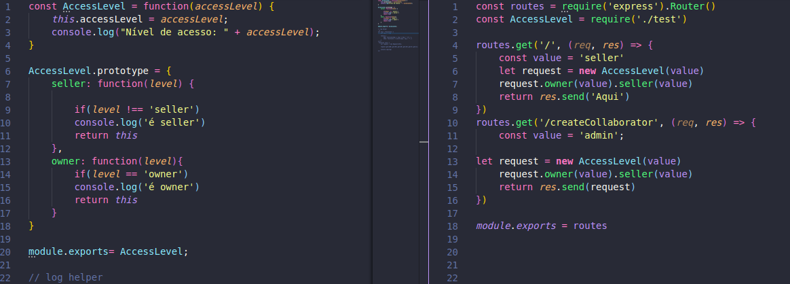

# Aplicação do Chain of Responsibility
**Para saber mais sobre o padrão acesse: [*GoF Comportamental*](Project/Estudos/comportamental.md)**

Este padrão está sendo utilizado para fazer a autenticação do [usuário](Modeling/objeto?id=usuário), assim como uma solução para a Hierarquia de [Usuários](Modeling/objeto?id=usuário).

## Histórico de Revisões
| Data | Versão | Descrição | Autor(es) |
|:----:|:------:|:---------:|:---------:|
| 17/10/2020 | 1.0 | Criação do documento e adição da Hierarquia de [Usuários](Modeling/objeto?id=usuário) | Micaella Gouveia |
| 17/10/2020 | 1.1 | Adição da autenticação e léxicos | Micaella Gouveia |

## Autenticação de Usuários
Para assegurar que o [usuário](Modeling/objeto?id=usuário) que tenta entrar na aplicação seja um [usuário](Modeling/objeto?id=usuário) credenciado, fazemos uma verificação de autenticação deste [usuário](Modeling/objeto?id=usuário). Utilizamos os middlewares como forma de verificação, eles são acionados antes da solicitação ganhar acesso à rota, e se o [usuário](Modeling/objeto?id=usuário) não possuir esta credencial, ele não ganha este acesso.

*Middleware de autenticação*

*Rota usando o middleware*

## Hierarquia de Usuários
Para solucionar o problema da Hierarquia de [Usuários](Modeling/objeto?id=usuário), este padrão propõe simplificar esta hierarquia, transformando as diversas classes de [usuários](Modeling/objeto?id=usuário) em uma só, que se diferenciam por um atributo de nível de acesso. Essa atributo será primordial para que o usuário tenha acesso às funcionalidades do sistema. 

Utilizamos os middlewares para fazer essa verificação. Assim como é feita a autenticação do usuário logado no sistema, agora este usuário, para acessa uma funcionalidade, sua solicitação passará por uma cadeia de verificação, confirmando ou não seu acesso.

*Exemplo do uso*
