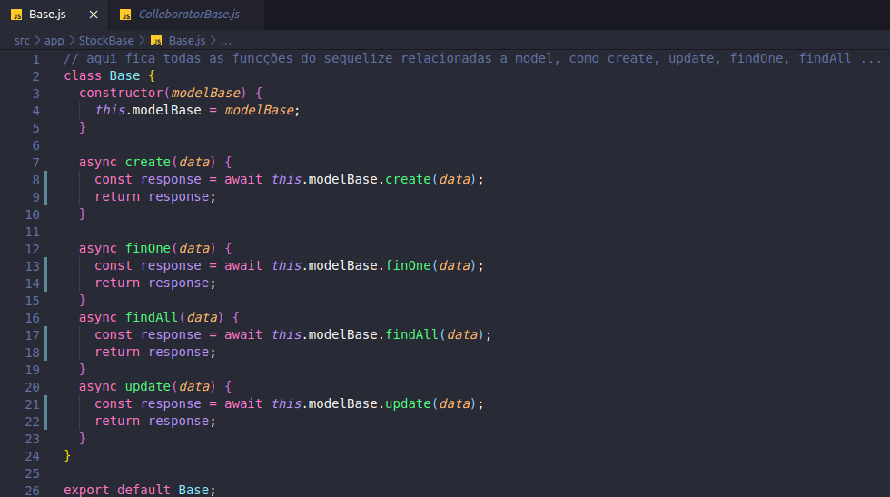
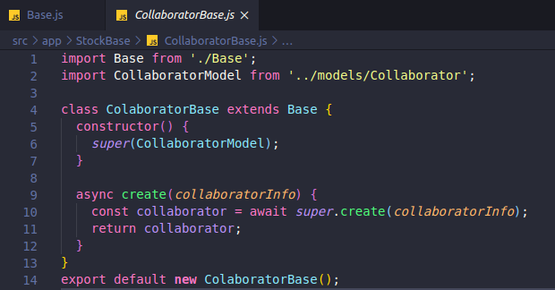

# Aplicação do Decorator
**Para saber mais sobre o padrão acesse: [*Decorator*](Project/Estudos/estrutural?id=Decorator.md)**

Para nossa aplicação, decidimos utilizar o padrão estrutural Decorate para a implementação dos principais métodos do banco de dados [Sequelize](Modeling/objeto?id=Sequelize).

## Histórico de Revisões
| Data | Versão | Descrição | Autor(es) |
|:----:|:------:|:---------:|:---------:|
| 19/10/2020 | 1.0 | Criação do documento e adição da Base do [Sequelize](Modeling/objeto?id=Sequelize) | Micaella Gouveia |
| 19/10/2020 | 1.1 | Linkagem dos Léxicos | Micaella Gouveia |
| 19/10/2020 | 1.2 | Adição dos links para github | Micaella Gouveia |

## Sequelize
Aqui o objetivo é criar uma nova camada para os métodos principais que o [Sequelize](Modeling/objeto?id=Sequelize) oferece como findAll, findOne, create e assim por diante para utilização pelas controllers, porém cada uma irá alterar o comportamento de acordo com sua necessidade. Para isso, utilizaremos o método Decorator, onde o Decorator Base irá implementar os métodos do [Sequelize](Modeling/objeto?id=Sequelize) e assim cada controller poderá herdar desse Decorator Base.

*Classe Base **([Link para github](https://github.com/UnBArqDsw/2020.1_G12_Stock_Backend/blob/devel/src/app/StockBase/Base.js))***

*Collaborator herdando da Classe Base **([Link para github](https://github.com/UnBArqDsw/2020.1_G12_Stock_Backend/blob/devel/src/app/StockBase/CollaboratorBase.js))***

