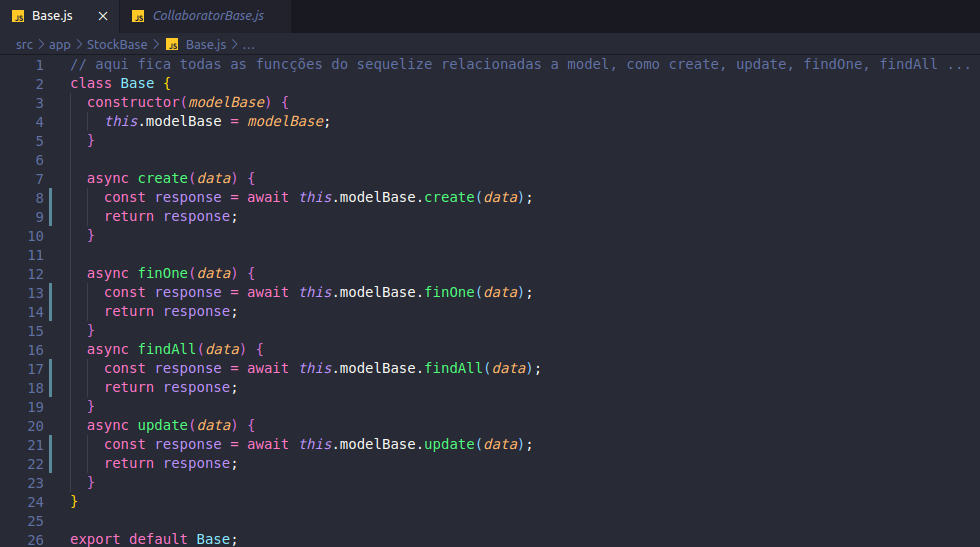
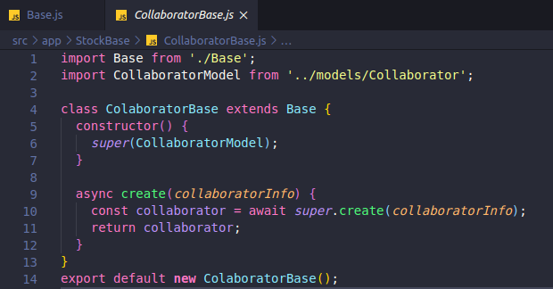

#  Aplicação do GRASP
**Para saber mais sobre o padrão acesse: [*GRASP*](Project/Estudos/GRASP.md)**

Utilizaremos alguns dos métodos GRASPs em nosso projeto, dentre eles está o Controller, Especialista e Polimorfismo.

## Histórico de Revisões
| Data | Versão | Descrição | Autor(es) |
|:----:|:------:|:---------:|:---------:|
| 19/10/2020 | 1.0 | Criação do documento e adição do tópico Controller | Micaella Gouveia |
| 19/10/2020 | 1.0 | Adição do tópico Polimorfismo | Micaella Gouveia |

## Controllers
Para a implementação das rotas da aplicação, estamos utilizando controllers, que são responsáveis em receber e tratar os dados das requisições. Todas as nossas requisições serão tratadas por suas controllers específicas.

*Exemplo do uso da Controller (**[Link para github](https://github.com/UnBArqDsw/2020.1_G12_Stock_Backend/blob/devel/src/app/controllers/CollaboratorController.js)**)*

*Routes importando Controller (**[Link para github](https://github.com/UnBArqDsw/2020.1_G12_Stock_Backend/blob/devel/src/routes/Collaborator.routes.js)**)*

## Polimorfismo
Em algumas classes, criamos classes que lidam com abstrações de métodos. Temos o exemplo da classe Base que possui os métodos relacionados ao [Sequelize](Modeling/objeto?id=Sequelize). Esse tipo de abstração torna o código menos acoplado e mais coeso. No caso do JavaScript, não é possível criar classes abstratas, então utilizamos o nome de classe, porém com conceitos e utilizações de classes abstratas.

*Exemplo de Prolimorfismo na Classe Base **([Link para github](https://github.com/UnBArqDsw/2020.1_G12_Stock_Backend/blob/devel/src/app/StockBase/Base.js))***

*Collaborator herdando da Classe Base **([Link para github](https://github.com/UnBArqDsw/2020.1_G12_Stock_Backend/blob/devel/src/app/StockBase/CollaboratorBase.js))***

