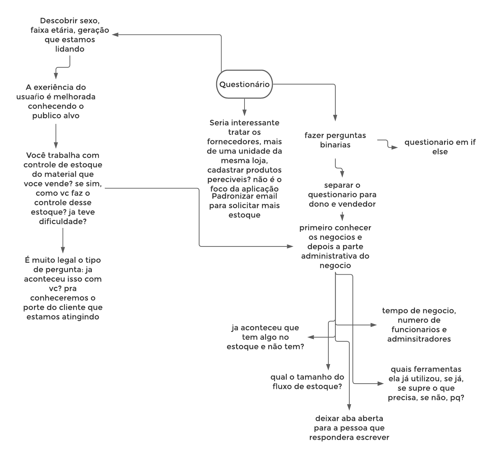
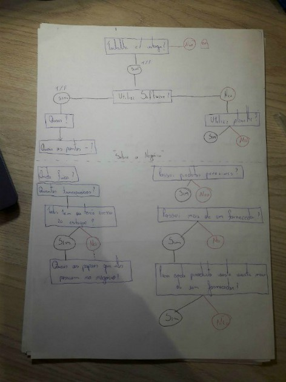
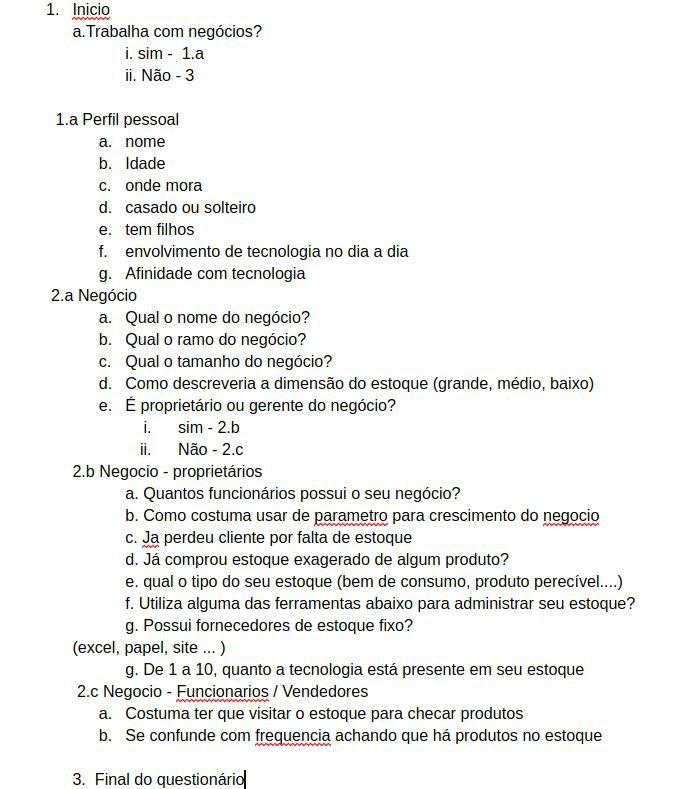
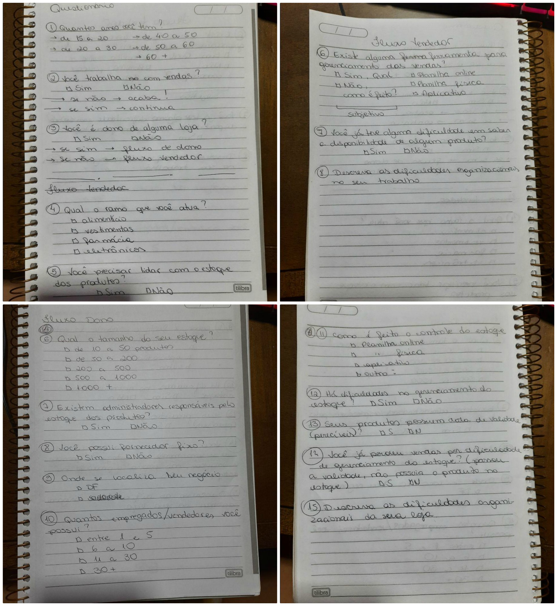
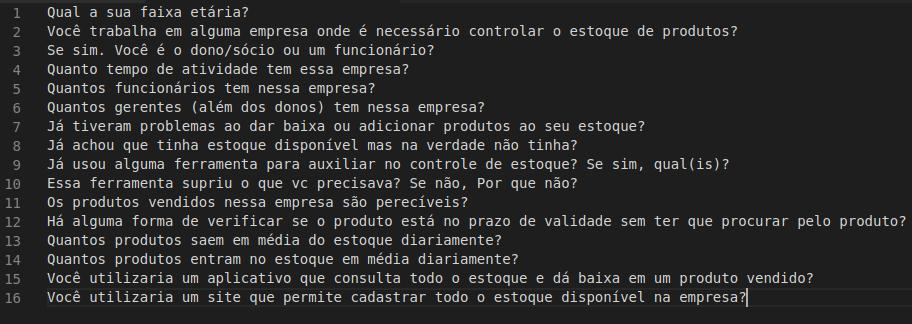
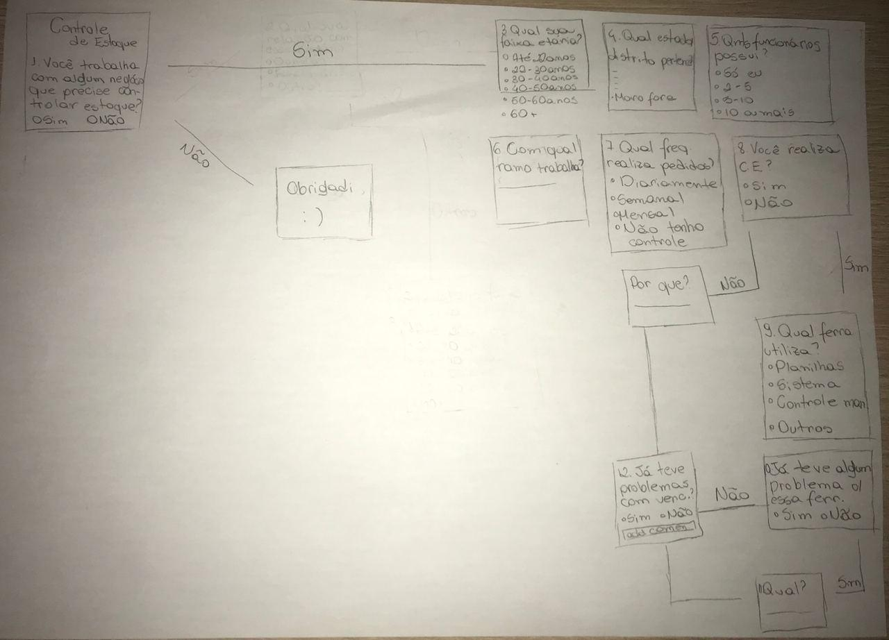

# Dia 1 - Questionário

| Horário | Duração | Mediador(a) | Participantes    |
| ------- | ------- | ----------- | ---------------- |
| 22:00   | 02:30   | Pedro Igor  | Todos os membros |

## Histórico de Revisões

|    Data    | Versão |              Descrição               |                                  Autor(es)                                  |
| :--------: | :----: | :----------------------------------: | :-------------------------------------------------------------------------: |
| 01/09/2020 |  1.0   | Levantamento de perguntas relevantes | Gabriel Alves, Gabriel Davi, Micaella Gouveia, Pedro Igor, Sofia Patrocínio |
| 06/09/2020 |  1.1   |     Adição do relato do mediador     |                                 Pedro Igor                                  |
| 09/09/2020 |  1.2   |    Padronização do texto e fotos     |                              Sofia Patrocínio                               |
| 11/09/2020 |  1.3   |         Adição das gravações         |                              Sofia Patrocínio                               |

## Relato do Mediador

Na etapa de **Entender (Unpack)**, que durou 20 minutos, definimos o objetivo das perguntas e o direcionamento de cada etapa do processo do questionário. Entendemos como a técnica deveria ser aplicada para a melhor extração de informações e posteriormente elicitação de requisitos. Nesta etapa foi criado um esboço de brainstorming tentado documentar o fluxo de pensamento do grupo na ligação: 
 

Na etapa **Esboçar (Sketch)**, que levou 30 minutos, cada um construiu o seu próprio questionário levando em consideração a etapa anterior traçando um fluxo de conhecimento sobre o usuário participante. Em seguida, na etapa **Decidir (Decide)**, em 30 minutos cada um dos membros compartilhou suas sugestões de perguntas e posicionamentos dentro do questionário como um todo. Foram escolhidas as perguntas mais adequadas para o grupo, sempre optando por questões o mais objetivas possível e filtrando o usuário que realmente faz parte do [público alvo](/Modeling/objeto?id=público-alvo) da aplicação. Criamos um [protótipo](Modeling/objeto?id=protótipo) com as perguntas escolhidas na etapa anterior, caracterizando a etapa **[Prototipar](/Modeling/verbo?id=prototipação) (Prototype)**. Esta etapa levou cerca de 1 hora. O questionário foi o único artefato a ir para a etapa **Teste (Test)**, onde criamos um formulário no Google Forms e compartilhamos com populações que atenderiam características do nosso [público alvo](/Modeling/objeto?id=público-alvo).

### Documentação produzida: [Questionário](Elicitation/Questionario.md)

## Gravações

<iframe allowFullScreen="allowFullScreen" src="https://www.youtube.com/embed/P03fadzjcwg?ecver=1&amp;iv_load_policy=3&amp;yt:stretch=16:9&amp;autohide=1&amp;color=red&amp;width=560&amp;width=560" width="560" height="315" allowtransparency="true" frameborder="0">
<a  id="RXWVoIsA" href="https://www.rockpamperscissors.co.uk/a-new-one-on-me/">Emma hybrid</a>

<a  id="RXWVoIsA" href="https://www.rockpamperscissors.co.uk/a-new-one-on-me/">https://www.rockpamperscissors.co.uk/a-new-one-on-me/</a>
<small>Powered by <a href="https://youtubevideoembed.com/ ">Embed YouTube Video</a></small></iframe>

<iframe allowFullScreen="allowFullScreen" src="https://www.youtube.com/embed/BixJd4FG_uQ?ecver=1&amp;iv_load_policy=3&amp;yt:stretch=16:9&amp;autohide=1&amp;color=red&amp;width=560&amp;width=560" width="560" height="315" allowtransparency="true" frameborder="0">
<a  id="RXWVoIsA" href="https://www.rockpamperscissors.co.uk/a-new-one-on-me/">Emma hybrid</a>

<a  id="RXWVoIsA" href="https://www.rockpamperscissors.co.uk/a-new-one-on-me/">https://www.rockpamperscissors.co.uk/a-new-one-on-me/</a>
<small>Powered by <a href="https://youtubevideoembed.com/ ">Embed YouTube Video</a></small></iframe>

## Documentos Individuais Produzidos

- Gabriel Alves 
   
- Gabriel Davi
   
- Micaella
   
- Pedro Igor
   
- Sofia
   
