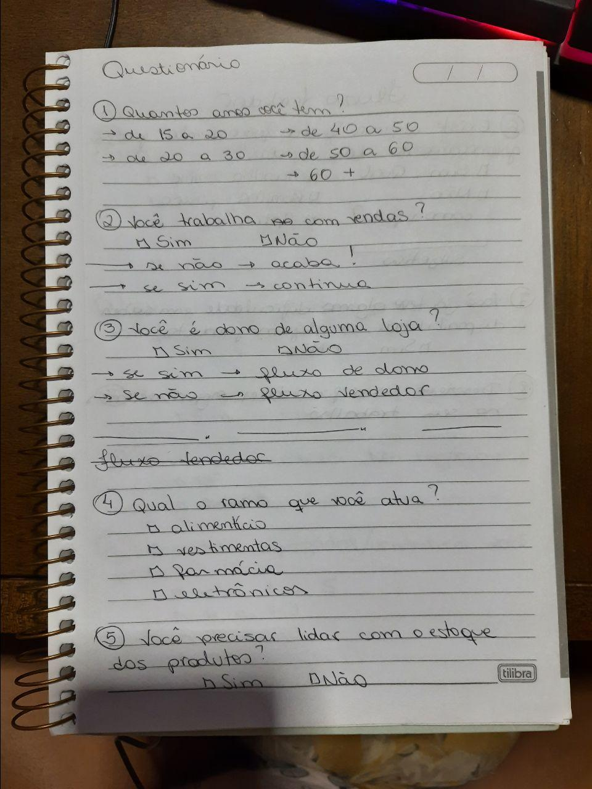
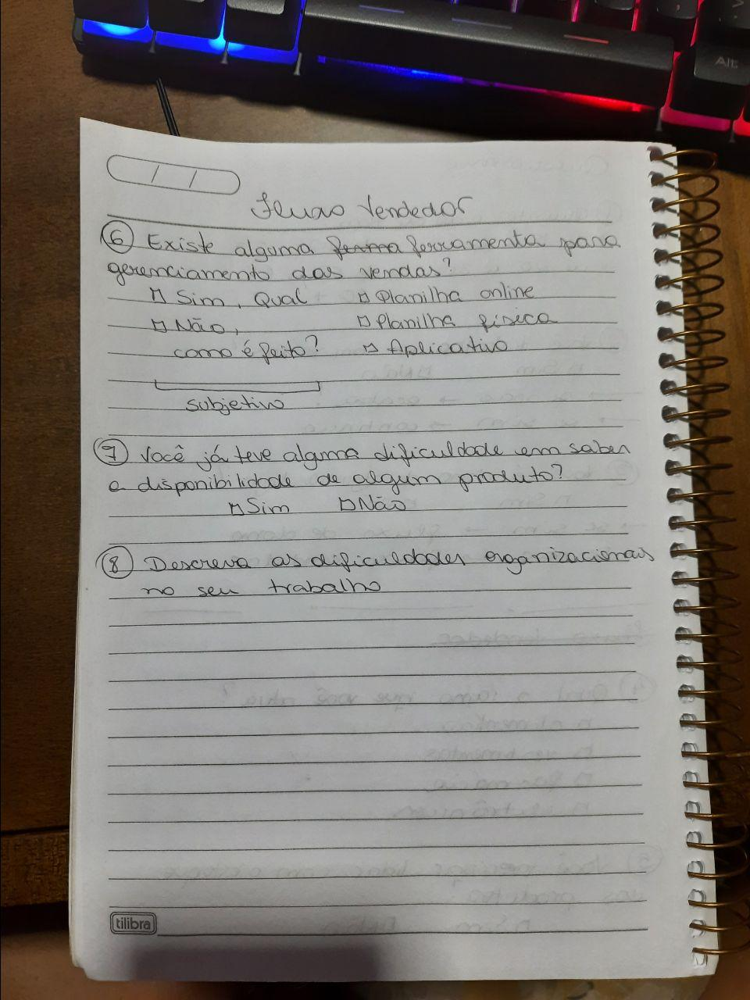
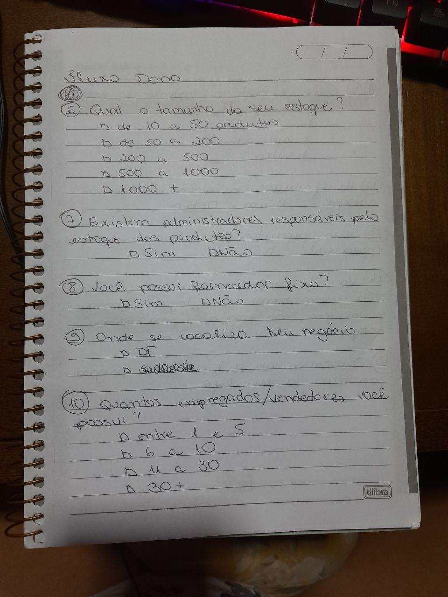
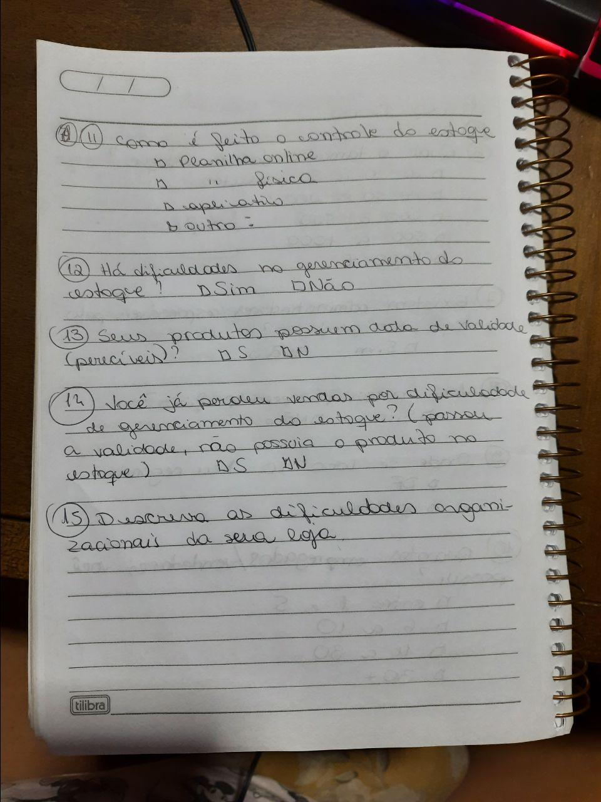

# Dia 1 - Questionário

| Horário | Duração | Mediador(a) | Participantes |
| - | - | - | - |
| 22:00 | 02:30 | Pedro Igor | Todos os membros   |

## Histórico de Revisões
|    Data    | Versão |         Descrição         |           Autor(es)            |
| :--------: | :----: | :-----------------------: | :----------------------------: |
| 01/09/2020 |  1.0   |  Levantamento de perguntas relevantes. | Gabriel Alves, Gabriel Davi, Micaella Gouveia, Pedro Igor, Sofia Patrocínio |
| 06/09/2020 |  1.1   | Adição do relato do mediador. | Pedro Igor |

## Relato do Mediador

Na etapa de **unpack** definimos o objetivo das perguntas e o direcionamento de cada etapa do processo do questionário. Entendemos como a técnica deveria ser aplicada para a melhor extração de informações e posteriormente elicitação de requisitos. Nesta etapa foi criado um esboço de brainstorming tentado documentar o fluxo de pensamento do grupo na ligação: 
 

Na etapa **sketch** cada um construiu o seu próprio questionário levando em consideração a etapa anterior traçando um fluxo de conhecimento sobre o usuário participante. Em seguida, na etapa **decision**, cada um dos membros compartilhou suas sugestões de perguntas e posicionamentos dentro do questionário como um todo. Foram escolhidas as perguntas mais adequadas para o grupo, sempre optando por questões o mais objetivas possível e filtrando o usuário que realmente faz parte do público alvo da aplicação. Criamos um protótipo com as perguntas escolhidas na etapa anterior, caracterizando a etapa **prototype**. O protótipo foi a base da etapa **test**, onde criamos um formulário no Google Forms e compartilhamos com populações que atenderiam características do nosso público alvo.

### Documentação produzida: [Questionário](../Elicitation/Questionario)
## Gravações

## Documentos Individuais Produzidos
* Gabriel Alves
 
* Gabriel Davi
 
* Micaella

 
* Pedro Igor
 
* Sofia
 