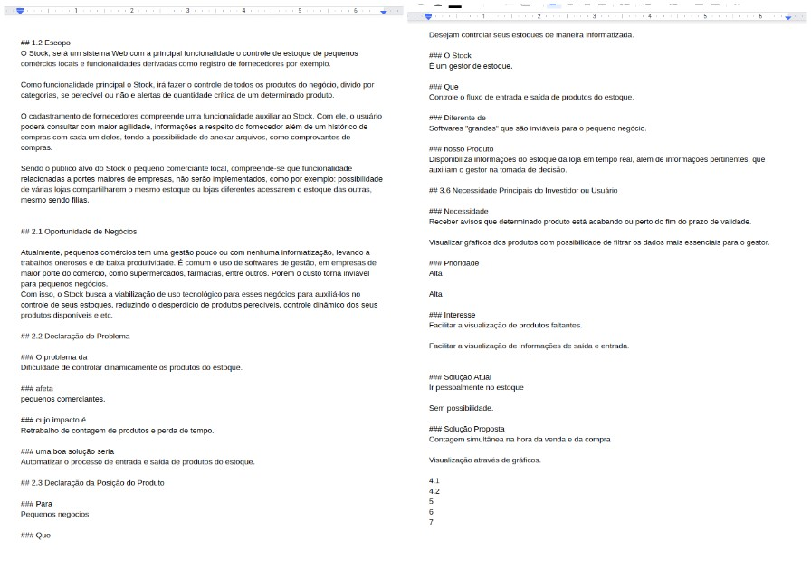
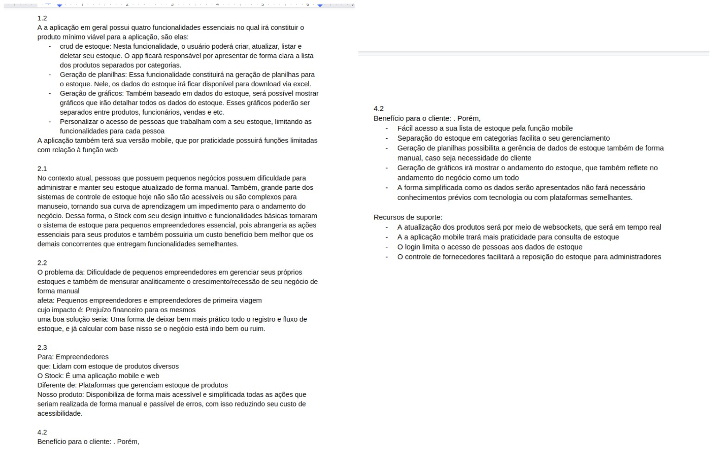
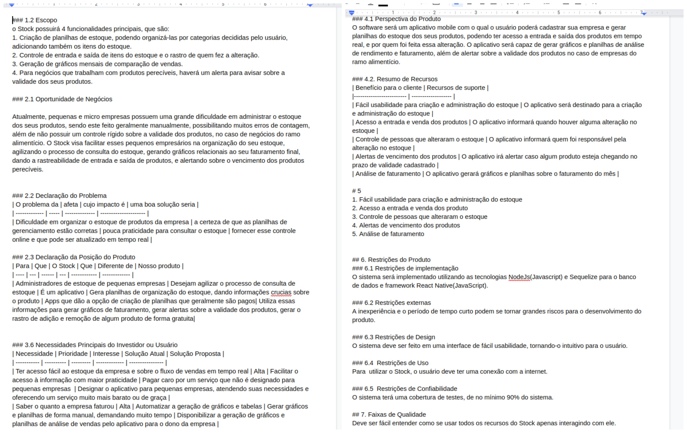
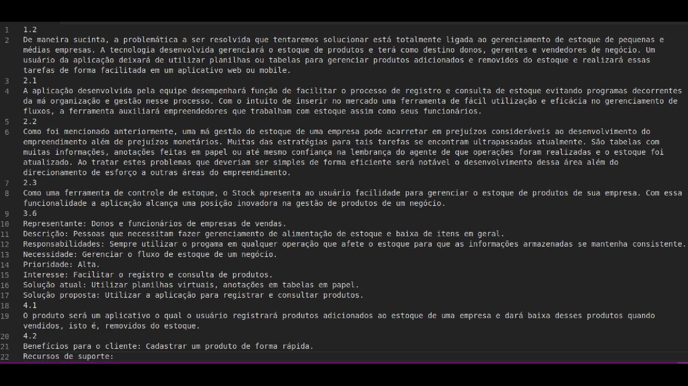
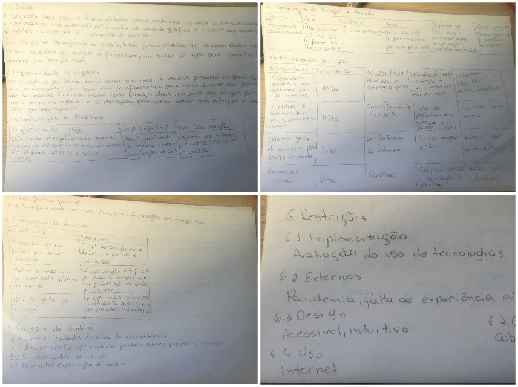

# Dia 2 - Documento de Visão

| Horário | Duração | Mediador(a) | Participantes |
| - | - | - | - |
| 16:00 | 03:00 | Sofia Patrocínio | Todos os membros |

## Histórico de Revisões

|    Data    | Versão |         Descrição         |           Autor(es)            |
| :--------: | :----: | :-----------------------: | :----------------------------: |
| 02/09/2020 |  1.0   |  Produção dos documentos individuais de visão | Gabriel Alves, Gabriel Davi, Micaella Gouveia, Pedro Igor, Sofia Patrocínio | 
| 03/09/2020 |  1.1   |  Criação do Documento de Visão | Sofia Patrocínio | 
| 04/09/2020 |  1.2   |  Criação do documento, relato e adição dos documentos individuais | Sofia Patrocínio | 

## Relato da Mediadora

No começo da reunião, decidimos Entender o que já tinhamos claro em mente com base em outros artefatos que já tinhamos produzido e o que seria necessário aplicar as dinâmicas. Nosso foco se tornou responder algumas questões e evoluir algumas ideas, como:
- O problema que desejamos atacar com o Stock
- O posicionamento do nosso produto em relação ao mercado
- Público alvo
- Perspectiva geral do nosso produto

Para isso, escolhemos os tópicos 1.2, 2.1, 2.2, 2.3, 3.6, 4.1, 4.2, 5, 6 e 7 para a fase de Esboçar, na qual cada membro escreveu um texto relativo a esses tópicos. Para essa fase, separamos 30 minutos. Ao final dessa fase, fomos para a fase de discutir e Decidir tópico a tópico. Com base nos documentos feitos por cada membro, decidimos o que faria mais sentido no contexto da nossa aplicação. Essa fase estava programa pra durar 30 minutos, porém ela se estendeu mais que isso, pois tinhamos muitas decisões importantes a tomar. Logo, como mediadora, comecei a Prototipar, com o uso de um arquivo em markdown como template. As duas etapas levaram cerca de 1h30 para serem concluidas. Ao final da etapa, eu fiquei responsável por finalizar e criar o documento, assim como documentá-lo na wiki.

### Documentação produzida: [Documento de Visão](product/DocVisão.md)
## Gravações

## Documentos Produzidos
* Gabriel Alves

* Gabriel Davi

* Micaella Gouveia

* Pedro Igor

* Sofia Patrocínio

