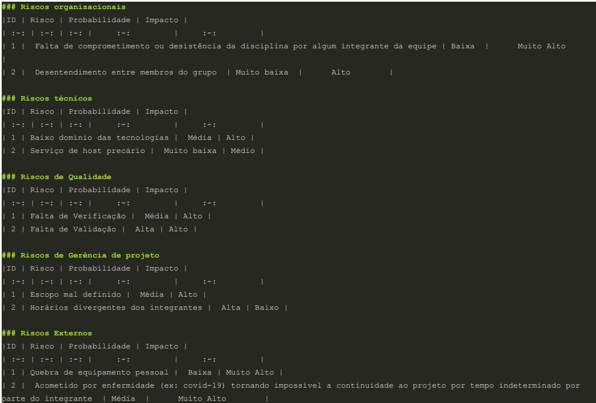
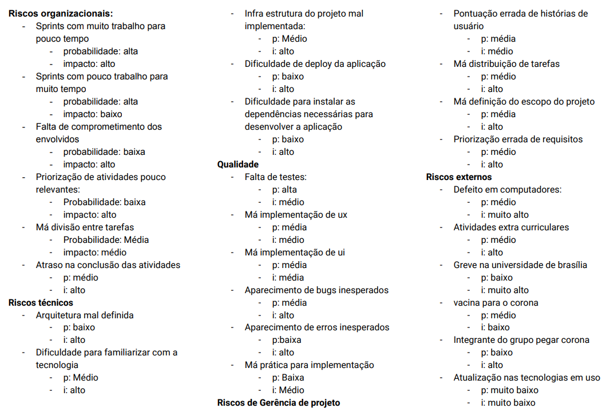
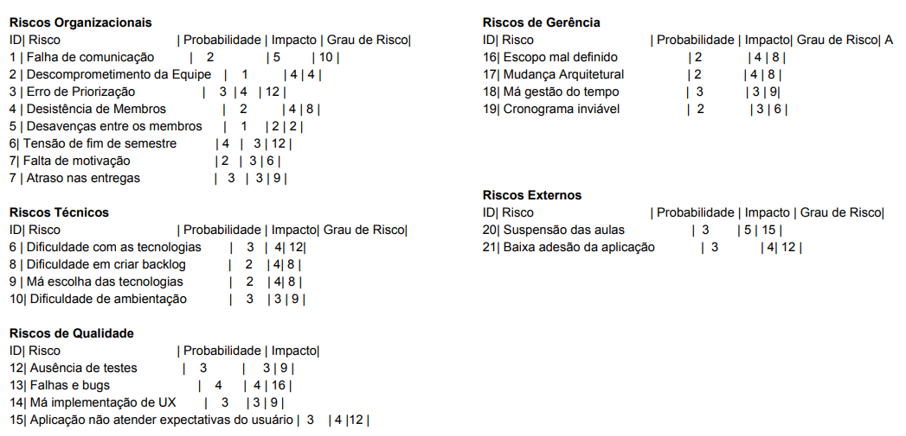
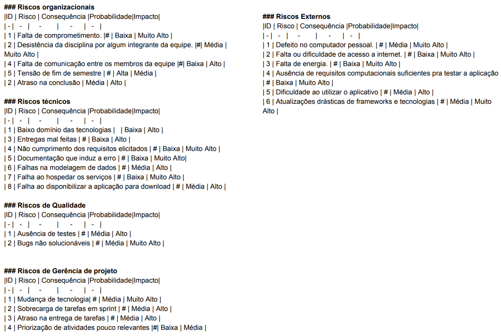
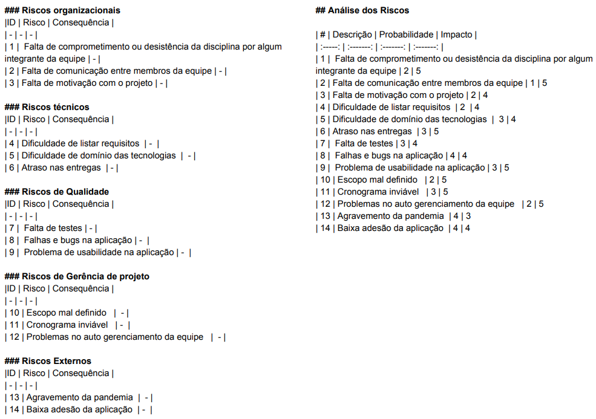

# Dia 3 - Plano de Análise de Risco

## Reunião
| Horário | Duração | Mediador(a) | Participantes |
| - | - | - | - |
| 10:00 | 03:00 | Micaella Gouveia | Todos os membros

## Histórico de Revisões

|    Data    | Versão |         Descrição         |           Autor(es)            |
| :--------: | :----: | :-----------------------: | :----------------------------: |
| 04/09/2020 |  1.0   |  Produção dos documentos individuais de riscos  | Gabriel Alves, Gabriel Davi, Micaella Gouveia, Pedro Igor, Sofia Patrocínio | 
| 04/09/2020 |  1.1   |  Criação do documento, relato e adição dos documentos | Micaella Gouveia | 

## Relato da Mediadora
Na fase de Entender, foi definido como seriam feitas todas as fases com mais detalhamento. Todos os membros iriam elicitaram os principais riscos do projeto por meio de um bate papo. A fase de Esboçar foi destinada para cada membro escrever os riscos e avaliar sua probabilidade e impacto no projeto e produto. A fase de Decidir foi destinada a escolha dos riscos, tendo como base todos os riscos levantados por todos os membros na fase anterior, além da definição de sua probabilidade e impacto. A fase de Prototipar ficou destinada para a documentação desses riscos escolhidos feito pela mediadora, além da definição das ações que deveriam ser tomadas para cada risco. No final, eu fiquei responsável em criar o documento e colocar todos os riscos elicitados com todos os tabelamentos preenchidos.

## Gravações

## Documentos Produzidos
* Gabriel Alves

* Gabriel Davi

* Micaella Gouveia

* Pedro Igor

* Sofia Patrocínio

