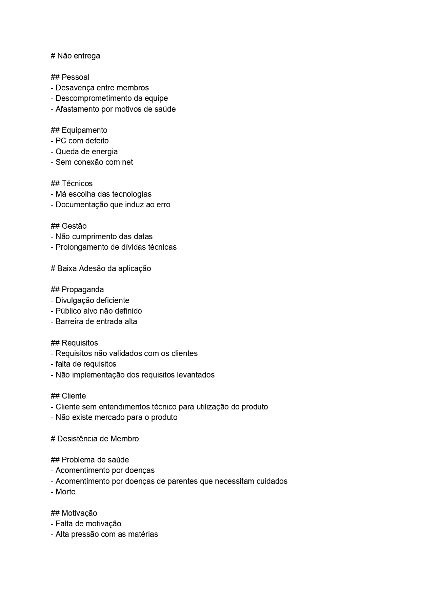
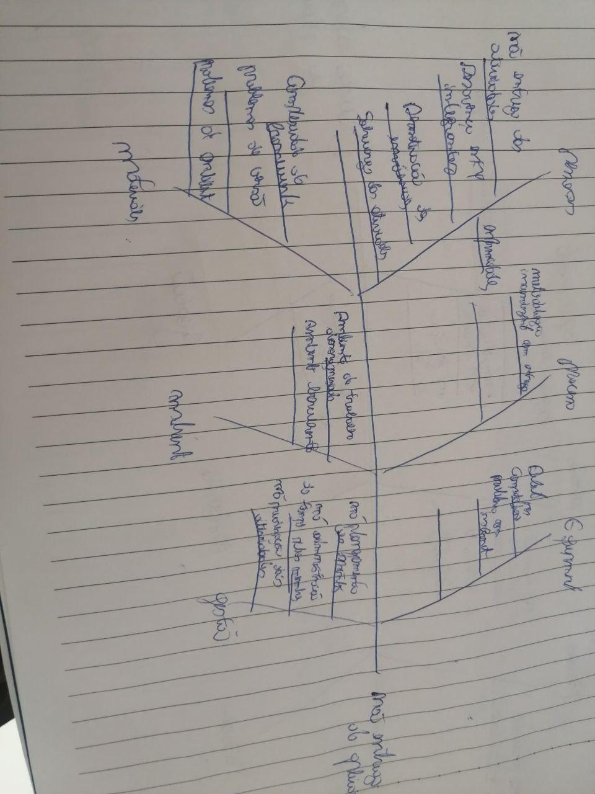
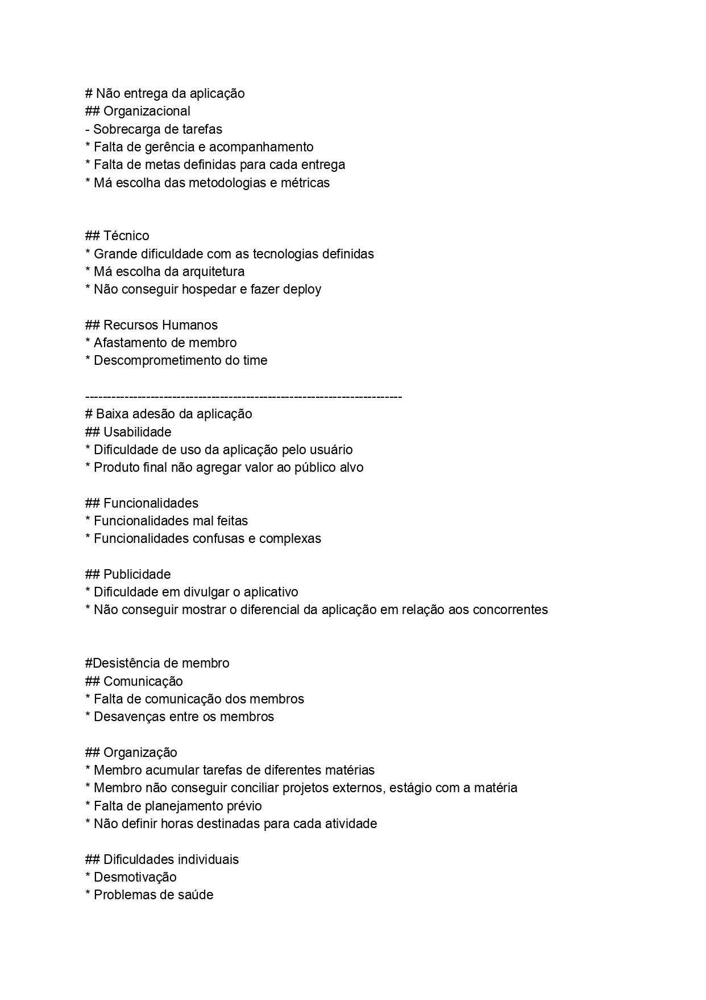
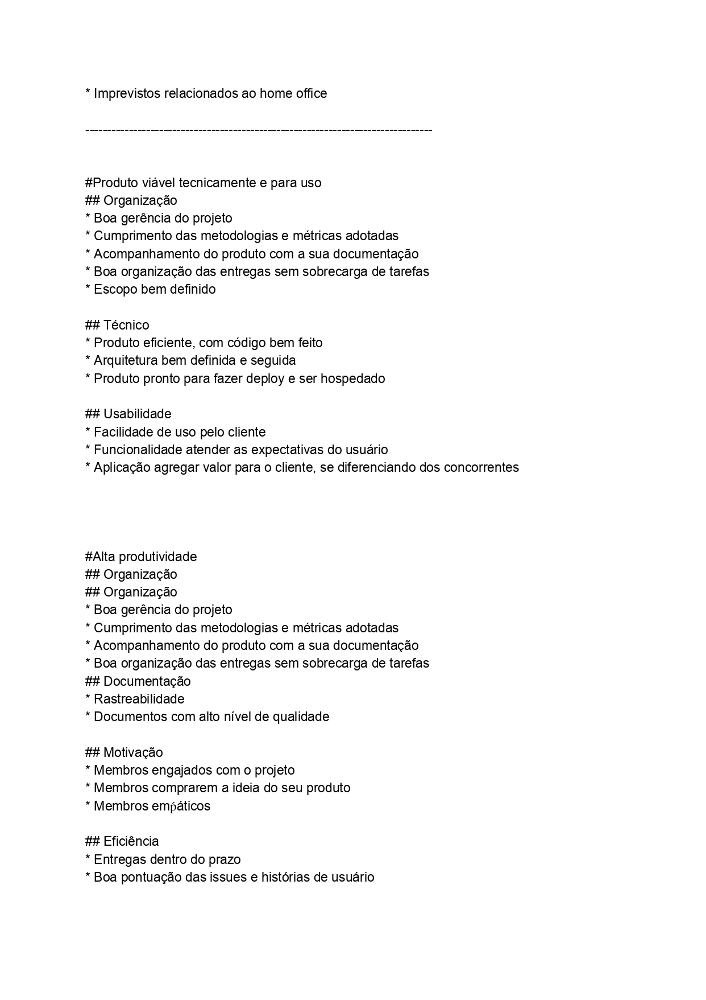
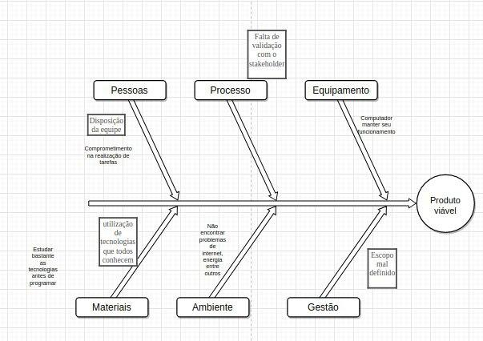
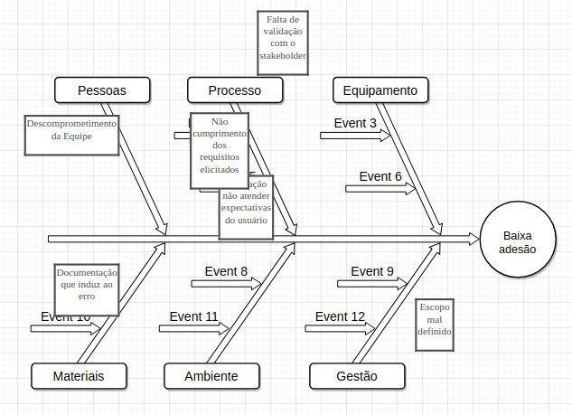
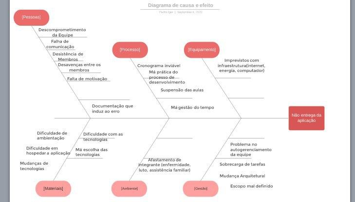
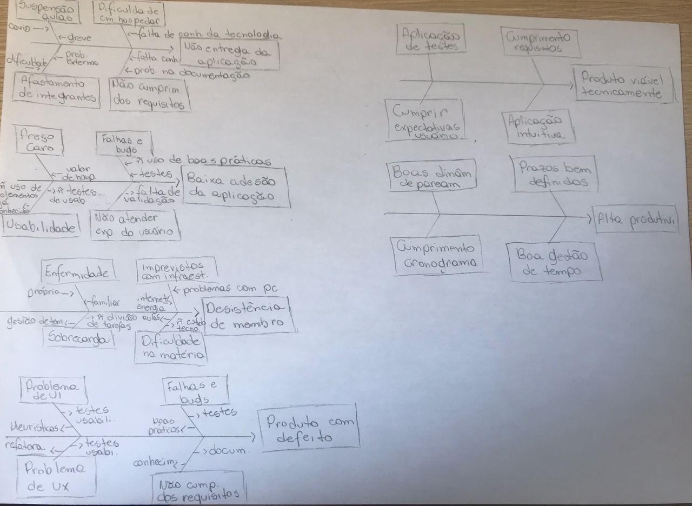

# Dia 4 - Causa-Efeito

| Horário | Duração | Mediador     | Participantes    |
| ------- | ------- | ------------ | ---------------- |
| 08:00 | 02:00 | Gabriel Alves | Todos os membros|

## Histórico de Revisões

|    Data    | Versão |         Descrição         |           Autor(es)            |
| :--------: | :----: | :-----------------------: | :----------------------------: |
| 04/09/2020 |  1.0   |  Produção dos documentos individuais de riscos  | Gabriel Alves, Gabriel Davi, Micaella Gouveia, Pedro Igor, Sofia Patrocínio | 
| 08/09/2020 |  1.1   |  Criação do documento, relato e adição dos documentos | Gabriel Alves |

## Relato do Mediador

### Entender (Unpack)

Primeiramente, nesta etapa os integrantes do grupo discorreram a respeito do artefato em si, com o objetivo de que todos tivessem total entendimento do que precisariam fazer a posteriori. Após as considerações individuais a respeito do documento os mesmos decidiram dividir os diagramas em duas categorias, efeitos positivos e efeitos negativos. Com isso, foram definidos todos os efeitos, que seriam diagramados.

### Esboçar (Sketch)

Tendo todos os efeitos já estipulados na fase anterior, cada membro seria responsável por identificar as possíveis causas para cada efeito.

### Decidir (Decide)

Nessa fase, cada membro disponibilizou ao restante do time, aquilo que identificou como sendo cada uma das causas que resultaram em seus respectivos efeitos. Os pontos em que houveram convergência de pensamento, foram marcados para serem acrescidos no documento final pelo mediador. Já os pontos que divergiam, cada um tinha a possibilidade de explicar os seus motivos e em seguida todo o time debatia e então aceitavam, recusavam ou alteravam o ponto em questão.

### Prototipar (Prototype)

A prototipação foi elaborada pelo mediador, com base no que foi decido na etapa anterior. Isso inclui a construção dos diagramas e a formatação textual para facilitar futuros hyperlinks de informações provenientes dos diagramas.

### Documentação produzida: [Diagrama Causa e Efeito](../preTraceability/causaEfeito.md)

## Documentos Produzidos

- Gabriel Alves

  
  

- Gabriel Davi

  

- Micaella Gouveia

  
  
  

- Pedro Igor

  
  
  

- Sofia Patrocínio

  