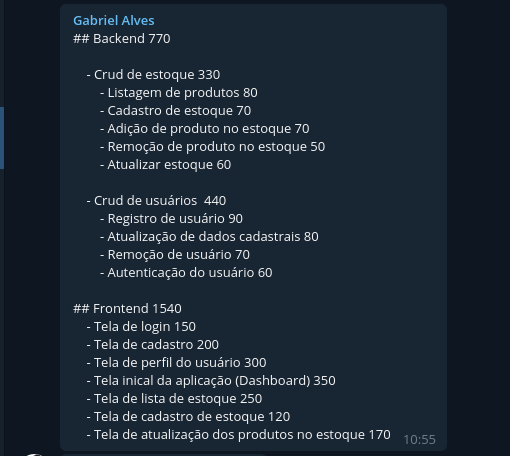
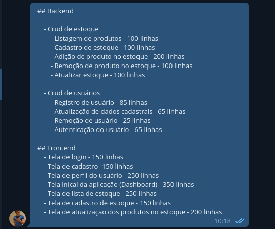
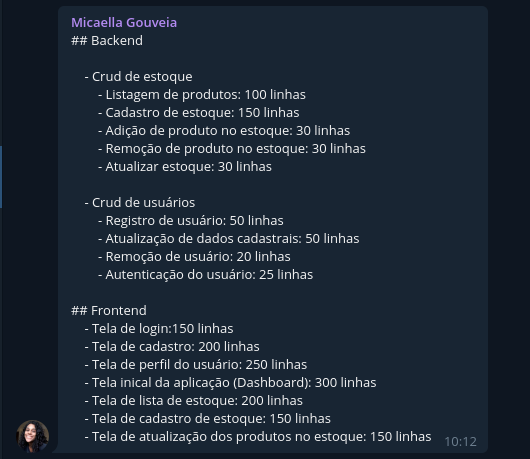
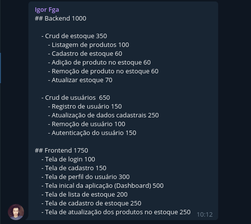
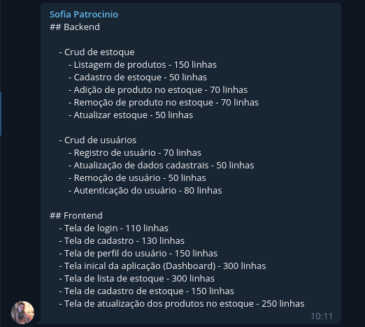
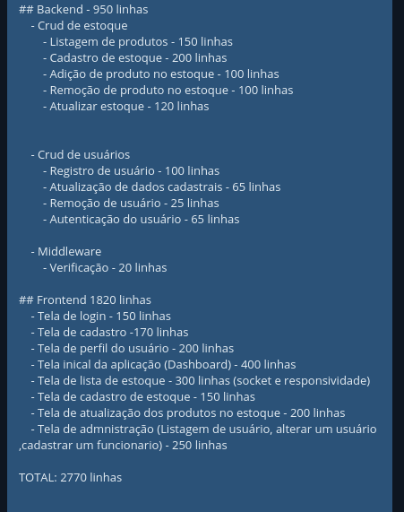

# Dia 5 - Estimativas

| Horário | Duração | Mediador     | Participantes    |
| ------- | ------- | ------------ | ---------------- |
| 8:30    | 3:00    | Gabriel Davi | Todos os membros |

## Histórico de Revisões

|    Data    | Versão |                                     Descrição                                     |                                  Autor(es)                                  |
| :--------: | :----: | :-------------------------------------------------------------------------------: | :-------------------------------------------------------------------------: |
| 05/09/2020 |  1.0   | Produção dos documentos individuais de estimativas de linhas de código do projeto | Gabriel Alves, Gabriel Davi, Micaella Gouveia, Pedro Igor, Sofia Patrocínio |
| 08/09/2020 |  1.1   |               Criação do documento, relato e adição dos documentos                |                                Gabriel Davi                                 |
| 09/09/2020 |  1.2   | Padronização do texto | Sofia Patrocínio |

## Relato do Mediador

Na fase de **Entender (Unpack)**, foi definido como seriam feitas todas as fases com mais detalhamento e também houve uma conversa sobre o método e valores que seriam levados em consideração para levantar as estimativas. Com isso, percebeu-se que a parte mais relevante e cabível de discussão foi o levantamento de linhas de código totais que iria demandar o projeto e, por isso, o grupo separou as principais funcionalidades da aplicação para tal levantamento. A fase de **Esboçar (Sketch)** foi destinada para todos os membros do grupo definir quantas linhas cada funcionalidade iria demandar. A fase de **Decidir (Decide)** foi destinada para que os membros chegassem a um consenso com relação a quantidade total das linhas do projeto, tendo base o que cada um levantou. A fase de **Prototipar (Prototype)** foi destinada ao membro mediador, pois não eram necessária discussão, somente aplicação da técnica de Estimativas.
No final, eu fiquei responsável por realizar todos os cálculos de estimativas que nosso projeto iria tomar, como de tempo, esforço e custo total do projeto.

### Documentação produzida: [Estimativas](Project/Evaluation.md)

## Gravações

## Documentos Produzidos

- Gabriel Alves

  

- Gabriel Davi

  

- Micaella Gouveia

  

- Pedro Igor

  

- Sofia Patrocínio

  

- Levantamento final

  
