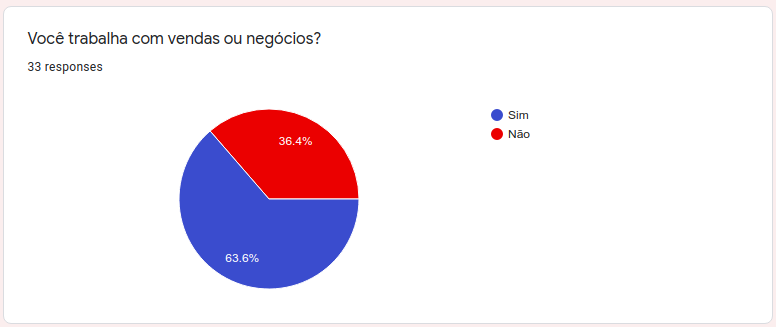
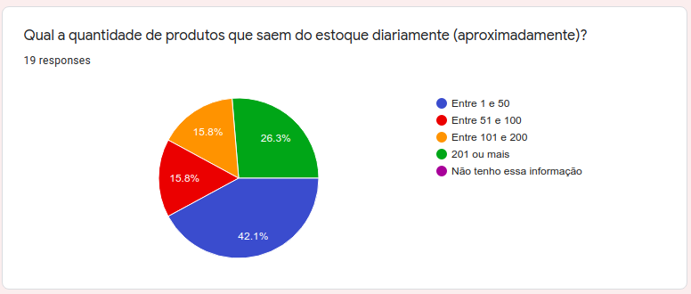

# Questionário

**Este artefato foi produzido durante o dia 1 da Design Sprint, para saber mais sobre a metodologia e como ela foi feita, clique aqui: _[Design Sprint](DesignSprint/DesignSprint.md)_**

O questionário é um método de elicitação de requisitos onde, por meio de perguntas estratégicas, é possível compreender melhor como o público de interesse reage a determinado assunto. Além disso, o questionário permite retirar características chave sobre um domínio quantificando o percentual de pessoas, do público, que se aplicam a determinada característica.  
As perguntas a seguir foram elaboradas em um dos dias de [Design Sprint](DesignSprint/DesignSprint.md) realizado pelo grupo. As perguntas foram escritas a princípio, individualmente por cada um dos membros do grupo, e discutidas em conjunto logo em seguida, planejando a melhor estratégia. Após o entendimento da finalidade do questionário para o projeto, foi feita a etapa de desenho, em que membro sugeriu perguntas relevantes. Em seguida, discussão em grupo onde foram decididas as melhores perguntas e traçado um objetivo, protototipação, gerando a presente documentação, e teste, enviando o Formulário em grupos específicos.

## Histórico de Revisões

|    Data    | Versão |                                                      Descrição                                                       |                         Autor(es)                         |
| :--------: | :----: | :------------------------------------------------------------------------------------------------------------------: | :-------------------------------------------------------: |
| 04/09/2020 |  1.0   |                                      Adicionado questionário definido em grupo.                                      | Gabriel Alves, Gabriel Davi, Micaella, Pedro Igor e Sofia |
| 04/09/2020 |  1.1   | Formatação do questionário, tabela de versões, referências, criação do formulário e explicação breve da metodologia. |                        Pedro Igor                         |
| 09/09/2020 |  1.2   |                                   Adição de hyperlink para página de Design Sprint                                   |                     Sofia Patrocínio                      |
| 11/09/2020 |  1.3   |  Linkagem dos léxicos. | Gabriel Alves, Gabriel Davi, Micaella Gouveia, Pedro Igor, Sofia Patrocínio |
| 15/09/2020 |  1.4   |  Adição das respostas do questionário. | Micaella Gouveia e Sofia Patrocínio |

## Respostas

**1** - Você trabalha com vendas ou negócios? 
 

**2** - A empresa a qual trabalha envolve [estoque](Modeling/objeto?id=Estoque) de [produtos](Modeling/objeto?id=Produto)? 

Apesar de termos direcionado nosso questionário à grupos com nosso público alvo, como grupos de vendas e de áreas como Administração, restringimos no próprio formulário as pessoas que se aplicavam a nosso contexto. Então, **Caso Não**, finaliza o questionário. **Caso Sim**, continua:  

_Perfil pessoal:_  

**3** - Qual a sua faixa etária? 

Notamos que nosso público alvo se encontra principalmente na faixa etária de 20 a 30 anos. Esse dado é importante para dirercionarmos a "nossa persona" à esse público.  

**4** - Qual a sua afinidade com a tecnologia? Sendo 10 = Tenho muita afinidade com tecnologia e 1 = Não consigo utilizar tecnologia alguma. 

Em relação à afinidade com tecnologia, podemos concluir que nosso público alvo possui uma média alta. Trata-se de um dado fundamental como abordaremos as interfaces e funcionalidades ao usuário.  

_Perfil da empresa:_  

**5** - Qual é o ramo de negócio da empresa a qual trabalha? 

Notamos que há uma diversidade muito grande de ramos de negócios. Essa informação é importante para tornar a aplicação mais acessível possível para todas as categorias.  

**6** - Quantas pessoas trabalham nesta empresa (contando com [donos](Modeling/objeto?id=Owner) e sócios)? 

Podemos perceber que nosso público alvo trata-se de micro empresas, com apenas o dono ou com poucos funcionários. Com essas respostas, podemos avaliar a necessidade dos usuários em relação à quantidade de acessos ao controle de estoque.  

**7** - Quais os cargos dessa empresa?(Marque todos os aplicáveis) 

Sobre os cargos existentes nesses negócios, podemos perceber três que se sobrepõem: Dono(a), Administrador(a) e Vendedor(a). Essa análise valida o nível de hierarquia dentro da aplicação.  

_Definições do [estoque](Modeling/objeto?id=Estoque):_  

**8** - Qual a frequência de reposição de [estoque](Modeling/objeto?id=Estoque)? 

Essa informação diz respeito ao fluxo do estoque, fundamental para elaboração de gráficos de controle do estoque e de vendas.  

**9** - Qual a quantidade de [produtos](Modeling/objeto?id=Produto) que saem do estoque diariamente (aproximadamente)? 

Esse dado, além de analisar o controle de saída, podemos pensar na melhoria da acurácia tendo maior rastros de vendas, como quando e por quem saiu a mercadoria.  

**10** - É possível categorizar cada [produto](Modeling/objeto?id=Produto) desta empresa? 

A categorização é muito importante para o controle do estoque e a aplicação de tags para separar produtos por seções.  

_Aplicação:_  

**11** - Está empresa trabalha com [produtos](Modeling/objeto?id=Produto) perecíveis?  

Quase metade do nosso público respondeu que trabalha com produtos perecíveis, o que nos mostra uma necessidade de ser possível adicionar data de vencimento dos produtos e alertá-los quando está próximo.  

**12** - Esta empresa já teve prejuízo por não controlar o [estoque](Modeling/objeto?id=Estoque) corretamente? ([Produto](Modeling/objeto?id=Produto) passar da [data de validade](Modeling/estado?id=Prazo-de-Validade), [produto](Modeling/objeto?id=Produto) não encontrado no estoque) 

A maioria das empresas já tiveram prejuízo pelo mau controle do estoque, o que significa que não utilizam/utilizaram ferramentas adequedas.  

**13** - Quais ferramentas de [controle de estoque](Modeling/verbo?id=Controle-de-Estoque) são utilizadas ou já foram utilizadas nesta empresa? (marque todas as aplicáveis)? 

A grande maioria faz controle manual dos seu estoque, gastando mais tempo e com uma precisão menor.  

**14** - Quais problemas você já encontrou ao fazer [controle de estoque](Modeling/verbo?id=Controle-de-Estoque)? (opcional) 

Entre os problemas encontrados, é muito comum a falta de assertividade no controle: quantidade de produto em estoque não bater com valor real. Além disso, podemos perceber que há problemas em separar os produtos por categorias e dificuldade em achá-los. Há também dificuldade em controlar o prazo de vencimento dos produtos.   

## Referências

- Google Forms enviado aos participantes: <https://docs.google.com/forms/d/e/1FAIpQLScm1jD2vjcqu5CZ3nuQBD3bgh19VgtuL2rltMG5WlqtbM0qcA/viewform?usp=sf_link> Último acesso em 04/09/2020.
