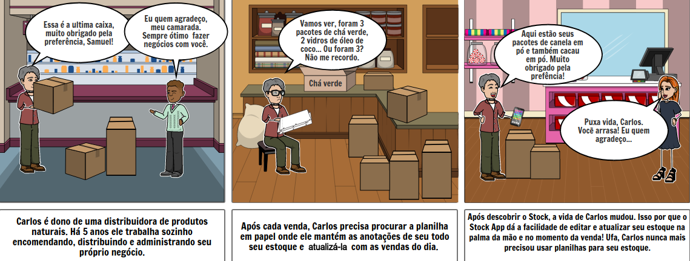
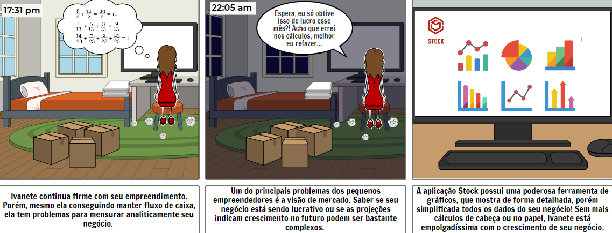

# Story Board

O storyboard é uma sequência de desenhos quadro a quadro com o esboço das diversas cenas pensadas para um conteúdo. O visual desse esboço é semelhante ao de uma história em quadrinhos e o objetivo é elaborar e detalhar a sequência da narrativa. Essa ferramenta é originalmente utilizada em animações, filmes e jogos, mas com o passar do tempo, tornou-se muito aplicada também em projetos para publicidade, marketing e software. Ou seja, o objetivo é desenvolver uma sequência de ações da forma mais divertida, instigante e confortável visualmente possível, de forma a otimizar o engajamento do público.

## Histórico de Revisões

|    Data    | Versão |                       Descrição                       |    Autor(es)     |
| :--------: | :----: | :---------------------------------------------------: | :--------------: |
| 30/08/2020 |  1.0   | Criação do documento e adição dos stroyboards criados |   Gabriel Davi   |
| 08/09/2020 |  1.1   |    Adição do storyboard de [Exportação](Modeling/verbo?id=Exportação) de planilha.    | Micaella Gouveia |
| 09/09/2020 |  1.2   |                Adição dos requisitos.                 |   Gabriel Davi   |
| 09/09/2020 |  1.3   |          Adição do storyboard de vencimento.          | Sofia Patrocínio |
| 09/09/2020 |  1.4   |           Adição do requisitos RF9 e RF21.            | Sofia Patrocínio |
| 11/09/2020 |  1.5   |  Linkagem dos léxicos. | Gabriel Alves, Gabriel Davi, Micaella Gouveia, Pedro Igor, Sofia Patrocínio |
| 17/09/2020 |  1.6   | Adição do requisito RF29   | Micaella Gouveia|

## StoryBoards

### Atualizar o [estoque](Modeling/objeto?id=Estoque) em qualquer lugar

#### Autor: Gabriel Davi

### Ivanete e seu [estoque](Modeling/objeto?id=Estoque)

#### Autor: Gabriel Davi

### [Estoque](Modeling/objeto?id=Estoque) em seu bolso

#### Autor: Gabriel Davi

### Gráficos e visão de negócio

#### Autor: Gabriel Davi

### Parceria de negócio

#### Autor: Gabriel Davi

### [Exportação](Modeling/verbo?id=Exportação) de planilhas de análise

#### Autora: Micaella Gouveia

### Notificação de [vencimento](Modeling/objeto?id=Prazo-de-Validade) de [produto](Modeling/objeto?id=Produto)

#### Autora: Sofia Patrocinio

## Requisitos levantados

|                                     Id                                     |                Nome                 |
| :------------------------------------------------------------------------: | :---------------------------------: |
|   [#RF03](Elicitation/RequisitosElicitados.md?id=requisitos-funcionais)    |     [Adição de itens](Modeling/verbo?id=Cadastrar-Produto) ao estoque      |
|   [#RF04](Elicitation/RequisitosElicitados.md?id=requisitos-funcionais)    |         [Consulta de estoque](Modeling/verbo?id=Consultar-Produto)         |
|   [#RF05](Elicitation/RequisitosElicitados.md?id=requisitos-funcionais)    |        [Filtro](Modeling/verbo?id=Filtrar-Produtos) por categoria         |
|   [#RF09](Elicitation/RequisitosElicitados.md?id=requisitos-funcionais)    |           Gerar planilha            |
|   [#RF012](Elicitation/RequisitosElicitados.md?id=requisitos-funcionais)   |       [Filtro](Modeling/verbo?id=Filtrar-Produtos) por nome e preço       |
|   [#RF013](Elicitation/RequisitosElicitados.md?id=requisitos-funcionais)   |        [Filtro](Modeling/verbo?id=Filtrar-Produtos) por data         |
|   [#RF014](Elicitation/RequisitosElicitados.md?id=requisitos-funcionais)   |        Plotagem de gráficos         |
|   [#RF015](Elicitation/RequisitosElicitados.md?id=requisitos-funcionais)   | Atualização instantânea de [estoque](Modeling/objeto?id=Estoque)  |
|   [#RF017](Elicitation/RequisitosElicitados.md?id=requisitos-funcionais)   | App para [consulta](Modeling/verbo?id=Consultar-Produto) fácil de [produtos](Modeling/objeto?id=Produto) |
|   [#RF018](Elicitation/RequisitosElicitados.md?id=requisitos-funcionais)   |  App para baixa fácil de [produtos](Modeling/objeto?id=Produto)   |
|   [#RF021](Elicitation/RequisitosElicitados.md?id=requisitos-funcionais)   | Notificação de [prazo de vencimento](Modeling/objeto?id=Prazo-de-Validade)  |
| [#RF029](Elicitation/RequisitosElicitados.md?id=requisitos-funcionais) | Filtro pela [prazo de validade](Modeling/objeto?id=Prazo-de-Validade) |
| [#RNF01](Elicitation/RequisitosElicitados.md?id=requisitos-não-funcionais) |         Rapidez na [consulta](Modeling/verbo?id=Consultar-Produto)         |
| [#RNF02](Elicitation/RequisitosElicitados.md?id=requisitos-não-funcionais) |         Gráficos didáticos          |
| [#RNF03](Elicitation/RequisitosElicitados.md?id=requisitos-não-funcionais) |          [Consultas](Modeling/verbo?id=Consultar-Produto) remotas          |

## Referências

- Storyboard That: <https://www.storyboardthat.com/>. Último acesso em 28/08/2020.
- RocketChat- Repositório de requisitos de software: <https://marcosnbj.github.io/2019.1-RocketChat/>. Último acesso em 30/08/2020.
