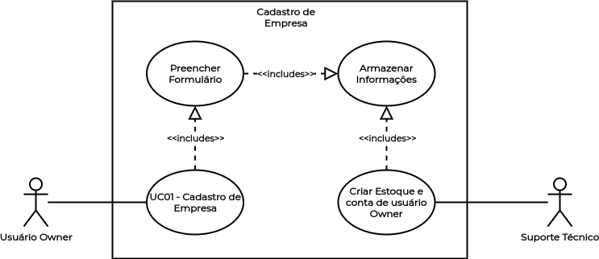

# UC01 - Cadastro de Empresa

## Histórico de Revisões

| Data | Versão | Descrição | Autor(es) |
|:----:|:------:|:---------:|:---------:|
| 30/09/2020 | 1.0 | Criação do documento e template | Micaella Gouveia |
| 30/09/2020 | 1.1 | Adição da descrição, atores, pré-requisitos, fluxos e pós condição | Micaella Gouveia |
| 30/09/2020 | 1.2 | Linkagem dos léxicos | Micaella Gouveia |
| 01/10/2020 | 1.3 | Adição do diagrama | Micaella Gouveia |

## Diagrama - UC01
Diagrama produzido com a ferramenta a ferramenta [Draw.io](https://app.diagrams.net/). Ele é composto por:
* Atores
* Casos de uso
* Relacionamentos

<a href="https://unbarqdsw.github.io/2020.1_G12_Stock/assets/pdf/diagramas/casosUso/caso1.pdf">Arquivo em PDF</a>

## Descrição
O [usuário Owner](Modeling/objeto?id=Owner) deve cadastrar sua empresa na aplicação.

## Atores
* [Usuário Owner](Modeling/objeto?id=Owner)
* Suporte Técnico

## Pré-requisitos
1. O [usuário Owner](Modeling/objeto?id=Owner) não deve possuir sua empresa cadastrada na aplicação.
2. O [usuário Owner](Modeling/objeto?id=Owner) deve possuir uma empresa para ser cadastrada.

## Fluxo de Eventos
### Fluxo Principal
1. O [usuário Owner](Modeling/objeto?id=Owner) que não possui sua empresa cadastrada entra no Stock.
2. O [usuário Owner](Modeling/objeto?id=Owner) seleciona o botão "Cadastrar [Estoque](Modeling/objeto?id=Estoque)".
3. O [usuário Owner](Modeling/objeto?id=Owner) é redirecionado para um formulário de cadastro.
4. O [usuário Owner](Modeling/objeto?id=Owner) preenche o formulário com os dados da sua empresa.
5. O [usuário Owner](Modeling/objeto?id=Owner) seleciona o botão "Enviar Formulário".
6. O formulário é enviado para o Suporte Técnico.
7. O Suporte Técnico entrará em contato com o [usuário Owner](Modeling/objeto?id=Owner) com as credenciais do novo [usuário](Modeling/objeto?id=usuário).

### Fluxos Alternativos
*Não há fluxos alternativos*

### Fluxos de Exceção

* **FE01**: Empresa já cadastrada
    1. O [usuário Owner](Modeling/objeto?id=Owner) que já possui sua empresa cadastrada entra no Stock.
    2. O [usuário Owner](Modeling/objeto?id=Owner) seleciona o botão "Cadastrar [Estoque](Modeling/objeto?id=Estoque)".
    3. O [usuário Owner](Modeling/objeto?id=Owner) é redirecionado para um formulário de cadastro.
    4. O [usuário Owner](Modeling/objeto?id=Owner) preenche o formulário com os dados da sua empresa.
    5. O [usuário Owner](Modeling/objeto?id=Owner) seleciona o botão "Enviar Formulário".
    6. O Sistema envia uma mensagem dizendo que a empresa já está cadastrada.

## Pós-condição
O [usuário Owner](Modeling/objeto?id=Owner) agora pode acessar seu [estoque](Modeling/objeto?id=Estoque) por meio do Stock, tendo direito a todas as funcionalidades da aplicação.

## Referências
* UML — Diagrama de Casos de Uso: <https://medium.com/operacionalti/uml-diagrama-de-casos-de-uso-29f4358ce4d5>. Último acesso em 01/10/2020.
