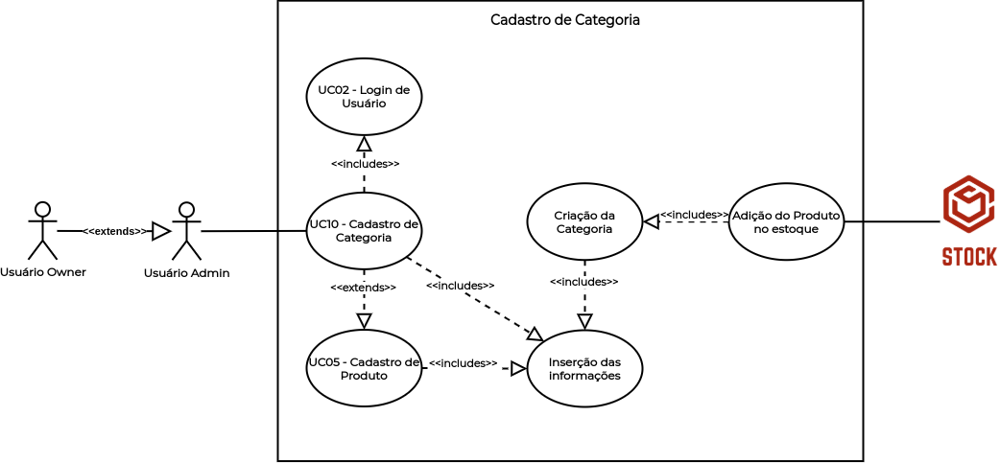

# UC10 - Cadastro de Categoria

## Histórico de Revisões

| Data | Versão | Descrição | Autor(es) |
|:----:|:------:|:---------:|:---------:|
| 30/09/2020 | 1.0 | Criação do documento e template | Micaella Gouveia |
| 30/09/2020 | 1.1 | Adição da descrição, atores, pré-requisitos, fluxos e pós condição | Micaella Gouveia |
| 30/09/2020 | 1.2 | Linkagem dos léxicos | Micaella Gouveia |
| 02/10/2020 | 1.3 | Adição do diagrama | Micaella Gouveia |

## Diagrama - UC10
Diagrama produzido com a ferramenta a ferramenta [Draw.io](https://app.diagrams.net/). Ele é composto por:
* Atores
* Casos de uso
* Relacionamentos

<a href="https://unbarqdsw.github.io/2020.1_G12_Stock/assets/pdf/diagramas/casosUso/caso10.pdf">Arquivo em PDF</a>

## Descrição
O [usuário Owner](Modeling/objeto?id=Owner)/[Admin](Modeling/objeto?id=Admin) deve cadastrar categorias no [estoque](Modeling/objeto?id=Estoque).

## Atores
* [Usuário Owner](Modeling/objeto?id=Owner)
* [Usuário Admin](Modeling/objeto?id=Admin)
* Sistema

## Pré-requisitos
O categoria não deve estar cadastrada no [estoque](Modeling/objeto?id=Estoque).

## Fluxo de Eventos
### Fluxo Principal
1. O [usuário Owner](Modeling/objeto?id=Owner)/[Admin](Modeling/objeto?id=Admin) deve entrar no Stock com suas credenciais.
2. O [usuário Owner](Modeling/objeto?id=Owner)/[Admin](Modeling/objeto?id=Admin) deve entrar na tela de [Estoque](Modeling/objeto?id=Estoque).
3. O [usuário Owner](Modeling/objeto?id=Owner)/[Admin](Modeling/objeto?id=Admin) deve selecionar o botão de "Adicionar Categoria".
4. O [usuário Owner](Modeling/objeto?id=Owner)/[Admin](Modeling/objeto?id=Admin) deve preencher as informações da nova categoria.
5. A nova categoria será cadastrada no [estoque](Modeling/objeto?id=Estoque).

### Fluxos Alternativos
* **FA01**:
    1. O [usuário Owner](Modeling/objeto?id=Owner)/[Admin](Modeling/objeto?id=Admin) deve entrar no Stock com suas credenciais.
    2. O [usuário Owner](Modeling/objeto?id=Owner)/[Admin](Modeling/objeto?id=Admin) deve entrar na tela de [Estoque](Modeling/objeto?id=Estoque).
    3. O [usuário Owner](Modeling/objeto?id=Owner)/[Admin](Modeling/objeto?id=Admin) deve selecionar o botão "Novo [Produto](Modeling/objeto?id=Produto)".
    4. O [usuário Owner](Modeling/objeto?id=Owner)/[Admin](Modeling/objeto?id=Admin) deve selecionar o botão de "Adicionar Categoria".
    5. O [usuário Owner](Modeling/objeto?id=Owner)/[Admin](Modeling/objeto?id=Admin) deve preencher as informações da nova categoria.
    6. A nova categoria será cadastrada no [estoque](Modeling/objeto?id=Estoque).

### Fluxos de Exceção
* **FE01**: Categoria já cadastrada
    1. O [usuário Owner](Modeling/objeto?id=Owner)/[Admin](Modeling/objeto?id=Admin) deve entrar no Stock com suas credenciais.
    2. O [usuário Owner](Modeling/objeto?id=Owner)/[Admin](Modeling/objeto?id=Admin) deve entrar na tela de [Estoque](Modeling/objeto?  id=Estoque).
    3. O [usuário Owner](Modeling/objeto?id=Owner)/[Admin](Modeling/objeto?id=Admin) deve selecionar o botão "Novo [Produto](Modeling/objeto?id=Produto)".
    4. O [usuário Owner](Modeling/objeto?id=Owner)/[Admin](Modeling/objeto?id=Admin) deve selecionar o botão de "Adicionar Categoria".
    5. O [usuário Owner](Modeling/objeto?id=Owner)/[Admin](Modeling/objeto?id=Admin) deve preencher as informações da nova categoria.
    5. A categoria já está cadastrada.
    6. O Sistema enviará uma mensagem de categoria já cadastrada.

## Pós-condição
 A nova categoria será cadastrada no [estoque](Modeling/objeto?id=Estoque).

## Referências
* UML — Diagrama de Casos de Uso: <https://medium.com/operacionalti/uml-diagrama-de-casos-de-uso-29f4358ce4d5>. Último acesso em 01/10/2020.