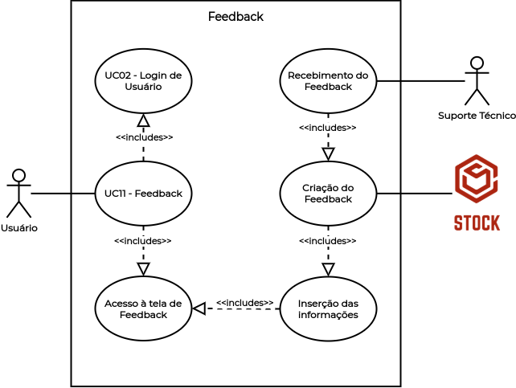

# UC11 - [Feedback](Modeling/verbo?id=feedback)

## Histórico de Revisões

| Data | Versão | Descrição | Autor(es) |
|:----:|:------:|:---------:|:---------:|
| 30/09/2020 | 1.0 | Criação do documento e template | Micaella Gouveia |
| 30/09/2020 | 1.1 | Adição da descrição, atores, pré-requisitos, fluxos e pós condição | Micaella Gouveia |
| 30/09/2020 | 1.2 | Linkagem dos léxicos | Micaella Gouveia |
| 02/10/2020 | 1.3 | Adição do diagrama | Micaella Gouveia |

## Diagrama - UC11
Diagrama produzido com a ferramenta a ferramenta [Draw.io](https://app.diagrams.net/). Ele é composto por:
* Atores
* Casos de uso
* Relacionamentos

<a href="https://unbarqdsw.github.io/2020.1_G12_Stock/assets/pdf/diagramas/casosUso/caso11.pdf">Arquivo em PDF</a>

## Descrição
O  [usuário](Modeling/objeto?id=usuário) deve poder enviar [feedbacks](Modeling/verbo?id=feedback) para o Suporte Técnico.

## Atores
* [Usuário](Modeling/objeto?id=usuário)
* Suporte Técnico

## Pré-requisitos
O  [usuário](Modeling/objeto?id=usuário) não deve estar na tela de [Feedback](Modeling/verbo?id=feedback).

## Fluxo de Eventos
### Fluxo Principal
1. O [usuário](Modeling/objeto?id=usuário) deve entrar no Stock com suas credenciais.
2. O [usuário](Modeling/objeto?id=usuário) deve entrar na tela de [Feedback](Modeling/verbo?id=feedback).
3. O [usuário](Modeling/objeto?id=usuário) deve selecionar o tipo de [feedback](Modeling/verbo?id=feedback).
4. O [usuário](Modeling/objeto?id=usuário) deve escrever seu [feedback](Modeling/verbo?id=feedback).
5. O [usuário](Modeling/objeto?id=usuário) deve selecionar o botão de "Enviar".
6. O Sistema mostrará uma mensagem de sucesso.
7. O Suporte Técnico receberá esse [feedback](Modeling/verbo?id=feedback).

### Fluxos Alternativos
*Não há fluxos alternativos*

### Fluxos de Exceção
* **FE01**: Campo de descrição do [feedback](Modeling/verbo?id=feedback) não preenchido.
    1. O [usuário](Modeling/objeto?id=usuário) deve entrar no Stock com suas credenciais.
    2. O [usuário](Modeling/objeto?id=usuário) deve entrar na tela de [Feedback](Modeling/verbo?id=feedback).
    3. O [usuário](Modeling/objeto?id=usuário) deve selecionar o tipo de [feedback](Modeling/verbo?id=feedback).
    4. O [usuário](Modeling/objeto?id=usuário) não preenche a descrição do [feedback](Modeling/verbo?id=feedback).
    5. O [usuário](Modeling/objeto?id=usuário) deve selecionar o botão de "Enviar".
    6. O Sistema alertará que há campos não preenchidos.

## Pós-condição

O [feedback](Modeling/verbo?id=feedback) será enviado para o Suporte Técnico, e caso precise, entrará em contato com o [Owner](Modeling/objeto?id=Owner) da empresa.

## Referências
* UML — Diagrama de Casos de Uso: <https://medium.com/operacionalti/uml-diagrama-de-casos-de-uso-29f4358ce4d5>. Último acesso em 01/10/2020.
