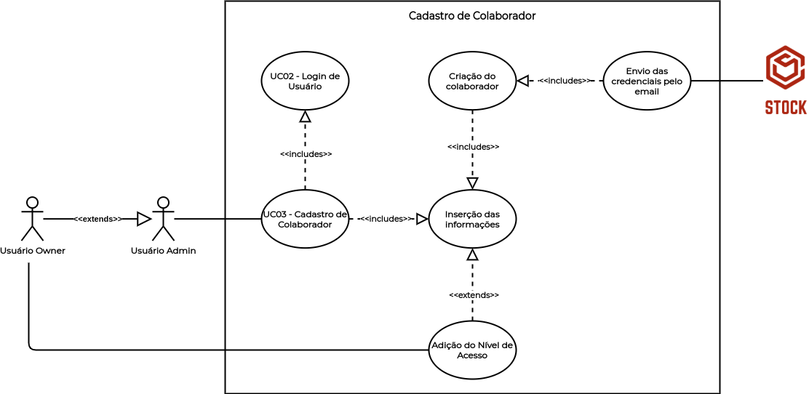

# UC03 - Cadastro de Colaborador

## Histórico de Revisões

| Data | Versão | Descrição | Autor(es) |
|:----:|:------:|:---------:|:---------:|
| 30/09/2020 | 1.0 | Criação do documento e template | Micaella Gouveia |
| 30/09/2020 | 1.1 | Adição da descrição, atores, pré-requisitos, fluxos e pós condição | Micaella Gouveia |
| 30/09/2020 | 1.2 | Linkagem dos léxicos | Micaella Gouveia |
| 01/10/2020 | 1.3 | Adição do diagrama | Micaella Gouveia |

## Diagrama - UC03
Diagrama produzido com a ferramenta a ferramenta [Draw.io](https://app.diagrams.net/). Ele é composto por:
* Atores
* Casos de uso
* Relacionamentos

## Descrição
1. O [usuário Owner](Modeling/objeto?id=Owner) deve cadastrar seus colaboradores, podendo ser [usuários Admins](Modeling/objeto?id=Admin) ou [usuários Sellers](Modeling/objeto?id=Seller).
2. O [usuário Admin](Modeling/objeto?id=Admin) deve cadastrar os colaboradores, sendo estes colaboradores [usuários Sellers](Modeling/objeto?id=Seller).

## Atores
* [Usuário Owner](Modeling/objeto?id=Owner)
* [Usuário Admin](Modeling/objeto?id=Admin)
* Sistema

## Pré-requisitos
O colaborador não deve estar cadastrado na aplicação.

## Fluxo de Eventos
### Fluxo Principal 1 (Usuário [Owner](Modeling/objeto?id=Owner))
1. O [usuário Owner](Modeling/objeto?id=Owner) deve entrar no Stock com suas credenciais.
2. O [usuário Owner](Modeling/objeto?id=Owner) deve acessar a tela de Colaboradores.
3. O [usuário Owner](Modeling/objeto?id=Owner) deve selecionar o botão "Adicionar Colaborador".
4. O [usuário Owner](Modeling/objeto?id=Owner) deve preencher as informações sobre o novo colaborador.
5. O [usuário Owner](Modeling/objeto?id=Owner) deve selecionar o tipo de colaborador.
6. O [usuário Owner](Modeling/objeto?id=Owner) deve selecionar o botão "Adicionar".
7. O Sistema enviará as credenciais do novo colaborador para o email cadastrado.
8. O colaborador passa a estar cadastrado na empresa.

### Fluxo Principal 2 (Usuário [Admin](Modeling/objeto?id=Admin))
1. O [usuário Admin](Modeling/objeto?id=Admin) deve entrar no Stock com suas credenciais.
2. O [usuário Admin](Modeling/objeto?id=Admin) deve acessar a tela de Colaboradores.
3. O [usuário Admin](Modeling/objeto?id=Admin) deve selecionar o botão "Adicionar Colaborador"
4. O [usuário Admin](Modeling/objeto?id=Admin) deve preencher as informações sobre o novo colaborador.
6. O [usuário Admin](Modeling/objeto?id=Admin) deve selecionar o botão "Adicionar".
7. O Sistema enviará as credenciais do novo colaborador [Seller](Modeling/objeto?id=Seller) para o email cadastrado.
8. O [usuário Seller](Modeling/objeto?id=Seller) passa a estar cadastrado na empresa.

### Fluxos Alternativos
* **FA01**: 
    1. O [usuário Owner](Modeling/objeto?id=Owner) deve entrar no Stock com suas credenciais.
    2. O [usuário Owner](Modeling/objeto?id=Owner) deve acessar a tela de Colaboradores.
    3. O [usuário Owner](Modeling/objeto?id=Owner) deve selecionar o botão "Adicionar Colaborador".
    4. O [usuário Owner](Modeling/objeto?id=Owner) deve preencher as informações sobre o novo colaborador.
    5. [O usuário Owner](Modeling/objeto?id=Owner) deve selecionar o tipo de colaborador.
    6. [O usuário Owner](Modeling/objeto?id=Owner) seleciona o colaborador como usuário [Admin](Modeling/objeto?id=Admin).
    6. O [usuário Owner](Modeling/objeto?id=Owner) deve selecionar o botão "Adicionar".
    7. O Sistema enviará as credenciais do novo [Admin](Modeling/objeto?id=Admin) para o email cadastrado.
    8. O [colaborador Admin](Modeling/objeto?id=Admin) passa a estar cadastrado na empresa.

* **FA02**: 
    1. O usuário [Owner](Modeling/objeto?id=Owner) deve entrar no Stock com suas credenciais.
    2. O usuário [Owner](Modeling/objeto?id=Owner) deve acessar a tela de Colaboradores.
    3. O usuário [Owner](Modeling/objeto?id=Owner) deve selecionar o botão "Adicionar Colaborador".
    4. O usuário [Owner](Modeling/objeto?id=Owner) deve preencher as informações sobre o novo colaborador.
    5. O usuário [Owner](Modeling/objeto?id=Owner) deve selecionar o tipo de colaborador.
    6. O usuário [Owner](Modeling/objeto?id=Owner) seleciona o colaborador como usuário [Admin](Modeling/objeto?id=Admin).
    6. O usuário [Owner](Modeling/objeto?id=Owner) deve selecionar o botão "Adicionar".
    7. O Sistema enviará as credenciais do novo [Seller](Modeling/objeto?id=Seller) para o email cadastrado.
    8. O colaborador [Seller](Modeling/objeto?id=Seller) passa a estar cadastrado na empresa.

### Fluxos de Exceção
* **FE01**: Colaborador já cadastrado
    1. O [usuário Owner](Modeling/objeto?id=Owner)/[Admin](Modeling/objeto?id=Admin) deve entrar no Stock com suas credenciais.
    2. O [usuário Owner](Modeling/objeto?id=Owner)/[Admin](Modeling/objeto?id=Admin) deve acessar a tela de Colaboradores.
    3. O [usuário Owner](Modeling/objeto?id=Owner)/[Admin](Modeling/objeto?id=Admin) deve selecionar o botão "Adicionar Colaborador".
    4. O [usuário Owner](Modeling/objeto?id=Owner)/[Admin](Modeling/objeto?id=Admin) deve preencher as informações sobre o novo colaborador.
    5. O [usuário Owner](Modeling/objeto?id=Owner)/[Admin](Modeling/objeto?id=Admin) deve selecionar o botão "Adicionar".
    6. O colaborador já está cadastrado.
    7. O Sistema mandará uma mensagem de aviso de colaborador já cadastrado.

## Pós-condição
O colaborador receberá suas credenciais por email e agora terá seu cadastro na aplicação e poderá acessar a sua conta no Stock.

## Referências
* UML — Diagrama de Casos de Uso: <https://medium.com/operacionalti/uml-diagrama-de-casos-de-uso-29f4358ce4d5>. Último acesso em 01/10/2020.