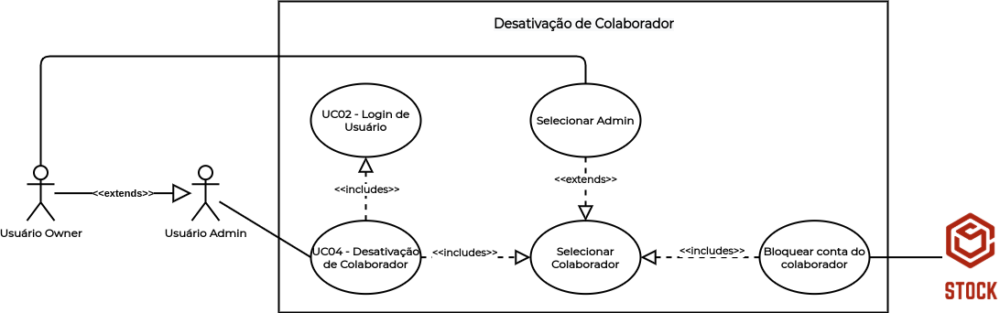

# UC04 - Desativação de Colaborador

## Histórico de Revisões

| Data | Versão | Descrição | Autor(es) |
|:----:|:------:|:---------:|:---------:|
| 30/09/2020 | 1.0 | Criação do documento e template | Micaella Gouveia |
| 30/09/2020 | 1.1 | Adição da descrição, atores, pré-requisitos, fluxos e pós condição | Micaella Gouveia |
| 30/09/2020 | 1.2 | Linkagem dos léxicos | Micaella Gouveia |
| 01/10/2020 | 1.3 | Adição do diagrama | Micaella Gouveia |

## Diagrama - UC04
Diagrama produzido com a ferramenta a ferramenta [Draw.io](https://app.diagrams.net/). Ele é composto por:
* Atores
* Casos de uso
* Relacionamentos

## Descrição
1. O [usuário Owner](Modeling/objeto?id=Owner) deve desativar o acesso de um colaborador, podendo ser [usuário Admin](Modeling/objeto?id=Admin) ou [usuário Seller](Modeling/objeto?id=Seller).
2. O [usuário Admin](Modeling/objeto?id=Admin) deve desativar o acesso de um colaborador, podendo ser [usuário Seller](Modeling/objeto?id=Seller)

## Atores
* [Usuário Owner](Modeling/objeto?id=Owner)
* [Usuário Admin](Modeling/objeto?id=Admin)
* [Usuários Seller](Modeling/objeto?id=Seller)
* Sistema

## Pré-requisitos
O colaborador deve estar ativado na aplicação.

## Fluxo de Eventos
### Fluxo Principal
1. O [usuário Owner](Modeling/objeto?id=Owner)/[Admin](Modeling/objeto?id=Admin) deve entrar no Stock com suas credenciais.
2. O [usuário Owner](Modeling/objeto?id=Owner)/[Admin](Modeling/objeto?id=Admin) deve acessar a tela de Colaboradores.
3. O [usuário Owner](Modeling/objeto?id=Owner)/[Admin](Modeling/objeto?id=Admin) deve encontrar o colaborador que deseja desativar.
4. O [usuário Owner](Modeling/objeto?id=Owner)/[Admin](Modeling/objeto?id=Admin) deve selecionar o botão "Desativar Colaborador".
5. O Sistema mandará uma mensagem de confirmação.
6. O [usuário Owner](Modeling/objeto?id=Owner)/[Admin](Modeling/objeto?id=Admin) deve selecionar o botão "Desativar".
7. O colaborador selecionado será desativado da empresa.

### Fluxos Alternativos
*Não existem fluxos alternativos*

### Fluxos de Exceção
* **FE01**: Colaborador já desativado
    1. O [usuário Owner](Modeling/objeto?id=Owner)/[Admin](Modeling/objeto?id=Admin) deve entrar no Stock com suas credenciais.
    2. O [usuário Owner](Modeling/objeto?id=Owner)/[Admin](Modeling/objeto?id=Admin) deve acessar a tela de Colaboradores.
    3. O [usuário Owner](Modeling/objeto?id=Owner)/[Admin](Modeling/objeto?id=Admin) deve encontrar o colaborador que deseja desativar.
    4. O colaborador já está desativado.

## Pós-condição
O colaborador desativado não poderá mais acessar sua conta no Stock.

## Referências
* UML — Diagrama de Casos de Uso: <https://medium.com/operacionalti/uml-diagrama-de-casos-de-uso-29f4358ce4d5>. Último acesso em 01/10/2020.