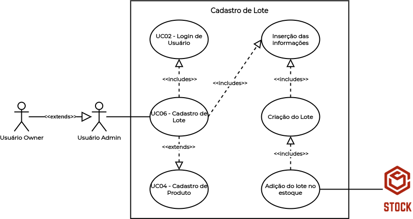

# UC06 - Cadastro de Lote

## Histórico de Revisões

| Data | Versão | Descrição | Autor(es) |
|:----:|:------:|:---------:|:---------:|
| 30/09/2020 | 1.0 | Criação do documento e template | Micaella Gouveia |
| 30/09/2020 | 1.1 | Adição da descrição, atores, pré-requisitos, fluxos e pós condição | Micaella Gouveia |
| 30/09/2020 | 1.2 | Linkagem dos léxicos | Micaella Gouveia |
| 01/10/2020 | 1.3 | Adição do diagrama | Micaella Gouveia |

## Diagrama - UC06
Diagrama produzido com a ferramenta a ferramenta [Draw.io](https://app.diagrams.net/). Ele é composto por:
* Atores
* Casos de uso
* Relacionamentos

## Descrição
O [usuário Owner](Modeling/objeto?id=Owner)/[Admin](Modeling/objeto?id=Admin) deve cadastrar lotes dos [produtos](Modeling/objeto?id=Produto) no [estoque](Modeling/objeto?id=Estoque).

## Atores
* [Usuário Owner](Modeling/objeto?id=Owner)
* [Usuário Admin](Modeling/objeto?id=Admin)
* Sistema

## Pré-requisitos
O produto não deve estar ter seu lote cadastrado no [estoque](Modeling/objeto?id=Estoque).

## Fluxo de Eventos
### Fluxo Principal
1. O [usuário Owner](Modeling/objeto?id=Owner)/[Admin](Modeling/objeto?id=Admin) deve entrar no Stock com suas credenciais.
2. O [usuário Owner](Modeling/objeto?id=Owner)/[Admin](Modeling/objeto?id=Admin) deve entrar na tela de [Estoque](Modeling/objeto?id=Estoque).
3. O [usuário Owner](Modeling/objeto?id=Owner)/[Admin](Modeling/objeto?id=Admin) deve selecionar o botão "Novo [Produto](Modeling/objeto?id=Produto)".
4. O [usuário Owner](Modeling/objeto?id=Owner)/[Admin](Modeling/objeto?id=Admin) deve selecionar o botão de "Definir Lote".
5. O [usuário Owner](Modeling/objeto?id=Owner)/[Admin](Modeling/objeto?id=Admin) deve preencher as informações do lote do produto.
6. O [usuário Owner](Modeling/objeto?id=Owner)/[Admin](Modeling/objeto?id=Admin) deve preencher as outras informações sobre o [produto](Modeling/objeto?id=Produto).
7. O [usuário Owner](Modeling/objeto?id=Owner)/[Admin](Modeling/objeto?id=Admin) deverá selecionar o botão "Adicionar".
8. O [produto](Modeling/objeto?id=Produto) será cadastrado com o seu lote cadastrado.

### Fluxos Alternativos
* **FA01**:
    1. O [usuário Owner](Modeling/objeto?id=Owner)/[Admin](Modeling/objeto?id=Admin) deve entrar no Stock com suas credenciais.
    2. O [usuário Owner](Modeling/objeto?id=Owner)/[Admin](Modeling/objeto?id=Admin) deve entrar na tela de [Estoque](Modeling/objeto?id=Estoque).
    3. O [usuário Owner](Modeling/objeto?id=Owner)/[Admin](Modeling/objeto?id=Admin) deve selecionar um [produto](Modeling/objeto?id=Produto) específico que não possua lote cadastrado.
    4. O [usuário Owner](Modeling/objeto?id=Owner)/[Admin](Modeling/objeto?id=Admin) deve selecionar o botão de "Editar Produto".
    4. O [usuário Owner](Modeling/objeto?id=Owner)/[Admin](Modeling/objeto?id=Admin) deve selecionar o botão de "Definir Lote".
    5. O [usuário Owner](Modeling/objeto?id=Owner)/[Admin](Modeling/objeto?id=Admin) deve preencher as informações do lote do produto.
    6. O [usuário Owner](Modeling/objeto?id=Owner)/[Admin](Modeling/objeto?id=Admin) deve preencher as outras informações sobre o [produto](Modeling/objeto?id=Produto).
    7. O [usuário Owner](Modeling/objeto?id=Owner)/[Admin](Modeling/objeto?id=Admin) deverá selecionar o botão "Adicionar".
    8. O [produto](Modeling/objeto?id=Produto) será atualizado com o seu lote cadastrado.
### Fluxos de Exceção
* **FE01**: Produto com lote já cadastrado
    1. O [usuário Owner](Modeling/objeto?id=Owner)/[Admin](Modeling/objeto?id=Admin) deve entrar no Stock com suas credenciais.
    2. O [usuário Owner](Modeling/objeto?id=Owner)/[Admin](Modeling/objeto?id=Admin) deve entrar na tela de [Estoque](Modeling/objeto?id=Estoque).
    3. O [usuário Owner](Modeling/objeto?id=Owner)/[Admin](Modeling/objeto?id=Admin) deve selecionar um [produto](Modeling/objeto?id=Produto).
    4. O [usuário Owner](Modeling/objeto?id=Owner)/[Admin](Modeling/objeto?id=Admin) deve selecionar o botão de "Editar Produto".
    4. O [usuário Owner](Modeling/objeto?id=Owner)/[Admin](Modeling/objeto?id=Admin) deve selecionar o botão de "Definir Lote".
    5. O [produto](Modeling/objeto?id=Produto) já possui lote cadastrado.
    6. O Sistema mandará uma mensagem de lote já cadastrado e se o usuário [Owner](Modeling/objeto?id=Owner)/[Admin](Modeling/objeto?id=Admin) deseja modificá-lo.
    7. O [usuário Owner](Modeling/objeto?id=Owner)/[Admin](Modeling/objeto?id=Admin) deve atualizar o lote ou sair da aba de "Definir Lote".

## Pós-condição
 A [produto](Modeling/objeto?id=Produto) possuirá um lote cadastrado.

## Referências
* UML — Diagrama de Casos de Uso: <https://medium.com/operacionalti/uml-diagrama-de-casos-de-uso-29f4358ce4d5>. Último acesso em 01/10/2020.