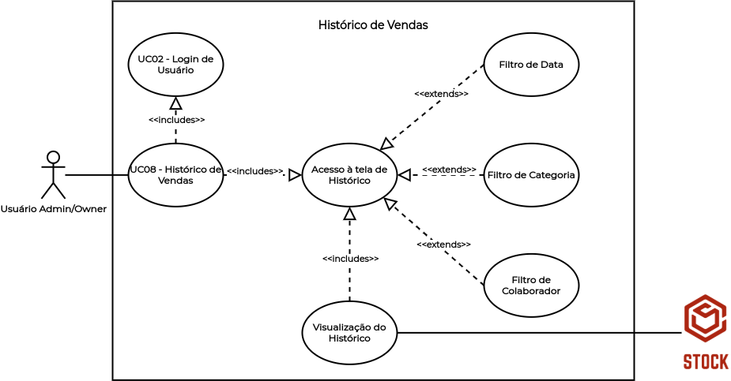
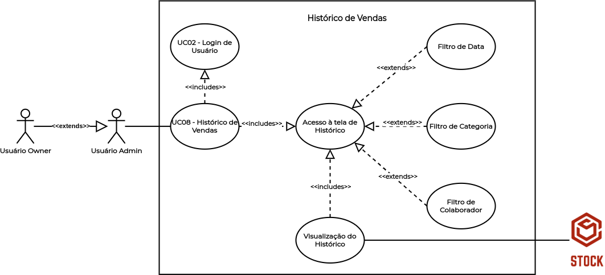

# UC08 - Histórico de Vendas

## Histórico de Revisões

| Data | Versão | Descrição | Autor(es) |
|:----:|:------:|:---------:|:---------:|
| 30/09/2020 | 1.0 | Criação do documento e template | Micaella Gouveia |
| 30/09/2020 | 1.1 | Adição da descrição, atores, pré-requisitos, fluxos e pós condição | Micaella Gouveia |
| 30/09/2020 | 1.2 | Linkagem dos léxicos | Micaella Gouveia |
| 01/10/2020 | 1.3 | Adição do diagrama | Micaella Gouveia |
| 24/10/2020 | 1.4 | Atualização do diagrama conforme padrões implementados (Diagrama V.1)| Micaella Gouveia e Sofia Patrocínio|

## Diagrama - UC08
Diagrama produzido com a ferramenta a ferramenta [Draw.io](https://app.diagrams.net/). Ele é composto por:
* Atores
* Casos de uso
* Relacionamentos

### Diagrama (V.1)

<a href="https://unbarqdsw.github.io/2020.1_G12_Stock/assets/pdf/diagramas/casosUso/v1/caso8V1.pdf">Arquivo em PDF</a>

### Diagrama (V.0)

<a href="https://unbarqdsw.github.io/2020.1_G12_Stock/assets/pdf/diagramas/casosUso/caso8.pdf">Arquivo em PDF</a>

## Descrição
O [usuário Owner](Modeling/objeto?id=Owner)/[Admin](Modeling/objeto?id=Admin) deve poder visualizar o histórico de vendas.

## Atores
* [Usuário Owner](Modeling/objeto?id=Owner)
* [Usuário Admin](Modeling/objeto?id=Admin)
* Sistema

## Pré-requisitos
O [usuário Owner](Modeling/objeto?id=Owner)/[Admin](Modeling/objeto?id=Admin) não deve estar na tela de Histórico ou no Painel de Controle.

## Fluxo de Eventos
### Fluxo Principal
1. O [usuário Owner](Modeling/objeto?id=Owner)/[Admin](Modeling/objeto?id=Admin) deve entrar no Stock com suas credenciais.
2. O [usuário Owner](Modeling/objeto?id=Owner)/[Admin](Modeling/objeto?id=Admin) deve entrar na tela de Histórico.
3. O Sistema disponibilizará o histórico de vendas da empresa.
4. O [usuário Owner](Modeling/objeto?id=Owner)/[Admin](Modeling/objeto?id=Admin) deve poder filtrar sua busca por data, colaborador e categoria.

### Fluxos Alternativos
* **FA01**:
    1. O [usuário Owner](Modeling/objeto?id=Owner)/[Admin](Modeling/objeto?id=Admin) deve entrar no Stock com suas credenciais.
    2. O [usuário Owner](Modeling/objeto?id=Owner)/[Admin](Modeling/objeto?id=Admin) deve entrar na tela de Painel de Controle.
    3. O Sistema disponibilizará o fluxo de saída de [produtos](Modeling/objeto?id=Produto).
    4. O [usuário Owner](Modeling/objeto?id=Owner)/[Admin](Modeling/objeto?id=Admin) deve poder filtrar esse fluxo por data e colaborador.
* **FA02**:
    1. O [usuário Owner](Modeling/objeto?id=Owner)/[Admin](Modeling/objeto?id=Admin) deve entrar no Stock com suas credenciais.
    2. O [usuário Owner](Modeling/objeto?id=Owner)/[Admin](Modeling/objeto?id=Admin) deve entrar na tela de Painel de Controle.
    3. O Sistema disponibilizará a relação de vendas durante a semana.
    4. O [usuário Owner](Modeling/objeto?id=Owner)/[Admin](Modeling/objeto?id=Admin) deve poder visualizar as vendas durante a semana.

### Fluxos de Exceção
* **FE01**: Nenhum [produto](Modeling/objeto?id=Produto) foi vendido
    1. O [usuário Owner](Modeling/objeto?id=Owner)/[Admin](Modeling/objeto?id=Admin) deve entrar no Stock com suas credenciais.
    2. O [usuário Owner](Modeling/objeto?id=Owner)/[Admin](Modeling/objeto?id=Admin) deve entrar na tela de Histórico ou o Painel de Controle.
    3. Nenhum [produto](Modeling/objeto?id=Produto) foi vendido.
    4. O Sistema mostrará uma mensagem de histórico vazio.

## Pós-condição
O usuário [Owner](Modeling/objeto?id=Owner)/[Admin](Modeling/objeto?id=Admin) poderá visualizar seu histórico de vendas.

## Referências
* UML — Diagrama de Casos de Uso: <https://medium.com/operacionalti/uml-diagrama-de-casos-de-uso-29f4358ce4d5>. Último acesso em 01/10/2020.