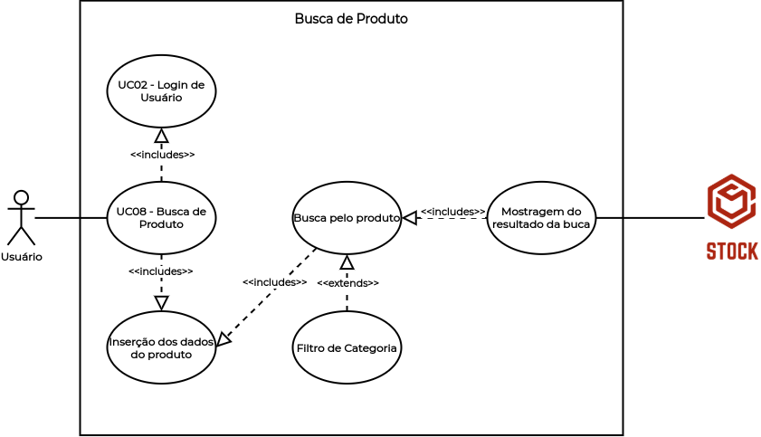

# UC09 - Busca de Produto

## Histórico de Revisões

| Data | Versão | Descrição | Autor(es) |
|:----:|:------:|:---------:|:---------:|
| 30/09/2020 | 1.0 | Criação do documento e template | Micaella Gouveia |
| 30/09/2020 | 1.1 | Adição da descrição, atores, pré-requisitos, fluxos e pós condição | Micaella Gouveia |
| 30/09/2020 | 1.2 | Linkagem dos léxicos | Micaella Gouveia |
| 01/10/2020 | 1.3 | Adição do diagrama | Micaella Gouveia |

## Diagrama - UC09
Diagrama produzido com a ferramenta a ferramenta [Draw.io](https://app.diagrams.net/). Ele é composto por:
* Atores
* Casos de uso
* Relacionamentos

## Descrição
O [usuário](Modeling/objeto?id=usuário) deve encontrar um [produto](Modeling/objeto?id=Produto) específico.

## Atores
* [Usuário](Modeling/objeto?id=usuário)
* Sistema

## Pré-requisitos
O [produto](Modeling/objeto?id=Produto) não deve estar disponponível para visualização.

## Fluxo de Eventos
### Fluxo Principal
1. O [usuário](Modeling/objeto?id=usuário) deve entrar no Stock com suas credenciais.
2. O [usuário](Modeling/objeto?id=usuário) deve entrar na tela de [Estoque](Modeling/objeto?id=Estoque).
3. O [usuário](Modeling/objeto?id=usuário) deve fazer uma busca pelo [produto](Modeling/objeto?id=Produto) desejado.
4. O [produto](Modeling/objeto?id=Produto) será disponibilizado.
5. O [usuário](Modeling/objeto?id=usuário) poderá ver as informações sobre este [produto](Modeling/objeto?id=Produto) específico.

### Fluxos Alternativos
* **FA01**:
    1. O [usuário](Modeling/objeto?id=usuário) deve entrar no Stock com suas credenciais.
    2. O [usuário](Modeling/objeto?id=usuário) deve entrar na tela de [Estoque](Modeling/objeto?id=Estoque).
    3. O [usuário](Modeling/objeto?id=usuário) deve filtrar sua busca pela categoria desejada.
    4. Os [produtos](Modeling/objeto?id=Produto) da categoria selecionada serão disponibilizados.
    5. O [usuário](Modeling/objeto?id=usuário) poderá selecionar o [produto](Modeling/objeto?id=Produto) específico.
    6. O [usuário](Modeling/objeto?id=usuário) poderá ver as informações sobre este [produto](Modeling/objeto?id=Produto) específico.

### Fluxos de Exceção
* **FE01**: Produto indisponível
    1. O [usuário](Modeling/objeto?id=usuário) deve entrar no Stock.
    2. O [usuário](Modeling/objeto?id=usuário) deve entrar na tela de [Estoque](Modeling/objeto?id=Estoque).
    3. O [usuário](Modeling/objeto?id=usuário) deve fazer uma busca pelo [produto](Modeling/objeto?id=Produto) desejado.
    6. O [produto](Modeling/objeto?id=Produto) se encontra indiponível.
    7. O Sistema mostrará mensagem de [produto](Modeling/objeto?id=Produto) indisponível.

* **FE02**: Produto não cadastrado
    1. O [usuário](Modeling/objeto?id=usuário) deve entrar no Stock.
    2. O [usuário](Modeling/objeto?id=usuário) deve entrar na tela de [Estoque](Modeling/objeto?id=Estoque).
    3. O [usuário](Modeling/objeto?id=usuário) deve fazer uma busca pelo [produto](Modeling/objeto?id=Produto) desejado.
    6. O [produto](Modeling/objeto?id=Produto) não foi cadastrado.
    7. O Sistema não retornará o [produto](Modeling/objeto?id=Produto) na busca feita.

## Pós-condição
O [usuário](Modeling/objeto?id=usuário) poderá visulizar informações sobre o [produto](Modeling/objeto?id=Produto) encontrado.

## Referências
* UML — Diagrama de Casos de Uso: <https://medium.com/operacionalti/uml-diagrama-de-casos-de-uso-29f4358ce4d5>. Último acesso em 01/10/2020.