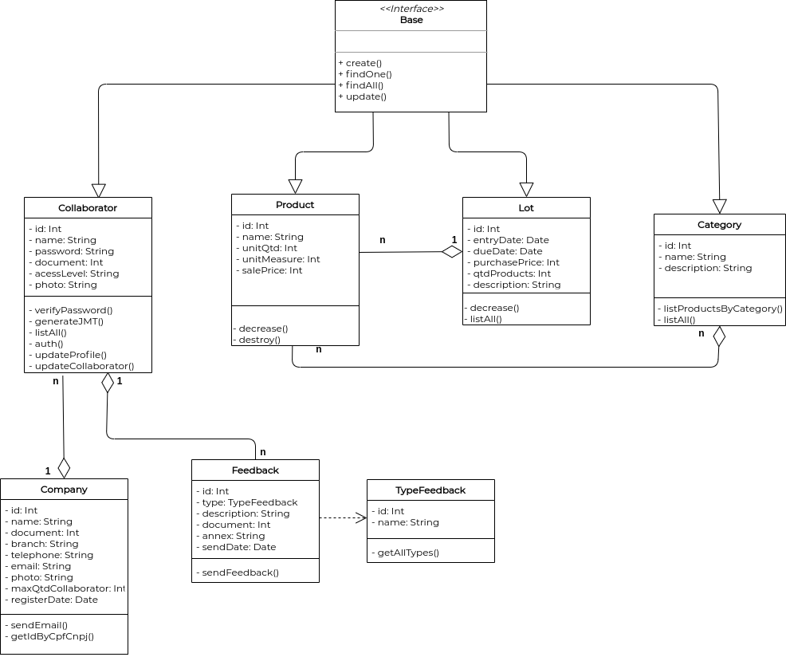
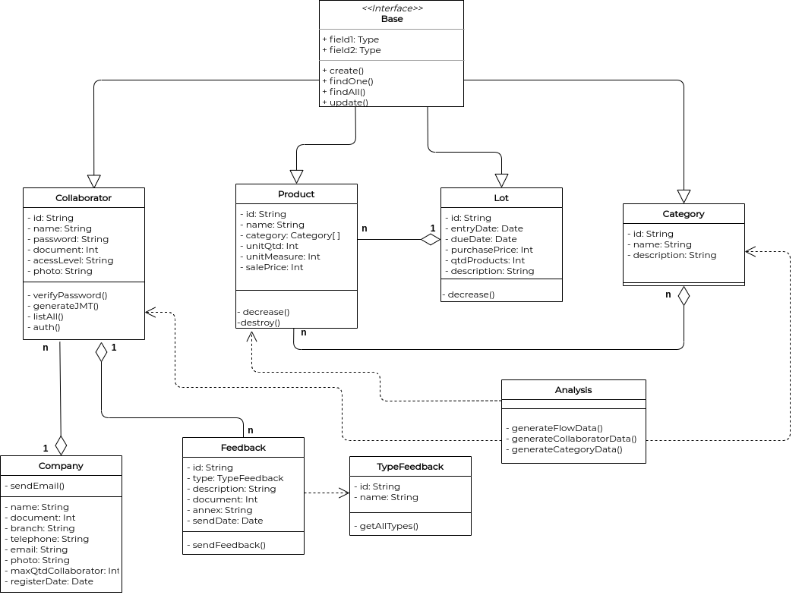
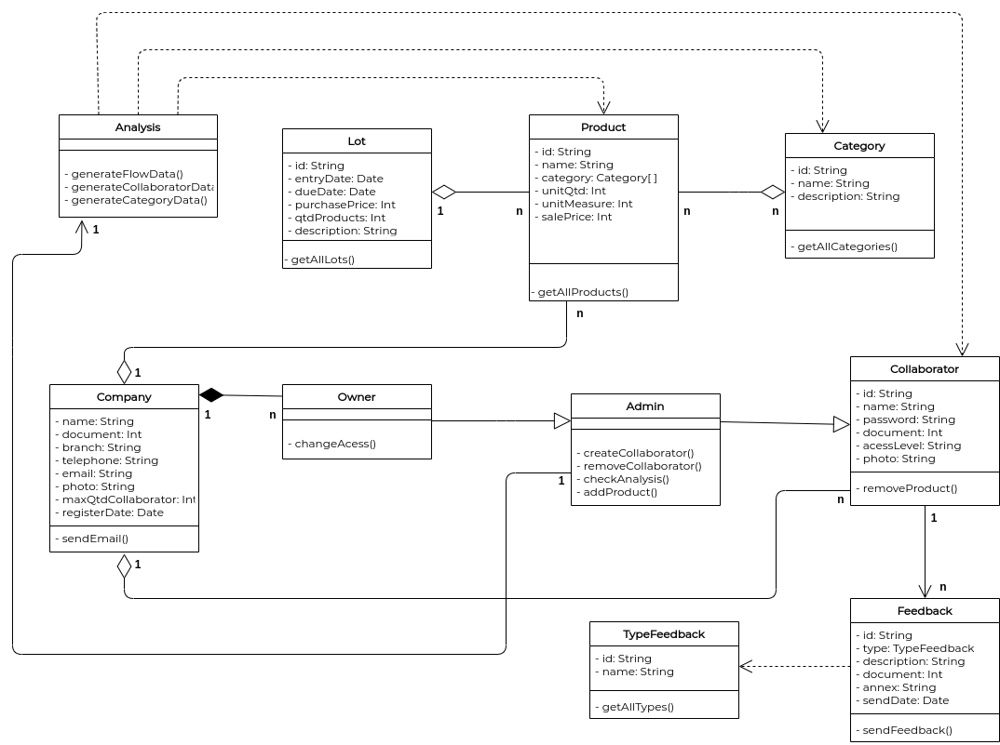
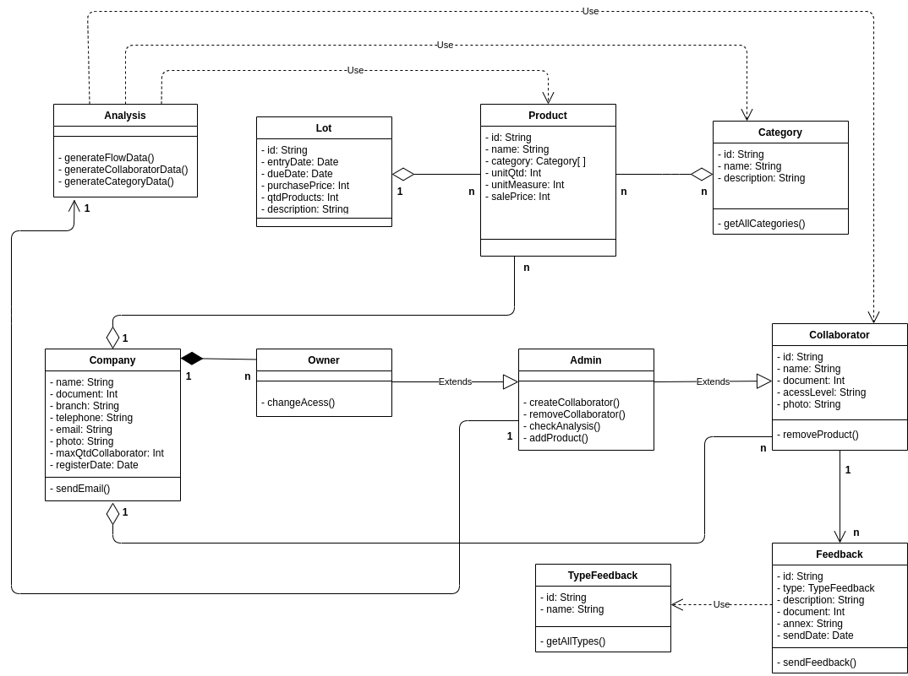

# Diagrama de Classes
**Este artefato foi produzido durante o dia 1 da Diagrams Sprint, para saber mais sobre a metodologia e como ela foi feita, clique aqui: _[Diagrams Sprint](Modeling/Diagrams/Diagrams.md)_**

Diagramas de classes tem como principal objetivo mapear de forma clara a estrutura de um sistema, modelando suas classes, atributos, métodos, operações e relações entre objetos. Este diagrama auxilia no entendimento da visão geral dos esquemas da aplicação, expressa visualmente as necessidades específicas do sistema, além de ilustrar modelos de dados independente de sua complexidade.

## Histórico de Revisões
| Data | Versão | Descrição | Autor(es) |
|:----:|:------:|:---------:|:---------:|
| 22/09/2020 | 1.0 | Criação das classes e seus atributos | Gabriel Alves, Gabriel Davi, Micaella Gouviea, Pedro Igor e Sofia Patrocínio |
| 22/09/2020 | 1.1 | Criação do diagrama de classe | Micaella Gouveia |
| 24/09/2020 | 1.2 | Adição da introdução, realização, arquivo PDF e referências | Micaella Gouveia |
| 25/09/2020 | 1.3 | Atualização do diagrama de classes conforme [feedback](Modeling/verbo?id=feedback) da professora Milene (Diagrama V.1) | Micaella Gouveia |
| 27/09/2020 | 1.4 | Adição do áudio explicativo | Micaella Gouveia |
| 15/10/2020 | 1.5 | Correção da relação entre Collaborator e Feedback (Diagrama V.2) - Correção feita pela professora Milene na Entrega 2 | Micaella Gouveia |
| 24/10/2020 | 1.6 | Atualização do diagrama conforme padrões implementados (Diagrama V.3)| Micaella Gouveia e Sofia Patrocínio |
| 19/11/2020 | 1.6 | Atualização do diagrama conforme padrões arquiteturais definidos (Diagrama V.4)| Micaella Gouveia |

## Realização
O diagrama foi produzido pelo [Draw.io](https://app.diagrams.net/). Nele há todas as classes do nosso sistema, contendo seus atributos e métodos, sendo ocultados métodos de Setter e Getter, além dos seus relacionamentos e cardinalidade.

## Diagramas

* **Diagrama de Classes (V.4)**

<a href="https://unbarqdsw.github.io/2020.1_G12_Stock/assets/pdf/diagramas/classe/DiagramaClassesV4.pdf">Arquivo em PDF</a>

* **Diagrama de Classes (V.3)**

<a href="https://unbarqdsw.github.io/2020.1_G12_Stock/assets/pdf/diagramas/classe/DiagramaClassesV3.pdf">Arquivo em PDF</a>

* **Diagrama de Classes (V.2)**

<a href="https://unbarqdsw.github.io/2020.1_G12_Stock/assets/pdf/diagramas/classe/DiagramaClassesV2.pdf">Arquivo em PDF</a>
<audio controls>
  <source src="https://unbarqdsw.github.io/2020.1_G12_Stock/assets/audios/diagramas/DiagramaClasse.m4a" type="audio/mpeg">
</audio>

* **Diagrama de Classes (V.1)**

<a href="https://unbarqdsw.github.io/2020.1_G12_Stock/assets/pdf/diagramas/classe/DiagramaClassesV1.pdf">Arquivo em PDF</a>

* **Diagrama de Classes (V.0)**

<a href="https://unbarqdsw.github.io/2020.1_G12_Stock/assets/pdf/diagramas/classe/DiagramaClassesV0.pdf">Arquivo em PDF</a>

## Referências
* O que é um diagrama de classe UML: <https://www.lucidchart.com/pages/pt/o-que-e-diagrama-de-classe-uml#section_1>. Último acesso em 24/09/2020.
* UML Diagrams: <https://www.uml-diagrams.org>. Último acesso em 24/09/2020.
