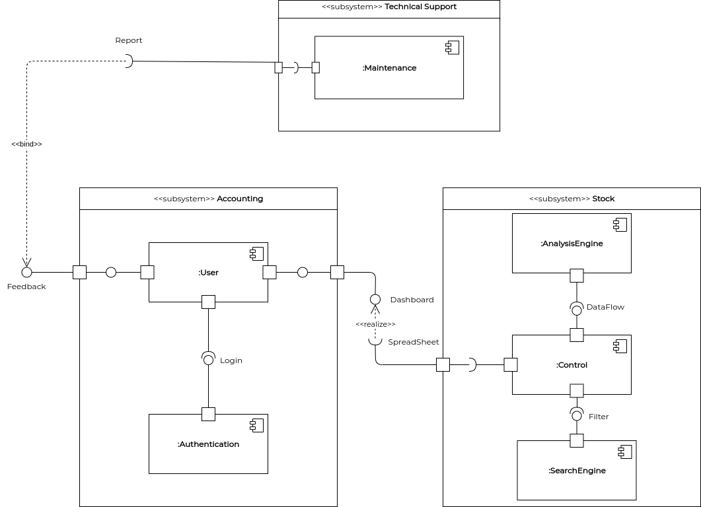
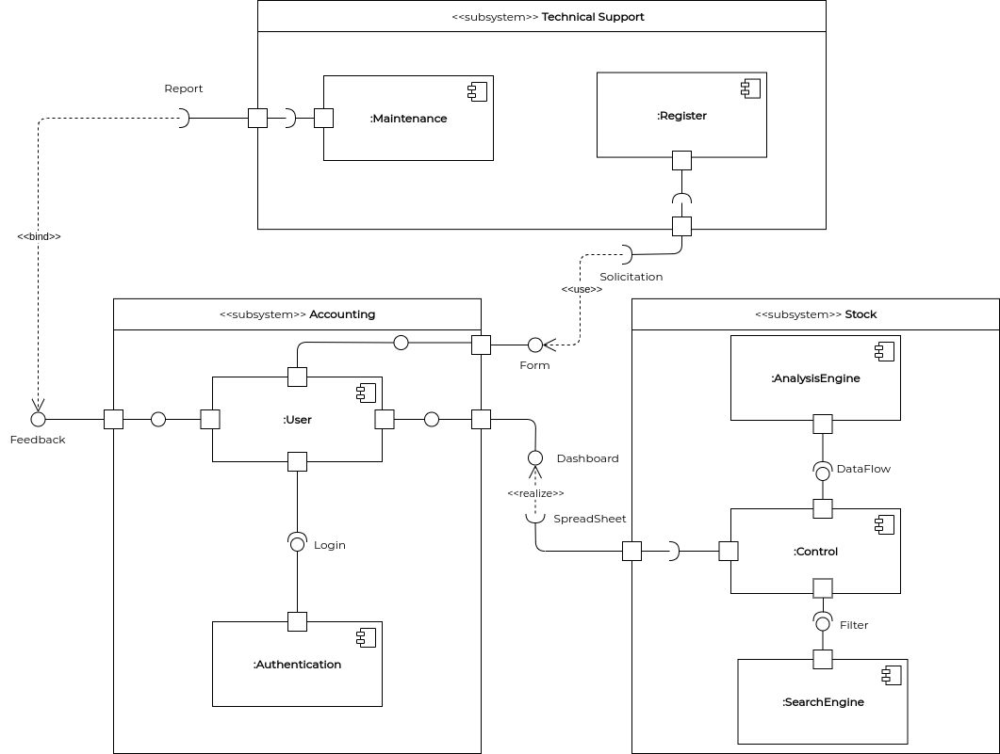
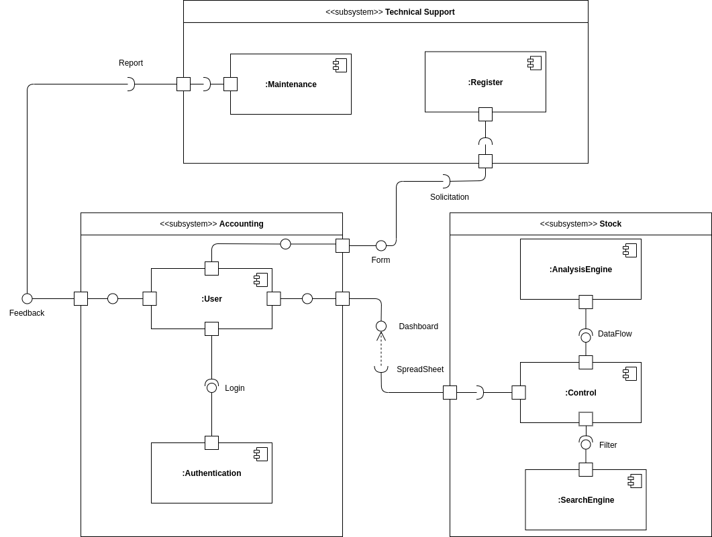

# Diagrama de Componentes
**Este artefato foi produzido durante o dia 1 da Diagrams Sprint, para saber mais sobre a metodologia e como ela foi feita, clique aqui: _[Diagrams Sprint](Modeling/Diagrams/Diagrams.md)_**

O Diagrama de Componentes tem como principal objetivo mostrar o relacionamento entre diferentes componentes de um sistema, sendo componente um módulo de classes que representa sistemas ou subsistemas independentes com capacidade de interagir com o restante do sistema. Seus principais benefícios são a atenção que a equipe prestará ao comportamento do serviço quanto à interface, além de imaginar a estrutura física do sistema, prestando atenção aos componentes do sistema e como eles se relacionam.

## Histórico de Revisões
| Data | Versão | Descrição | Autor(es) |
|:----:|:------:|:---------:|:---------:|
| 22/09/2020 | 1.0 | Criação dos módulos e possíveis interfaces | Gabriel Alves, Gabriel Davi, Micaella Gouviea, Pedro Igor e Sofia Patrocínio |
| 23/09/2020 | 1.1 | Criação do diagrama de componentes | Micaella Gouveia |
| 24/09/2020 | 1.2 | Adição da introdução, realização, arquivo PDF e referências | Micaella Gouveia |
| 25/09/2020 | 1.3 | Atualização do diagrama de componentes conforme [feedback](Modeling/verbo?id=feedback) da professora Milene (Diagrama V.1)| Micaella Gouveia |
| 27/09/2020 | 1.4 | Adição do áudio explicativo | Micaella Gouveia |
| 15/10/2020 | 1.5 | Especificação das relações de depedências entre os componentes de diferentes subsistemas (Diagrama V.2) - Correção feita pela professora Milene na Entrega 2 | Micaella Gouveia |
| 24/10/2020 | 1.6 | Atualização do diagrama conforme padrões implementados (Diagrama V.3)| Micaella Gouveia e Sofia Patrocínio|

## Realização
O diagrama foi produzido pelo [Draw.io](https://app.diagrams.net/). Nele há todas os subsistemas contendo seus componentes, fazendo a relação entre os componentes com suas devidas interfaces.

## Diagrama

* **Diagrama de Componentes(V.3)**

<a href="https://unbarqdsw.github.io/2020.1_G12_Stock/assets/pdf/diagramas/componentes/DiagramaComponentesV2.pdf">Arquivo em PDF</a>

* **Diagrama de Componentes(V.2)**

<a href="https://unbarqdsw.github.io/2020.1_G12_Stock/assets/pdf/diagramas/componentes/DiagramaComponentesV2.pdf">Arquivo em PDF</a>

<audio controls>
  <source src="https://unbarqdsw.github.io/2020.1_G12_Stock/assets/audios/diagramas/DiagramaComponentes.m4a" type="audio/mpeg">
</audio>

* **Diagrama de Componentes(V.1)**

<a href="https://unbarqdsw.github.io/2020.1_G12_Stock/assets/pdf/diagramas/componentes/DiagramaComponentesV1.pdf">Arquivo em PDF</a>

* **Diagrama de Componentes(V.0)**

<a href="https://unbarqdsw.github.io/2020.1_G12_Stock/assets/pdf/diagramas/componentes/DiagramaComponentesV0.pdf">Arquivo em PDF</a>

## Referências
* Diagrama de componentes UML: <https://www.lucidchart.com/pages/pt/diagrama-de-componentes-uml>. Último acesso em 24/09/2020.
* UML Diagrams: <https://www.uml-diagrams.org>. Último acesso em 24/09/2020.