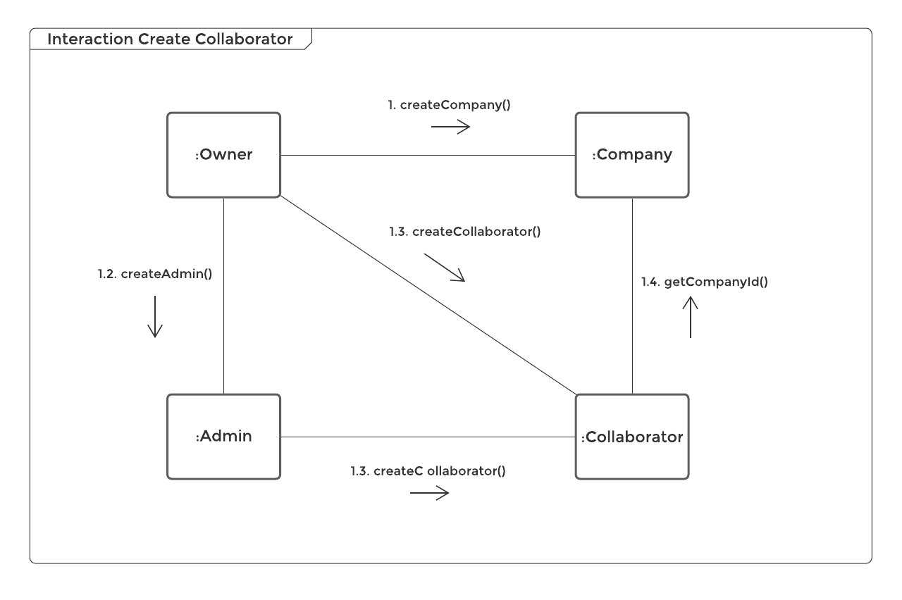
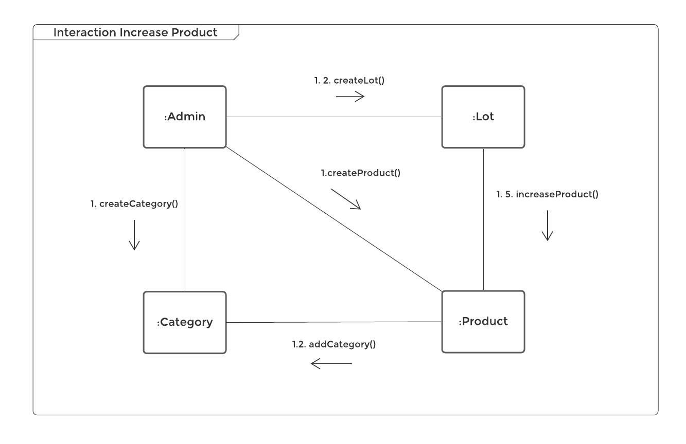
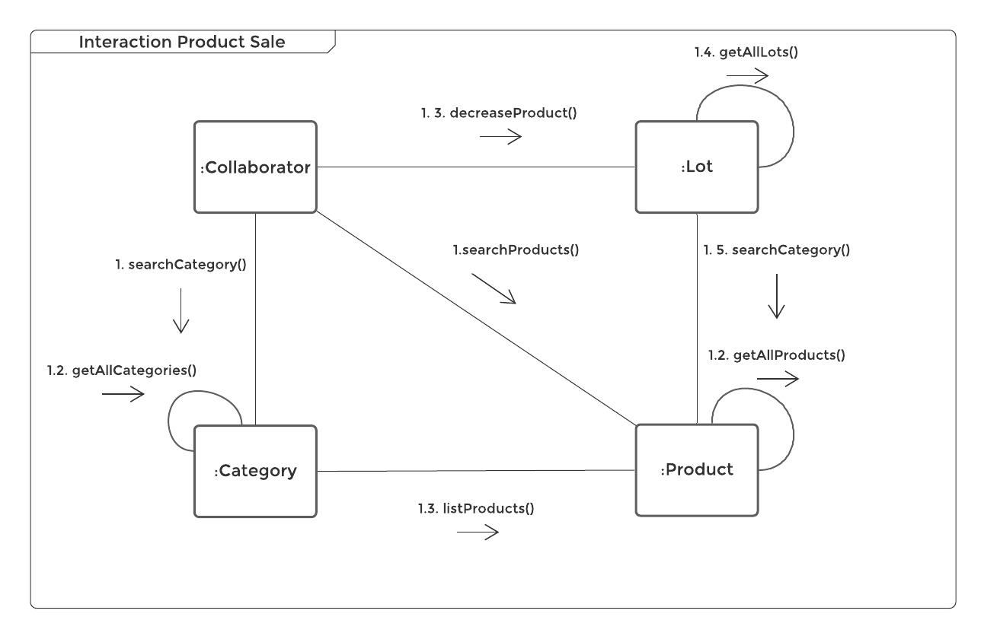
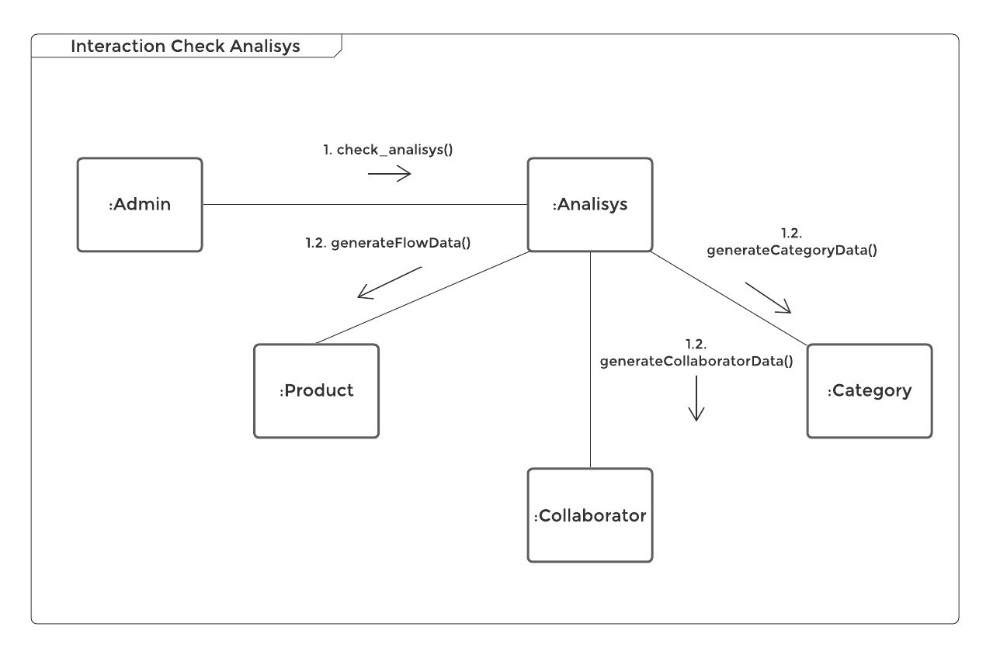
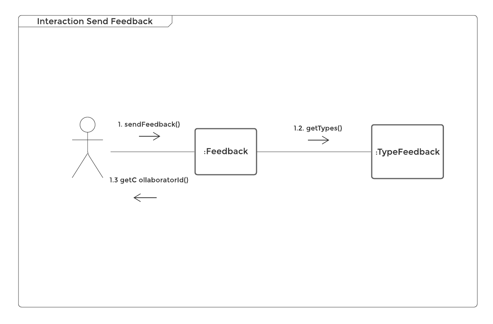

# Diagrama de Comunicação
**Este artefato foi produzido durante o dia 4 da Diagrams Sprint, para saber mais sobre a metodologia e como ela foi feita, clique aqui: _[Diagrams Sprint](Modeling/Diagrams/Diagrams.md)_**

Também conhecido como diagrama de colaboração, o diagrama de comunicação mostra os objetos e as mensagens trocadas entre eles e enfatiza a ordem estrutural das mensagens em um arranjo de forma livre. É equivalente ao diagrama de sequência.

## Histórico de Revisões
| Data | Versão | Descrição | Autor(es) |
|:----:|:------:|:---------:|:---------:|
| 24/09/2020 | 1.0 | Adição da explicação sobre diagrama de comunicação | Sofia Patrocínio |
| 25/09/2020 | 1.1 | Criação das relações entre classes | Gabriel Davi, Micaella Gouviea, Pedro Igor e Sofia Patrocínio |
| 26/09/2020 | 1.2 | Criação dos diagramas | Sofia Patrocínio |

## Realização
O diagrama foi produzido pelo [LucidChart](https://www.lucidchart.com/). Nele há quadro, objetos, linhas de vida e setas na direção da comunicação, bem como mensagens trocadas.

## Diagramas

* **Criação de Colaborador**

<a href="https://unbarqdsw.github.io/2020.1_G12_Stock/assets/pdf/diagramas/CreateCollaborator.pdf">Arquivo em PDF</a>

* **Adição de Produto ao Estoque**

<a href="https://unbarqdsw.github.io/2020.1_G12_Stock/assets/pdf/diagramas/IncreaseProduct.pdf">Arquivo em PDF</a>

* **Venda de Produto**

<a href="https://unbarqdsw.github.io/2020.1_G12_Stock/assets/pdf/diagramas/ProductSale.pdf">Arquivo em PDF</a>

* **Visualização de Gráficos**

<a href="https://unbarqdsw.github.io/2020.1_G12_Stock/assets/pdf/diagramas/CheckAnalisys.pdf">Arquivo em PDF</a>

* **Envio de Feedback**

<a href="https://unbarqdsw.github.io/2020.1_G12_Stock/assets/pdf/diagramas/SendFeedback.pdf">Arquivo em PDF</a>

## Referências
- ENGENHARIA DE SOFTWARE Prof. Ricardo Rodrigues Barcelar MODELAGEM DE SISTEMAS ORIENTADA A OBJETOS COM UML. Disponível em: <https://docplayer.com.br/7303694-Engenharia-de-software-prof-ricardo-rodrigues-barcelar-http-www-ricardobarcelar-com-br.html>. Último acesso em 23/09/2020.
- Activity Diagrams. Disponível em: <https://www.uml-diagrams.org/communication-diagrams.html>. Último acesso em 23/09/2020.