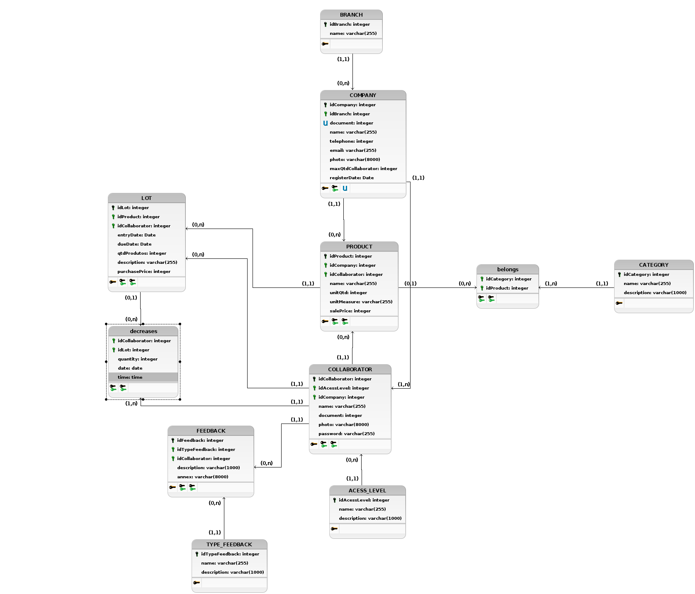

# Diagrama Entidade Relacionamento
**Este artefato foi produzido durante o dia 2 da Diagrams Sprint, para saber mais sobre a metodologia e como ela foi feita, clique aqui: _[Diagrams Sprint](Modeling/Diagrams/Diagrams.md)_**

O Modelo Entidade Relacionamento tem por finalidade modelar todo o banco de dados do sistema com suas respectivas tabelas e relacionamentos. Esse documento é composto por um MER (Modelo Entidade Relacionamento), DER (Diagrama Entidade Relacionamento), DL (Diagrama Lógico) e o seu respectivo Dicionário de Dados.

## Histórico de Revisões
| Data | Versão | Descrição | Autor(es) |
|:----:|:------:|:---------:|:---------:|
| 23/09/2020 | 1.0 | Criação das entidades e seus atributos | Gabriel Alves, Gabriel Davi, Micaella Gouveia, Pedro Igor e Sofia Patrocínio |
| 25/09/2020 | 1.1 | Criação dos diagramas relacionamento e lógico | Gabriel Alves |
| 25/09/2020 | 1.2 | Correção de alguns erros de digitação e linkagem do documento a navbar | Pedro Igor |
| 25/09/2020 | 1.3 | Atualização dos diagramas. | Pedro Igor |

## Modelo Entidade Relacionamento (MER)

### Entidades

**COMPANY** (<ins>document</ins>, name, telephone, email, photo, maxQtdCollaborator, registerDate)

**BRANCH** (<ins>idBranch</ins>, name)

**PRODUCT** (<ins>idProduct</ins>, name, unitQt, unitMeasure, salePrice)

**LOT** (<ins>idLot</ins>, entryDate, dueDate, productsQt, description, purchasePrice)

**CATEGORY** (<ins>idCategory</ins>, name, description)

**COLLABORATOR** (<ins>idCollaborator</ins>, name, document, acessLevel, photo, password)

**FEEDBACK** (<ins>idFeedback</ins>, type, description, document, annex)

**TYPE_FEEDBACK** (<ins>idTypeFeedback</ins>, name)

**decreases** (<ins>date</ins>, <ins>time</ins>, <ins>idCollaborator</ins>, <ins>idLot</ins>, quantity)

### Relacionamentos

**COMPANY** - stocks - **PRODUCT** 
Uma COMPANY pode estocar nenhum ou vários PRODUCTS e um PRODUCT pode ser estocado por uma e no máximo uma COMPANY.  
**Cardinalidade -> 1:n**

**COMPANY** - belongs - **BRANCH** 
Uma COMPANY pertence a uma e somente uma BRANCH e uma BRANCH pode possuir nenhuma ou várias COMPANYS. 
**Cardinalidade -> n:1**

**COMPANY** - has - **COLLABORATOR** 
Uma COMPANY possui um ou vários COLLABORATOR e um COLLABORATOR pertence a uma e somente uma COMPANY. 
**Cardinalidade -> 1:n**

**LOT** - composes - **PRODUCT** 
Um LOT pode compor um e no máximo um PRODUCT e um PRODUCT pode ser composto por nenhum ou vários LOTs. 
**Cardinalidade -> n:1**

**PRODUCT** - belongs - **CATEGORY** 
Um PRODUCT pode pertencer a um ou a várias CATEGORYS e uma CATEGORY pode ser de nenhum ou vários PRODUCTS. 
**Cardinalidade -> n:m**

**COLLABORATOR** - fills - **LOT** 
Um COLLBORATOR pode popular nenhum ou vários LOTS e um LOT pode ser populado por um e apenas um COLLABORATOR. 
**Cardinalidade -> 1:n**

**COLLABORATOR** - registers - **PRODUCT** 
Um COLLABORATOR pode registrar nenhum ou vários PRODUCTS e um PRODUCT pode ser registrado por um e apenas um COLLABORATOR. 
**Cardinalidade -> 1:n**

**COLLABORATOR** - decreases - **LOT** 
Um COLLBORATOR pode decrementar nenhum ou vários LOTS e um LOT pode ser decrementado por um ou vários COLLBORATORS. 
**Cardinalidade -> n:m**

**FEEDBACK** - has - **TYPE_FEEDBACK** 
Um FEEDBACK pode possuir um e no máximo um tipo de FEEDBACK e um tipo de FEEDBACK pode possuir nenhum ou vários FEEDBACKS. 
**Cardinalidade -> n:1**

**COLLABORATOR** - sends - **FEEDBACK** 
Um COLLABORATOR pode enviar nenhum ou vários FEEDBACKS e um FEEDBACK pode ser enviado por um e apenas um COLLABORATOR. 
**Cardinalidade -> 1:n**

## Diagrama Entidade Relacionamento (DER)

## Diagrama Lógico

## Referências 
- Software para Diagramação do Modelo Entidade Relacionamento - brModelo <http://www.sis4.com/brModelo/>. Último acesso em 25/09/2020 