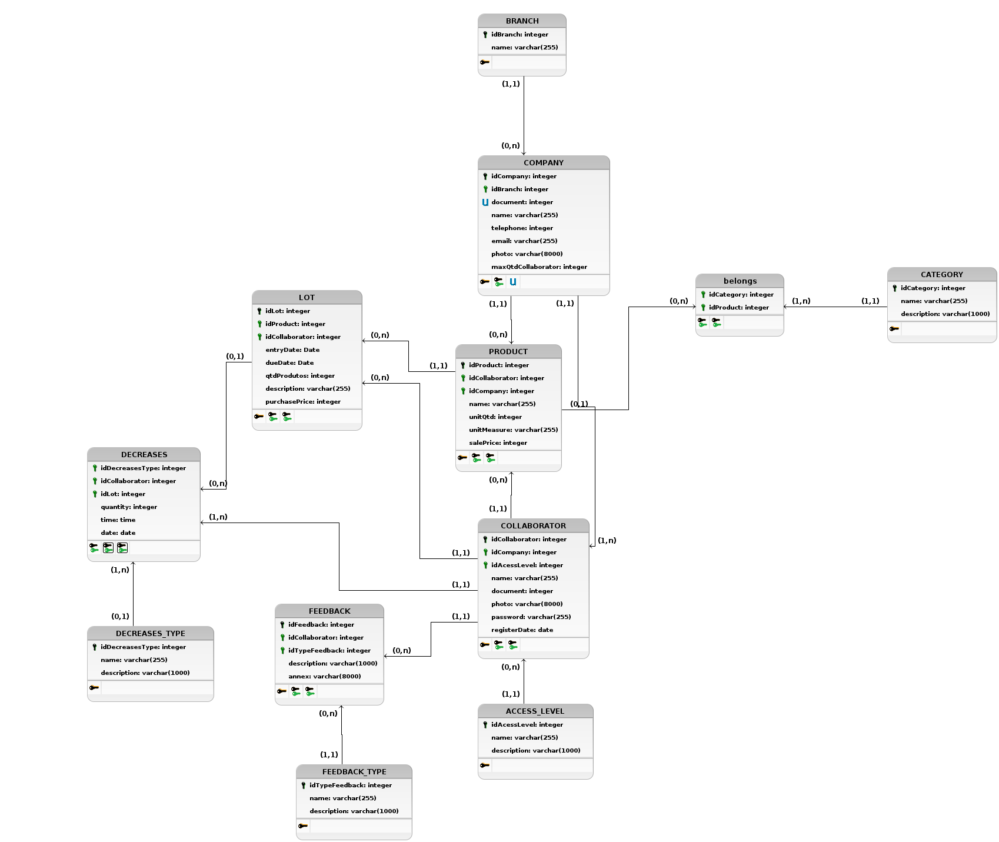

# Diagrama Entidade Relacionamento
**Este artefato foi produzido durante o dia 2 da Diagrams Sprint, para saber mais sobre a metodologia e como ela foi feita, clique aqui: _[Diagrams Sprint](Modeling/Diagrams/Diagrams.md)_**

O Modelo Entidade Relacionamento tem por finalidade modelar todo o banco de dados do sistema com suas respectivas tabelas e relacionamentos. Esse documento é composto por um MER (Modelo Entidade Relacionamento), DER (Diagrama Entidade Relacionamento), DL (Diagrama Lógico) e o seu respectivo Dicionário de Dados.

## Histórico de Revisões
| Data | Versão | Descrição | Autor(es) |
|:----:|:------:|:---------:|:---------:|
| 23/09/2020 | 1.0 | Criação das entidades e seus atributos | Gabriel Alves, Gabriel Davi, Micaella Gouveia, Pedro Igor e Sofia Patrocínio |
| 25/09/2020 | 1.1 | Criação dos diagramas relacionamento e lógico | Gabriel Alves |
| 25/09/2020 | 1.2 | Correção de alguns erros de digitação e linkagem do documento a navbar | Pedro Igor |
| 25/09/2020 | 1.3 | Atualização dos diagramas | Pedro Igor |
| 26/09/2020 | 1.4 | Linkagem de léxicos | Pedro Igor |
| 06/10/2020 | 1.5 | Atualização e correção dos diagramas | Gabriel Alves |
| 09/10/2020 | 1.6 | Adicionando observação da implementação do script físico com [Sequelize](Modeling/objeto?id=Sequelize) | Pedro Igor |
| 16/10/2020 | 1.7 | Atualização do Modelo | Gabriel Alves |

## Modelo Entidade Relacionamento (MER)

### Entidades

**BRANCH** (<ins>idBranch</ins>, name)

**[COMPANY](/Modeling/objeto?id=micro-empresa)** (<ins>idCompany</ins>, idBranch, document, name, telephone, email, photo, maxQtdCollaborator, registerDate)

**[PRODUCT](Modeling/objeto?id=produto)** (<ins>idProduct</ins>, idCompany, idCollaborator, name, unitQt, unitMeasure, salePrice)

**LOT** (<ins>idLot</ins>, idProduct, idCollaborator, entryDate, dueDate, qtdProdutos, description, purchasePrice)

**COLLABORATOR** (<ins>idCollaborator</ins>, idAcessLevel, idCompany, name, document, photo, password)

**[CATEGORY](/Modeling/objeto?id=tag)** (<ins>idCategory</ins>, name, description)

**[FEEDBACK](/Modeling/verbo?id=feedback)** (<ins>idFeedback</ins>, idTypeFeedback, idCollaborator, description, annex)

**FEEDBACK_TYPE** (<ins>idTypeFeedback</ins>, name, description)

**ACESS_LEVEL** (<ins>idAcessLevel</ins>, name, description)

**[DECREASES](/Modeling/verbo?id=baixa-em-produto)** (idCollaborator, idLot, idDecreasesType, quantity, date, time)

**TYPE_DECREASES** (<ins>idTypeDecreases</ins>, name, description)

### Tabelas

**belongs** (idCategory, idProduct)

### Relacionamentos

**COMPANY** - stocks - **PRODUCT** 
Uma [COMPANY](/Modeling/objeto?id=micro-empresa) pode [estocar](/Modeling/verbo?id=armazenar) nenhum ou vários [PRODUCTS](/Modeling/objeto/id=produto) e um [PRODUCT](/Modeling/objeto/id=produto) pode ser estocado por uma e no máximo uma [COMPANY](/Modeling/objeto?id=micro-empresa).  
**Cardinalidade -> 1:n**

**COMPANY** - belongs - **BRANCH** 
Uma [COMPANY](/Modeling/objeto?id=micro-empresa) pertence a uma e somente uma BRANCH e uma BRANCH pode possuir nenhuma ou várias [COMPANYS](/Modeling/objeto?id=micro-empresa). 
**Cardinalidade -> n:1**

**[COMPANY](/Modeling/objeto?id=micro-empresa)** - has - **COLLABORATOR** 
Uma [COMPANY](/Modeling/objeto?id=micro-empresa) possui um ou vários COLLABORATOR e um COLLABORATOR pertence a uma e somente uma [COMPANY](/Modeling/objeto?id=micro-empresa). 
**Cardinalidade -> 1:n**

**LOT** - composes - **[PRODUCT](Modeling/objeto?id=produto)** 
Um LOT pode compor um e no máximo um [PRODUCT](Modeling/objeto?id=produto) e um [PRODUCT](Modeling/objeto?id=produto) pode ser composto por nenhum ou vários LOTs. 
**Cardinalidade -> n:1**

**[PRODUCT](Modeling/objeto?id=produto)** - belongs - **[CATEGORY](/Modeling/objeto?id=tag)** 
Um [PRODUCT](Modeling/objeto?id=produto) pode pertencer a um ou a várias [CATEGORYS](/Modeling/objeto?id=tag) e uma [CATEGORY](/Modeling/objeto?id=tag) pode ser de nenhum ou vários [PRODUCTS](Modeling/objeto?id=produto). 
**Cardinalidade -> n:m**

**COLLABORATOR** - fills - **LOT** 
Um COLLBORATOR pode popular nenhum ou vários LOTS e um LOT pode ser populado por um e apenas um COLLABORATOR. 
**Cardinalidade -> 1:n**

**COLLABORATOR** - registers - **[PRODUCT](Modeling/objeto?id=produto)** 
Um COLLABORATOR pode registrar nenhum ou vários [PRODUCTS](Modeling/objeto?id=produto) e um [PRODUCT](Modeling/objeto?id=produto) pode ser registrado por um e apenas um COLLABORATOR. 
**Cardinalidade -> 1:n**

**COLLABORATOR** - decreases - **LOT** 
Um COLLABORATOR pode decrementar nenhum ou vários LOTS e um LOT pode ser decrementado por um ou vários COLLABORATORS. 
**Cardinalidade -> n:m**

**[FEEDBACK](/Modeling/verbo?id=feedback)** - has - **TYPE_FEEDBACK** 
Um [FEEDBACK](/Modeling/verbo?id=feedback) pode possuir um e no máximo um tipo de [FEEDBACK](/Modeling/verbo?id=feedback) e um tipo de [FEEDBACK](/Modeling/verbo?id=feedback) pode possuir nenhum ou vários [FEEDBACKS](/Modeling/verbo?id=feedback). 
**Cardinalidade -> n:1**

**COLLABORATOR** - sends - **[FEEDBACK](/Modeling/verbo?id=feedback)** 
Um COLLABORATOR pode enviar nenhum ou vários [FEEDBACKS](/Modeling/verbo?id=feedback) e um [FEEDBACK](/Modeling/verbo?id=feedback) pode ser enviado por um e apenas um COLLABORATOR. 
**Cardinalidade -> 1:n**

**COLLABORATOR** - has - **ACESS_LEVEL** 
Um COLLABORATOR por ter um e somente um ACESS_LEVEL e um ACESS_LEVEL pode ter nenhum ou vários COLLABORATORS. 
**Cardinalidade -> n:1**

**DECREASES** - has - **DECREASES_TYPE** 
Um DECREASES por ter um e somente um DECREASES_TYPE e um DECREASES_TYPE pode ter nenhum ou vários DECREASES. 
**Cardinalidade -> n:1**

**COMPANY** - creates - **CATEGORY** 
Uma COMPANY pode criar zero ou mais CATEGORY e um CATEGORY pode ser gerada por uma única COMPANY. 
**Cardinalidade -> 1:n**

## Diagrama Entidade Relacionamento (DER)

 
<a href="https://unbarqdsw.github.io/2020.1_G12_Stock/assets/pdf/diagramas/bancoDados/Diagrama_Entidade_Relacionamento.pdf" target="_black">Arquivo em PDF</a> 

<audio controls>
  <source src="https://unbarqdsw.github.io/2020.1_G12_Stock/assets/audios/der/DER.wav" type="audio/mpeg">
</audio>

## Diagrama Lógico

<a href="https://unbarqdsw.github.io/2020.1_G12_Stock/assets/pdf/diagramas/bancoDados/Diagrama_Logico.pdf" target="_black">Arquivo em PDF</a>

<audio controls>
  <source src="https://unbarqdsw.github.io/2020.1_G12_Stock/assets/audios/der/Diagrama_Logico.wav" type="audio/mpeg">
</audio>

## Dicionário de Dados

<table class="waffle" cellspacing="0" cellpadding="0">
  <tbody>
      <tr style="height:20px;">
          <td class="s0" dir="ltr" colspan="5" style="text-align: center; font-weight: bold;">Entidade: BRANCH</td>
      </tr>
      <tr style="height:20px;">
          <td class="s0" dir="ltr" colspan="5" style="text-align: center; font-weight: bold;">Descrição: Define os dados da branch (ramo) que será cadastrada no
              Stock.</td>
      </tr>
      <tr style="height:20px;">
          <td class="s0" dir="ltr">Atributo</td>
          <td class="s0" dir="ltr">Propriedades do atributo</td>
          <td class="s0" dir="ltr">Tipo de dado</td>
          <td class="s0" dir="ltr">Tamanho</td>
          <td class="s0" dir="ltr">Descrição</td>
      </tr>
      <tr style="height:20px;">
          <td class="s1" dir="ltr">idBranch</td>
          <td class="s1" dir="ltr">chave primária obrigatório</td>
          <td class="s1" dir="ltr">integer</td>
          <td class="s1" dir="ltr">variável</td>
          <td class="s1" dir="ltr">Número Identificador da branch</td>
      </tr>
      <tr style="height:20px;">
          <td class="s1" dir="ltr">name</td>
          <td class="s1" dir="ltr">obrigatório</td>
          <td class="s1" dir="ltr">varchar</td>
          <td class="s1" dir="ltr">255</td>
          <td class="s1" dir="ltr">Nome da branch</td>
      </tr>
      <tr style="height:20px;">
          <td class="s2" dir="ltr"></td>
          <td class="s2" dir="ltr"></td>
          <td class="s2" dir="ltr"></td>
          <td class="s2" dir="ltr"></td>
          <td class="s2" dir="ltr"></td>
      </tr>
      <tr style="height:20px;">
          <td class="s0" dir="ltr" colspan="5" style="text-align: center; font-weight: bold;">Entidade: COMPANY</td>
      </tr>
      <tr style="height:20px;">
          <td class="s0" dir="ltr" colspan="5" style="text-align: center; font-weight: bold;">Descrição: Define os dados da company (empresa) que será cadastrada no
              Stock.</td>
      </tr>
      <tr style="height:20px;">
          <td class="s0" dir="ltr">Atributo</td>
          <td class="s0" dir="ltr">Propriedades do atributo</td>
          <td class="s0" dir="ltr">Tipo de dado</td>
          <td class="s0" dir="ltr">Tamanho</td>
          <td class="s0" dir="ltr">Descrição</td>
      </tr>
      <tr style="height:20px;">
          <td class="s1" dir="ltr">idCompany</td>
          <td class="s1" dir="ltr">chave primária</td>
          <td class="s1" dir="ltr">integer</td>
          <td class="s1" dir="ltr">variável</td>
          <td class="s1" dir="ltr">número de identificação da empresa</td>
      </tr>
      <tr style="height:20px;">
          <td class="s1" dir="ltr">document</td>
          <td class="s1" dir="ltr">chave candidata  unique</td>
          <td class="s1" dir="ltr">integer</td>
          <td class="s1" dir="ltr">variável</td>
          <td class="s1" dir="ltr">Número do documento de CNPJ da empresa</td>
      </tr>
      <tr style="height:20px;">
          <td class="s1" dir="ltr">name</td>
          <td class="s1" dir="ltr">obrigatório</td>
          <td class="s1" dir="ltr">varchar</td>
          <td class="s1" dir="ltr">255</td>
          <td class="s1" dir="ltr">Nome da empresa</td>
      </tr>
      <tr style="height:20px;">
          <td class="s1" dir="ltr">telephone</td>
          <td class="s1" dir="ltr">optativo</td>
          <td class="s1" dir="ltr">integer</td>
          <td class="s1" dir="ltr">variável</td>
          <td class="s1" dir="ltr">Número de telefone da empresa</td>
      </tr>
      <tr style="height:20px;">
          <td class="s1" dir="ltr">email</td>
          <td class="s1" dir="ltr">obrigatório</td>
          <td class="s1" dir="ltr">varchar</td>
          <td class="s1" dir="ltr">255</td>
          <td class="s1" dir="ltr">Email da empresa</td>
      </tr>
      <tr style="height:20px;">
          <td class="s1" dir="ltr">photo</td>
          <td class="s1" dir="ltr">optativo</td>
          <td class="s1" dir="ltr">varchar</td>
          <td class="s1" dir="ltr">8000</td>
          <td class="s1" dir="ltr">Logo da empresa</td>
      </tr>
      <tr style="height:20px;">
          <td class="s1" dir="ltr">maxQtdCollaborator</td>
          <td class="s1" dir="ltr">obrigatório</td>
          <td class="s1" dir="ltr">integer</td>
          <td class="s1" dir="ltr">variável</td>
          <td class="s1" dir="ltr">Quantidade máxima de colaboradores</td>
      </tr>
      <tr style="height:20px;">
          <td class="s1" dir="ltr">registerDate</td>
          <td class="s1" dir="ltr">obrigatório</td>
          <td class="s1" dir="ltr">date</td>
          <td class="s1" dir="ltr">-</td>
          <td class="s1" dir="ltr">Data de registro da empresa</td>
      </tr>
      <tr style="height:20px;">
          <td class="s1" dir="ltr">idBranch</td>
          <td class="s1" dir="ltr">chave estrangeira  obrigatório</td>
          <td class="s1" dir="ltr">integer</td>
          <td class="s1" dir="ltr">variável</td>
          <td class="s1" dir="ltr">número identificador do ramo da empresa</td>
      </tr>
      <tr style="height:20px;">
          <td class="s2" dir="ltr"></td>
          <td class="s2" dir="ltr"></td>
          <td class="s2" dir="ltr"></td>
          <td class="s2" dir="ltr"></td>
          <td class="s2" dir="ltr"></td>
      </tr>
      <tr style="height:20px;">
          <td class="s0" dir="ltr" colspan="5" style="text-align: center; font-weight: bold;">Entidade: PRODUCT</td>
      </tr>
      <tr style="height:20px;">
          <td class="s0" dir="ltr" colspan="5" style="text-align: center; font-weight: bold;">Descrição: Define os dados do product (produto) que será cadastrado no
              Stock.</td>
      </tr>
      <tr style="height:20px;">
          <td class="s0" dir="ltr">Atributo</td>
          <td class="s0" dir="ltr">Propriedades do atributo</td>
          <td class="s0" dir="ltr">Tipo de dado</td>
          <td class="s0" dir="ltr">Tamanho</td>
          <td class="s0" dir="ltr">Descrição</td>
      </tr>
      <tr style="height:20px;">
          <td class="s1" dir="ltr">idProduct</td>
          <td class="s1" dir="ltr">chave primária  obrigatório</td>
          <td class="s1" dir="ltr">integer</td>
          <td class="s1" dir="ltr">variável</td>
          <td class="s1" dir="ltr">Número identificador do produto</td>
      </tr>
      <tr style="height:20px;">
          <td class="s1" dir="ltr">idComapany</td>
          <td class="s1" dir="ltr">chave estrangeira  obrigatório</td>
          <td class="s1" dir="ltr">integer</td>
          <td class="s1" dir="ltr">variável</td>
          <td class="s1" dir="ltr">Número identificador da empresa, que está registrado o produto</td>
      </tr>
      <tr style="height:20px;">
          <td class="s1" dir="ltr">idCollaborator</td>
          <td class="s1" dir="ltr">chave estrangeira  obrigatório</td>
          <td class="s1" dir="ltr">integer</td>
          <td class="s1" dir="ltr">variável</td>
          <td class="s1" dir="ltr">Número identificador do colaborador, que registra o produto</td>
      </tr>
      <tr style="height:20px;">
          <td class="s1" dir="ltr">name</td>
          <td class="s1" dir="ltr">obrigatório</td>
          <td class="s1" dir="ltr">varchar</td>
          <td class="s1" dir="ltr">255</td>
          <td class="s1" dir="ltr">nome do produto</td>
      </tr>
      <tr style="height:20px;">
          <td class="s1" dir="ltr">unitQtd</td>
          <td class="s1" dir="ltr">opcional</td>
          <td class="s1" dir="ltr">integer</td>
          <td class="s1" dir="ltr">variável</td>
          <td class="s1" dir="ltr">quantidade unitária do produto (ex: 100ml, 1l, 2kg)</td>
      </tr>
      <tr style="height:20px;">
          <td class="s1" dir="ltr">unitMeasure</td>
          <td class="s1" dir="ltr">opcional</td>
          <td class="s1" dir="ltr">varchar</td>
          <td class="s1" dir="ltr">255</td>
          <td class="s1" dir="ltr">unidade de medida (ex: litro, metros, kg)</td>
      </tr>
      <tr style="height:20px;">
          <td class="s1" dir="ltr">salePrice</td>
          <td class="s1" dir="ltr">obrigatório</td>
          <td class="s1" dir="ltr">integer</td>
          <td class="s1" dir="ltr">variável</td>
          <td class="s1" dir="ltr">Preço final de venda do produto</td>
      </tr>
      <tr style="height:20px;">
          <td class="s2" dir="ltr"></td>
          <td class="s2" dir="ltr"></td>
          <td class="s2" dir="ltr"></td>
          <td class="s2" dir="ltr"></td>
          <td class="s2" dir="ltr"></td>
      </tr>
      <tr style="height:20px;">
          <td class="s0" dir="ltr" colspan="5" style="text-align: center; font-weight: bold;">Entidade: COLLABORATOR</td>
      </tr>
      <tr style="height:20px;">
          <td class="s0" dir="ltr" colspan="5" style="text-align: center; font-weight: bold;">Descrição: Define os dados do collaborator (colaborador) que será
              cadastrado no Stock.</td>
      </tr>
      <tr style="height:20px;">
          <td class="s0" dir="ltr">Atributo</td>
          <td class="s0" dir="ltr">Propriedades do atributo</td>
          <td class="s0" dir="ltr">Tipo de dado</td>
          <td class="s0" dir="ltr">Tamanho</td>
          <td class="s0" dir="ltr">Descrição</td>
      </tr>
      <tr style="height:20px;">
          <td class="s1" dir="ltr">idCollaborator</td>
          <td class="s1" dir="ltr">chave primária  obrigatório</td>
          <td class="s1" dir="ltr">integer</td>
          <td class="s1" dir="ltr">variável</td>
          <td class="s1" dir="ltr">Número identificador do colaborador</td>
      </tr>
      <tr style="height:20px;">
          <td class="s1" dir="ltr">idAcessLevel</td>
          <td class="s1" dir="ltr">chave estrangeira  obrigatório</td>
          <td class="s1" dir="ltr">integer</td>
          <td class="s1" dir="ltr">variável</td>
          <td class="s1" dir="ltr">Número identificador do nível de acesso do colaborador</td>
      </tr>
      <tr style="height:20px;">
          <td class="s1" dir="ltr">idCompany</td>
          <td class="s1" dir="ltr">chave estrangeira  obrigatório</td>
          <td class="s1" dir="ltr">integer</td>
          <td class="s1" dir="ltr">variável</td>
          <td class="s1" dir="ltr">Número identificador da empresa, que está registrado o colaborador</td>
      </tr>
      <tr style="height:20px;">
          <td class="s1" dir="ltr">name</td>
          <td class="s1" dir="ltr">obrigatório</td>
          <td class="s1" dir="ltr">varchar</td>
          <td class="s1" dir="ltr">255</td>
          <td class="s1" dir="ltr">nome do colaborador</td>
      </tr>
      <tr style="height:20px;">
          <td class="s1" dir="ltr">document</td>
          <td class="s1" dir="ltr">obrigatório</td>
          <td class="s1" dir="ltr">integer</td>
          <td class="s1" dir="ltr">variável</td>
          <td class="s1" dir="ltr">Número do documento de identificação do colaborador</td>
      </tr>
      <tr style="height:20px;">
          <td class="s1" dir="ltr">photo</td>
          <td class="s1" dir="ltr">opcional</td>
          <td class="s1" dir="ltr">varchar</td>
          <td class="s1" dir="ltr">8000</td>
          <td class="s1" dir="ltr">Foto do colaborador</td>
      </tr>
      <tr style="height:20px;">
          <td class="s1" dir="ltr">password</td>
          <td class="s1" dir="ltr">obrigatório</td>
          <td class="s1" dir="ltr">varchar</td>
          <td class="s1" dir="ltr">255</td>
          <td class="s1" dir="ltr">Senha de acesso do colaborador</td>
      </tr>
      <tr style="height:20px;">
          <td class="s1" dir="ltr">registerDate</td>
          <td class="s1" dir="ltr">obrigatório</td>
          <td class="s1" dir="ltr">date</td>
          <td class="s1" dir="ltr">-</td>
          <td class="s1" dir="ltr">Data de registro do colaborador</td>
      </tr>
      <tr style="height:20px;">
          <td class="s2" dir="ltr"></td>
          <td class="s2" dir="ltr"></td>
          <td class="s2" dir="ltr"></td>
          <td class="s2" dir="ltr"></td>
          <td class="s2" dir="ltr"></td>
      </tr>
      <tr style="height:20px;">
          <td class="s0" dir="ltr" colspan="5" style="text-align: center; font-weight: bold;">Entidade: ACESS_LEVEL</td>
      </tr>
      <tr style="height:20px;">
          <td class="s0" dir="ltr" colspan="5" style="text-align: center; font-weight: bold;">Descrição: Define os dados do access level (nível de acesso) que será
              cadastrada no Stock.</td>
      </tr>
      <tr style="height:20px;">
          <td class="s0" dir="ltr">Atributo</td>
          <td class="s0" dir="ltr">Propriedades do atributo</td>
          <td class="s0" dir="ltr">Tipo de dado</td>
          <td class="s0" dir="ltr">Tamanho</td>
          <td class="s0" dir="ltr">Descrição</td>
      </tr>
      <tr style="height:20px;">
          <td class="s1" dir="ltr">idAcessLevel</td>
          <td class="s1" dir="ltr">chave primária obrigatório</td>
          <td class="s1" dir="ltr">integer</td>
          <td class="s1" dir="ltr">variável</td>
          <td class="s1" dir="ltr">Número Identificador do nível de acesso</td>
      </tr>
      <tr style="height:20px;">
          <td class="s1" dir="ltr">name</td>
          <td class="s1" dir="ltr">obrigatório</td>
          <td class="s1" dir="ltr">varchar</td>
          <td class="s1" dir="ltr">255</td>
          <td class="s1" dir="ltr">Nome do nível de acesso</td>
      </tr>
      <tr style="height:20px;">
          <td class="s1" dir="ltr">description</td>
          <td class="s1" dir="ltr">obrigatório</td>
          <td class="s1" dir="ltr">varchar</td>
          <td class="s1" dir="ltr">1000</td>
          <td class="s1" dir="ltr">descrição do nível de acesso</td>
      </tr>
      <tr style="height:20px;">
          <td class="s3"></td>
          <td class="s4"></td>
          <td class="s4"></td>
          <td class="s4"></td>
          <td class="s4"></td>
      </tr>
      <tr style="height:20px;">
          <td class="s0" dir="ltr" colspan="5" style="text-align: center; font-weight: bold;">Entidade: LOT</td>
      </tr>
      <tr style="height:20px;">
          <td class="s0" dir="ltr" colspan="5" style="text-align: center; font-weight: bold;">Descrição: Define os dados do lot (lote) que será cadastrado no Stock.
          </td>
      </tr>
      <tr style="height:20px;">
          <td class="s0" dir="ltr">Atributo</td>
          <td class="s0" dir="ltr">Propriedades do atributo</td>
          <td class="s0" dir="ltr">Tipo de dado</td>
          <td class="s0" dir="ltr">Tamanho</td>
          <td class="s0" dir="ltr">Descrição</td>
      </tr>
      <tr style="height:20px;">
          <td class="s1" dir="ltr">idLot</td>
          <td class="s1" dir="ltr">chave primária obrigatório</td>
          <td class="s1" dir="ltr">integer</td>
          <td class="s1" dir="ltr">variável</td>
          <td class="s1" dir="ltr">Número Identificador do lote</td>
      </tr>
      <tr style="height:20px;">
          <td class="s1" dir="ltr">idProduct</td>
          <td class="s1" dir="ltr">chave estrangeira  obrigatório</td>
          <td class="s1" dir="ltr">integer</td>
          <td class="s1" dir="ltr">variável</td>
          <td class="s1" dir="ltr">Número identificador do produto</td>
      </tr>
      <tr style="height:20px;">
          <td class="s1" dir="ltr">idCollaborator</td>
          <td class="s1" dir="ltr">chave estrangeira  obrigatório</td>
          <td class="s1" dir="ltr">integer</td>
          <td class="s1" dir="ltr">variável</td>
          <td class="s1" dir="ltr">Número identificador do colaborador que estocou o produto</td>
      </tr>
      <tr style="height:20px;">
          <td class="s1" dir="ltr">entryDate</td>
          <td class="s1" dir="ltr">obrigatório</td>
          <td class="s1" dir="ltr">date</td>
          <td class="s1" dir="ltr">-</td>
          <td class="s1" dir="ltr">Data de entrada do produto</td>
      </tr>
      <tr style="height:20px;">
          <td class="s1" dir="ltr">dueDate</td>
          <td class="s1" dir="ltr">obrigatório</td>
          <td class="s1" dir="ltr">date</td>
          <td class="s1" dir="ltr">-</td>
          <td class="s1" dir="ltr">Data de validade do produto</td>
      </tr>
      <tr style="height:20px;">
          <td class="s1" dir="ltr">qtdProdutos</td>
          <td class="s1" dir="ltr">obrigatório</td>
          <td class="s1" dir="ltr">integer</td>
          <td class="s1" dir="ltr">variável</td>
          <td class="s1" dir="ltr">Quantidade de produtos no estoque</td>
      </tr>
      <tr style="height:20px;">
          <td class="s1" dir="ltr">description</td>
          <td class="s1" dir="ltr">obrigatório</td>
          <td class="s1" dir="ltr">varchar</td>
          <td class="s1" dir="ltr">255</td>
          <td class="s1" dir="ltr">Descrição do lote</td>
      </tr>
      <tr style="height:20px;">
          <td class="s1" dir="ltr">purchasePrice</td>
          <td class="s1" dir="ltr">obrigatório</td>
          <td class="s1" dir="ltr">integer</td>
          <td class="s1" dir="ltr">variável</td>
          <td class="s1" dir="ltr">Preço de compra do produto</td>
      </tr>
      <tr style="height:20px;">
          <td class="s5"></td>
          <td class="s4"></td>
          <td class="s4"></td>
          <td class="s4"></td>
          <td class="s4"></td>
      </tr>
      <tr style="height:20px;">
          <td class="s0" dir="ltr" colspan="5" style="text-align: center; font-weight: bold;">Tabela: decreases</td>
      </tr>
      <tr style="height:20px;">
          <td class="s0" dir="ltr" colspan="5" style="text-align: center; font-weight: bold;">Descrição: Tabela resultando do relacionamento n:m de Collaborator com
              Lot</td>
      </tr>
      <tr style="height:20px;">
          <td class="s0" dir="ltr">Atributo</td>
          <td class="s0" dir="ltr">Propriedades do atributo</td>
          <td class="s0" dir="ltr">Tipo de dado</td>
          <td class="s0" dir="ltr">Tamanho</td>
          <td class="s0" dir="ltr">Descrição</td>
      </tr>
      <tr style="height:20px;">
          <td class="s1" dir="ltr">idCollaborator</td>
          <td class="s1" dir="ltr">chave estrangeira  obrigatório</td>
          <td class="s1" dir="ltr">integer</td>
          <td class="s1" dir="ltr">variável</td>
          <td class="s1" dir="ltr">Número Identificador colaborador que efetuou a saída do produto do estoque</td>
      </tr>
      <tr style="height:20px;">
          <td class="s1" dir="ltr">idLot</td>
          <td class="s1" dir="ltr">chave estrangeira  obrigatório</td>
          <td class="s1" dir="ltr">integer</td>
          <td class="s1" dir="ltr">variável</td>
          <td class="s1" dir="ltr">Número Identificador do lote que foi decrementado do estoque</td>
      </tr>
      <tr style="height:20px;">
          <td class="s1" dir="ltr">quantity</td>
          <td class="s1" dir="ltr">obrigatório</td>
          <td class="s1" dir="ltr">integer</td>
          <td class="s1" dir="ltr">variável</td>
          <td class="s1" dir="ltr">Quantidade de produtos que foram subtraídos</td>
      </tr>
      <tr style="height:20px;">
          <td class="s1" dir="ltr">date</td>
          <td class="s1" dir="ltr">obrigatório</td>
          <td class="s1" dir="ltr">date</td>
          <td class="s1" dir="ltr">-</td>
          <td class="s1" dir="ltr">data em que ocorreu a subtração do produto</td>
      </tr>
      <tr style="height:20px;">
          <td class="s1" dir="ltr">time</td>
          <td class="s1" dir="ltr">obrigatório</td>
          <td class="s1" dir="ltr">time</td>
          <td class="s1" dir="ltr">-</td>
          <td class="s1" dir="ltr">hora em que ocorreu a subtração do produto</td>
      </tr>
      <tr style="height:20px;">
          <td class="s5"></td>
          <td class="s4"></td>
          <td class="s4"></td>
          <td class="s4"></td>
          <td class="s4"></td>
      </tr>
      <tr style="height:20px;">
          <td class="s0" dir="ltr" colspan="5" style="text-align: center; font-weight: bold;">Entidade: FEEDBACK</td>
      </tr>
      <tr style="height:20px;">
          <td class="s0" dir="ltr" colspan="5" style="text-align: center; font-weight: bold;">Descrição: Define os dados do feedback que será cadastrado no Stock.
          </td>
      </tr>
      <tr style="height:20px;">
          <td class="s0" dir="ltr">Atributo</td>
          <td class="s0" dir="ltr">Propriedades do atributo</td>
          <td class="s0" dir="ltr">Tipo de dado</td>
          <td class="s0" dir="ltr">Tamanho</td>
          <td class="s0" dir="ltr">Descrição</td>
      </tr>
      <tr style="height:20px;">
          <td class="s1" dir="ltr">idFeedback</td>
          <td class="s1" dir="ltr">chave primária</td>
          <td class="s1" dir="ltr">integer</td>
          <td class="s1" dir="ltr">variável</td>
          <td class="s1" dir="ltr">número de identificação do feedback</td>
      </tr>
      <tr style="height:20px;">
          <td class="s1" dir="ltr">idTypeFeedback</td>
          <td class="s1" dir="ltr">chave estrangeira  obrigatório</td>
          <td class="s1" dir="ltr">integer</td>
          <td class="s1" dir="ltr">variável</td>
          <td class="s1" dir="ltr">número identificador do tipo de feedback</td>
      </tr>
      <tr style="height:20px;">
          <td class="s1" dir="ltr">idCollaborator</td>
          <td class="s1" dir="ltr">chave estrangeira  obrigatório</td>
          <td class="s1" dir="ltr">integer</td>
          <td class="s1" dir="ltr">variável</td>
          <td class="s1" dir="ltr">número identificador do colaborador que efetuou o feedback</td>
      </tr>
      <tr style="height:20px;">
          <td class="s1" dir="ltr">description</td>
          <td class="s1" dir="ltr">obrigatório</td>
          <td class="s1" dir="ltr">varchar</td>
          <td class="s1" dir="ltr">1000</td>
          <td class="s1" dir="ltr">Descrição do lote</td>
      </tr>
      <tr style="height:20px;">
          <td class="s1" dir="ltr">annex</td>
          <td class="s1" dir="ltr">opcional</td>
          <td class="s1" dir="ltr">varchar</td>
          <td class="s1" dir="ltr">8000</td>
          <td class="s1" dir="ltr">Documentos anexados para auxiliar no feedback</td>
      </tr>
      <tr style="height:20px;">
          <td class="s5"></td>
          <td class="s4"></td>
          <td class="s4"></td>
          <td class="s4"></td>
          <td class="s4"></td>
      </tr>
      <tr style="height:20px;">
          <td class="s0" dir="ltr" colspan="5" style="text-align: center; font-weight: bold;">Entidade: TYPE_FEEDBACK</td>
      </tr>
      <tr style="height:20px;">
          <td class="s0" dir="ltr" colspan="5" style="text-align: center; font-weight: bold;">Descrição: Define os dados do type feedback (tipo de feedback) que será
              cadastrado no Stock.</td>
      </tr>
      <tr style="height:20px;">
          <td class="s0" dir="ltr">Atributo</td>
          <td class="s0" dir="ltr">Propriedades do atributo</td>
          <td class="s0" dir="ltr">Tipo de dado</td>
          <td class="s0" dir="ltr">Tamanho</td>
          <td class="s0" dir="ltr">Descrição</td>
      </tr>
      <tr style="height:20px;">
          <td class="s1" dir="ltr">idTypeFeedback</td>
          <td class="s1" dir="ltr">chave primária obrigatório</td>
          <td class="s1" dir="ltr">integer</td>
          <td class="s1" dir="ltr">variável</td>
          <td class="s1" dir="ltr">Número Identificador do tipo de feedback</td>
      </tr>
      <tr style="height:20px;">
          <td class="s1" dir="ltr">name</td>
          <td class="s1" dir="ltr">obrigatório</td>
          <td class="s1" dir="ltr">varchar</td>
          <td class="s1" dir="ltr">255</td>
          <td class="s1" dir="ltr">Nome do tipo de feedback</td>
      </tr>
      <tr style="height:20px;">
          <td class="s1" dir="ltr">description</td>
          <td class="s1" dir="ltr">obrigatório</td>
          <td class="s1" dir="ltr">varchar</td>
          <td class="s1" dir="ltr">1000</td>
          <td class="s1" dir="ltr">descrição do tipo de feedback</td>
      </tr>
      <tr style="height:20px;">
          <td class="s5"></td>
          <td class="s4"></td>
          <td class="s4"></td>
          <td class="s4"></td>
          <td class="s4"></td>
      </tr>
      <tr style="height:20px;">
          <td class="s0" dir="ltr" colspan="5" style="text-align: center; font-weight: bold;">Tabela: belongs</td>
      </tr>
      <tr style="height:20px;">
          <td class="s0" dir="ltr" colspan="5" style="text-align: center; font-weight: bold;">Descrição: Tabela resultante do relacionamento n:m de Product e
              Category</td>
      </tr>
      <tr style="height:20px;">
          <td class="s0" dir="ltr">Atributo</td>
          <td class="s0" dir="ltr">Propriedades do atributo</td>
          <td class="s0" dir="ltr">Tipo de dado</td>
          <td class="s0" dir="ltr">Tamanho</td>
          <td class="s0" dir="ltr">Descrição</td>
      </tr>
      <tr style="height:20px;">
          <td class="s1" dir="ltr">idCategory</td>
          <td class="s1" dir="ltr">chave estrangeira  obrigatório</td>
          <td class="s1" dir="ltr">integer</td>
          <td class="s1" dir="ltr">variável</td>
          <td class="s1" dir="ltr">Número Identificador da categoria do produto</td>
      </tr>
      <tr style="height:20px;">
          <td class="s1" dir="ltr">idProduct</td>
          <td class="s1" dir="ltr">chave estrangeira  obrigatório</td>
          <td class="s1" dir="ltr">integer</td>
          <td class="s1" dir="ltr">variável</td>
          <td class="s1" dir="ltr">Número Identificador do produto</td>
      </tr>
      <tr style="height:20px;">
          <td class="s5"></td>
          <td class="s4"></td>
          <td class="s4"></td>
          <td class="s4"></td>
          <td class="s4"></td>
      </tr>
      <tr style="height:20px;">
          <td class="s0" dir="ltr" colspan="5" style="text-align: center; font-weight: bold;">Entidade: CATEGORY</td>
      </tr>
      <tr style="height:20px;">
          <td class="s0" dir="ltr" colspan="5" style="text-align: center; font-weight: bold;">Descrição: Define os dados de category (categoria) dos produtos que
              serão cadastrados no Stock.</td>
      </tr>
      <tr style="height:20px;">
          <td class="s0" dir="ltr">Atributo</td>
          <td class="s0" dir="ltr">Propriedades do atributo</td>
          <td class="s0" dir="ltr">Tipo de dado</td>
          <td class="s0" dir="ltr">Tamanho</td>
          <td class="s0" dir="ltr">Descrição</td>
      </tr>
      <tr style="height:20px;">
          <td class="s1" dir="ltr">idCategory</td>
          <td class="s1" dir="ltr">chave primária obrigatório</td>
          <td class="s1" dir="ltr">integer</td>
          <td class="s1" dir="ltr">variável</td>
          <td class="s1" dir="ltr">Número Identificador da categoria</td>
      </tr>
      <tr style="height:20px;">
          <td class="s1" dir="ltr">idCompany</td>
          <td class="s1" dir="ltr">chave estrangeira obrigatório</td>
          <td class="s1" dir="ltr">integer</td>
          <td class="s1" dir="ltr">variável</td>
          <td class="s1" dir="ltr">Número Identificador da empresa</td>
      </tr>
      <tr style="height:20px;">
          <td class="s1" dir="ltr">name</td>
          <td class="s1" dir="ltr">obrigatório</td>
          <td class="s1" dir="ltr">varchar</td>
          <td class="s1" dir="ltr">255</td>
          <td class="s1" dir="ltr">Nome do tipo da categoria</td>
      </tr>
      <tr style="height:20px;">
          <td class="s1" dir="ltr">description</td>
          <td class="s1" dir="ltr">obrigatório</td>
          <td class="s1" dir="ltr">varchar</td>
          <td class="s1" dir="ltr">1000</td>
          <td class="s1" dir="ltr">descrição da categoria</td>
      </tr>
      <tr style="height:20px;">
          <td class="s0" dir="ltr" colspan="5" style="text-align: center; font-weight: bold;">Entidade: DECREASES_TYPE</td>
      </tr>
      <tr style="height:20px;">
          <td class="s0" dir="ltr" colspan="5" style="text-align: center; font-weight: bold;">Descrição: Define os dados de tipos de decremento na qual um colaborador poderá fazer em um lote.</td>
      </tr>
      <tr style="height:20px;">
          <td class="s0" dir="ltr">Atributo</td>
          <td class="s0" dir="ltr">Propriedades do atributo</td>
          <td class="s0" dir="ltr">Tipo de dado</td>
          <td class="s0" dir="ltr">Tamanho</td>
          <td class="s0" dir="ltr">Descrição</td>
      </tr>
      <tr style="height:20px;">
          <td class="s1" dir="ltr">idDecreasesType</td>
          <td class="s1" dir="ltr">chave primária obrigatório</td>
          <td class="s1" dir="ltr">integer</td>
          <td class="s1" dir="ltr">variável</td>
          <td class="s1" dir="ltr">Número Identificador do tipo de decremento</td>
      </tr>
      <tr style="height:20px;">
          <td class="s1" dir="ltr">name</td>
          <td class="s1" dir="ltr">obrigatório</td>
          <td class="s1" dir="ltr">varchar</td>
          <td class="s1" dir="ltr">255</td>
          <td class="s1" dir="ltr">Nome do tipo de decremento</td>
      </tr>
      <tr style="height:20px;">
          <td class="s1" dir="ltr">description</td>
          <td class="s1" dir="ltr">obrigatório</td>
          <td class="s1" dir="ltr">varchar</td>
          <td class="s1" dir="ltr">1000</td>
          <td class="s1" dir="ltr">descrição do tipo de decremento</td>
      </tr>
  </tbody>
</table>

<a href="https://unbarqdsw.github.io/2020.1_G12_Stock/assets/pdf/diagramas/bancoDados/Dicionario_de_Dados.pdf" target="_black">Arquivo em PDF</a>

Obs: Vale lembrar que na modelagem da base de dados não é permitida a utilização de plural nas relações. Já na definição de tabelas do [Sequelize](Modeling/objeto?id=Sequelize) é obrigatória a utilização de plural. Então, por mais que esta documentação mencione o nome de entidades e relacionamentos no singular, no script físico gerado pelas migrations apenas o nome da tabela é colocado no plural mantendo os atributos da forma como foram modelados.

## Referências 
- Software para Diagramação do Modelo Entidade Relacionamento - brModelo <http://www.sis4.com/brModelo/>. Último acesso em 25/09/2020 