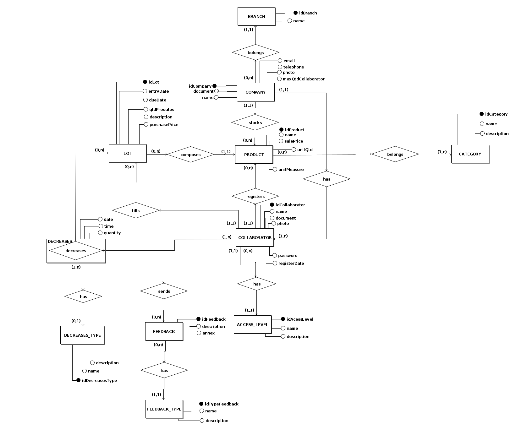

# Diagrama Entidade Relacionamento
**Este artefato foi produzido durante o dia 2 da Diagrams Sprint, para saber mais sobre a metodologia e como ela foi feita, clique aqui: _[Diagrams Sprint](Modeling/Diagrams/Diagrams.md)_**

O Modelo Entidade Relacionamento tem por finalidade modelar todo o banco de dados do sistema com suas respectivas tabelas e relacionamentos. Esse documento é composto por um MER (Modelo Entidade Relacionamento), DER (Diagrama Entidade Relacionamento), DL (Diagrama Lógico) e o seu respectivo Dicionário de Dados.

## Histórico de Revisões
| Data | Versão | Descrição | Autor(es) |
|:----:|:------:|:---------:|:---------:|
| 23/09/2020 | 1.0 | Criação das entidades e seus atributos | Gabriel Alves, Gabriel Davi, Micaella Gouveia, Pedro Igor e Sofia Patrocínio |
| 25/09/2020 | 1.1 | Criação dos diagramas relacionamento e lógico | Gabriel Alves |
| 25/09/2020 | 1.2 | Correção de alguns erros de digitação e linkagem do documento a navbar | Pedro Igor |
| 25/09/2020 | 1.3 | Atualização dos diagramas | Pedro Igor |
| 26/09/2020 | 1.4 | Linkagem de léxicos | Pedro Igor |
## Modelo Entidade Relacionamento (MER)

### Entidades

**[COMPANY](/Modeling/objeto?id=micro-empresa)** (<ins>document</ins>, name, telephone, email, photo, maxQtdCollaborator, registerDate)

**BRANCH** (<ins>idBranch</ins>, name)

**[PRODUCT](Modeling/objeto?id=produto)** (<ins>idProduct</ins>, name, unitQt, unitMeasure, salePrice)

**LOT** (<ins>idLot</ins>, entryDate, dueDate, productsQt, description, purchasePrice)

**[CATEGORY](/Modeling/objeto?id=tag)** (<ins>idCategory</ins>, name, description)

**COLLABORATOR** (<ins>idCollaborator</ins>, name, document, acessLevel, photo, password)

**[FEEDBACK](/Modeling/verbo?id=feedback)** (<ins>idFeedback</ins>, type, description, document, annex)

**TYPE_FEEDBACK** (<ins>idTypeFeedback</ins>, name)

**[decreases](/Modeling/verbo?id=baixa-em-produto)** (<ins>date</ins>, <ins>time</ins>, <ins>idCollaborator</ins>, <ins>idLot</ins>, quantity)

### Relacionamentos

**COMPANY** - stocks - **PRODUCT** 
Uma [COMPANY](/Modeling/objeto?id=micro-empresa) pode [estocar](/Modeling/verbo?id=armazenar) nenhum ou vários [PRODUCTS](/Modeling/objeto/id=produto) e um [PRODUCT](/Modeling/objeto/id=produto) pode ser estocado por uma e no máximo uma [COMPANY](/Modeling/objeto?id=micro-empresa).  
**Cardinalidade -> 1:n**

**COMPANY** - belongs - **BRANCH** 
Uma [COMPANY](/Modeling/objeto?id=micro-empresa) pertence a uma e somente uma BRANCH e uma BRANCH pode possuir nenhuma ou várias [COMPANYS](/Modeling/objeto?id=micro-empresa). 
**Cardinalidade -> n:1**

**[COMPANY](/Modeling/objeto?id=micro-empresa)** - has - **COLLABORATOR** 
Uma [COMPANY](/Modeling/objeto?id=micro-empresa) possui um ou vários COLLABORATOR e um COLLABORATOR pertence a uma e somente uma [COMPANY](/Modeling/objeto?id=micro-empresa). 
**Cardinalidade -> 1:n**

**LOT** - composes - **[PRODUCT](Modeling/objeto?id=produto)** 
Um LOT pode compor um e no máximo um [PRODUCT](Modeling/objeto?id=produto) e um [PRODUCT](Modeling/objeto?id=produto) pode ser composto por nenhum ou vários LOTs. 
**Cardinalidade -> n:1**

**[PRODUCT](Modeling/objeto?id=produto)** - belongs - **[CATEGORY](/Modeling/objeto?id=tag)** 
Um [PRODUCT](Modeling/objeto?id=produto) pode pertencer a um ou a várias [CATEGORYS](/Modeling/objeto?id=tag) e uma [CATEGORY](/Modeling/objeto?id=tag) pode ser de nenhum ou vários [PRODUCTS](Modeling/objeto?id=produto). 
**Cardinalidade -> n:m**

**COLLABORATOR** - fills - **LOT** 
Um COLLBORATOR pode popular nenhum ou vários LOTS e um LOT pode ser populado por um e apenas um COLLABORATOR. 
**Cardinalidade -> 1:n**

**COLLABORATOR** - registers - **[PRODUCT](Modeling/objeto?id=produto)** 
Um COLLABORATOR pode registrar nenhum ou vários [PRODUCTS](Modeling/objeto?id=produto) e um [PRODUCT](Modeling/objeto?id=produto) pode ser registrado por um e apenas um COLLABORATOR. 
**Cardinalidade -> 1:n**

**COLLABORATOR** - decreases - **LOT** 
Um COLLABORATOR pode decrementar nenhum ou vários LOTS e um LOT pode ser decrementado por um ou vários COLLABORATORS. 
**Cardinalidade -> n:m**

**[FEEDBACK](/Modeling/verbo?id=feedback)** - has - **TYPE_FEEDBACK** 
Um [FEEDBACK](/Modeling/verbo?id=feedback) pode possuir um e no máximo um tipo de [FEEDBACK](/Modeling/verbo?id=feedback) e um tipo de [FEEDBACK](/Modeling/verbo?id=feedback) pode possuir nenhum ou vários [FEEDBACKS](/Modeling/verbo?id=feedback). 
**Cardinalidade -> n:1**

**COLLABORATOR** - sends - **[FEEDBACK](/Modeling/verbo?id=feedback)** 
Um COLLABORATOR pode enviar nenhum ou vários [FEEDBACKS](/Modeling/verbo?id=feedback) e um [FEEDBACK](/Modeling/verbo?id=feedback) pode ser enviado por um e apenas um COLLABORATOR. 
**Cardinalidade -> 1:n**

## Diagrama Entidade Relacionamento (DER)

 
<a href="https://unbarqdsw.github.io/2020.1_G12_Stock/assets/diagramas/bancoDados/Diagrama_Entidade_Relacionamento.pdf">Arquivo em PDF</a> 

<audio controls>
  <source src="https://unbarqdsw.github.io/2020.1_G12_Stock/assets/audios/der/DER.wav" type="audio/mpeg">
</audio>

## Diagrama Lógico

<a href="https://unbarqdsw.github.io/2020.1_G12_Stock/assets/diagramas/bancoDados/Diagrama_Logico.pdf">Arquivo em PDF</a>
## Referências 
- Software para Diagramação do Modelo Entidade Relacionamento - brModelo <http://www.sis4.com/brModelo/>. Último acesso em 25/09/2020 