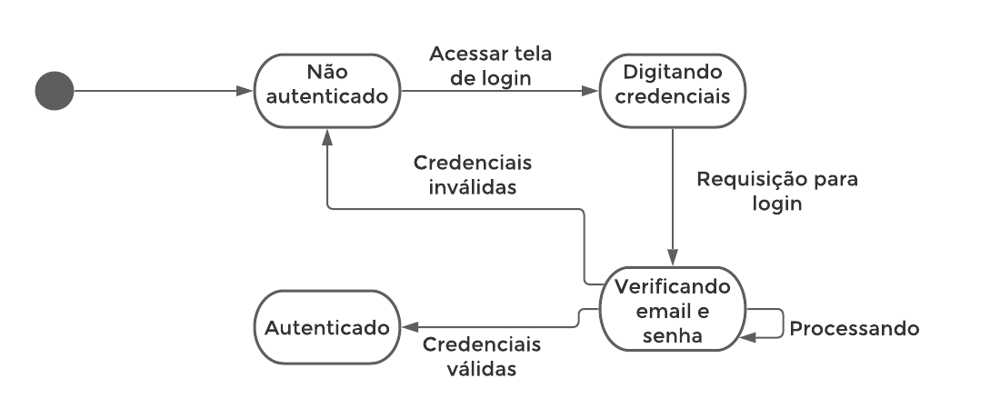
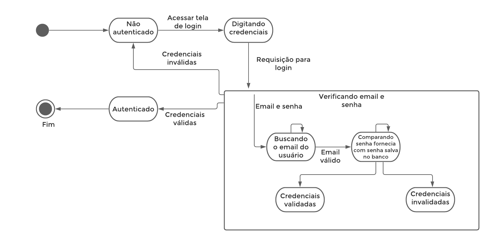
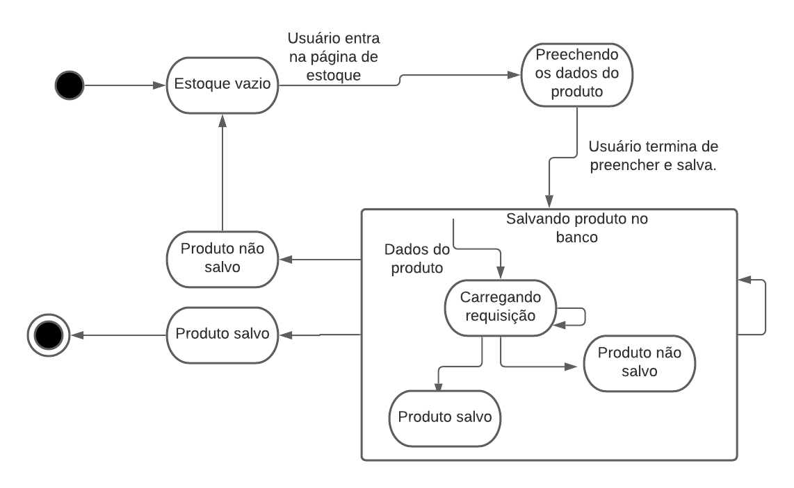
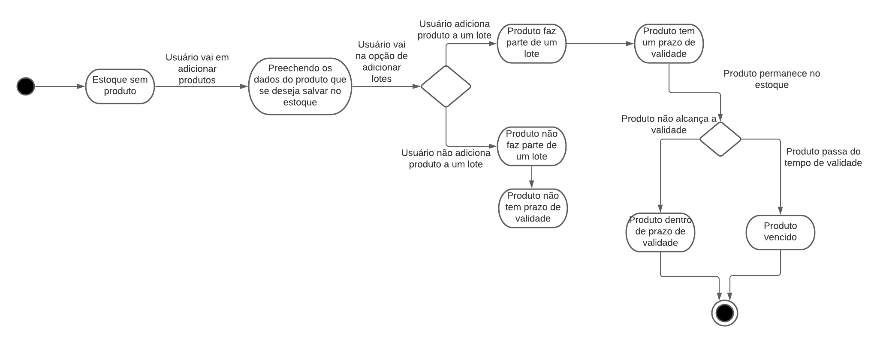

# Diagrama de Estado
**Este artefato foi produzido durante o dia 3 da Diagrams Sprint, para saber mais sobre a metodologia e como ela foi feita, clique aqui: _[Diagrams Sprint](Modeling/Diagrams/Diagrams.md)_**

Diagramas de estado servem para modelar os diversos estados de um objeto durante o seu ciclo de vida. É uma maneira eficiente e clara de descrever todos os possíveis estados de um sistema, assim como quais eventos levam transição de um estado para outro.

## Histórico de Revisões
| Data | Versão | Descrição | Autor(es) |
|:----:|:------:|:---------:|:---------:|
| 24/09/2020 | 1.0 | Reunião para debate sobre os diagramas | Gabriel Alves, Gabriel Davi, Micaella Gouveia, Pedro Igor e Sofia Patrocínio |
| 25/09/2020 | 1.1 | Confecção dos diagramas de estado | Gabriel Davi|
| 28/09/2020 | 1.2 | Documentação dos diagramas | Gabriel Davi|
| 28/09/2020 | 1.3 | Adição dos áudios | Gabriel Davi|

## Realização
Os diagramas foi produzido pelo [Lucichart](https://www.lucidchart.com/). Eles descrevem os possíveis estados de uma [aplicação](Modeling/objeto?id=Web-App) em todo o seu ciclo de vida.

## Diagramas

### Autenticação (V.0)

### Autenticação (V.1)

<a href="https://unbarqdsw.github.io/2020.1_G12_Stock/assets/pdf/diagramas/estado/Diagrama_estado_autenticacao.pdf">Arquivo em PDF</a>

<audio controls>
  <source src="https://unbarqdsw.github.io/2020.1_G12_Stock/assets/audios/diagramas/estado/estado_autenticacao.m4a" type="audio/mpeg">
</audio>

### Produto (V.0)

<a href="https://unbarqdsw.github.io/2020.1_G12_Stock/assets/pdf/diagramas/estado/Diagrama_estado_produto.pdf">Arquivo em PDF</a>

<audio controls>
  <source src="https://unbarqdsw.github.io/2020.1_G12_Stock/assets/audios/diagramas/estado/estado_produto.m4a" type="audio/mpeg">
</audio>

### Produto vencido (V.0)

<a href="https://unbarqdsw.github.io/2020.1_G12_Stock/assets/pdf/diagramas/estado/Diagrama_estado_produtoVencido.pdf">Arquivo em PDF</a>

<audio controls>
  <source src="https://unbarqdsw.github.io/2020.1_G12_Stock/assets/audios/diagramas/estado/estado_prazo.m4a" type="audio/mpeg">
</audio>

## Referências
* O que é um diagrama de estado: <https://micreiros.com/diagramas-comportamentais-da-uml-diagrama-de-estados/>. Último acesso em 28/09/2020.
