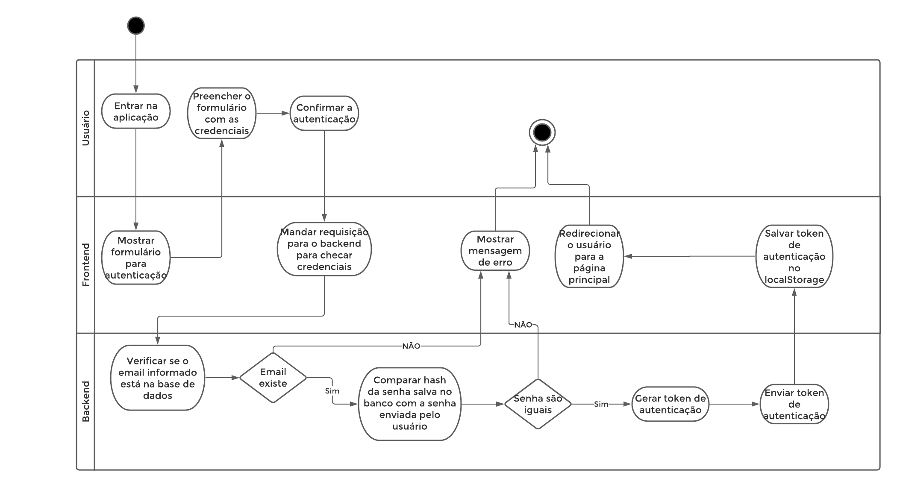
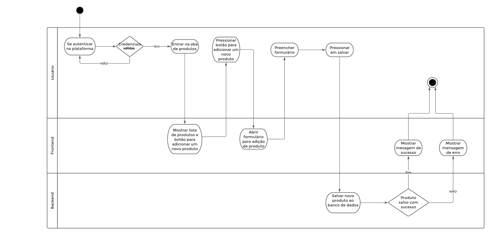
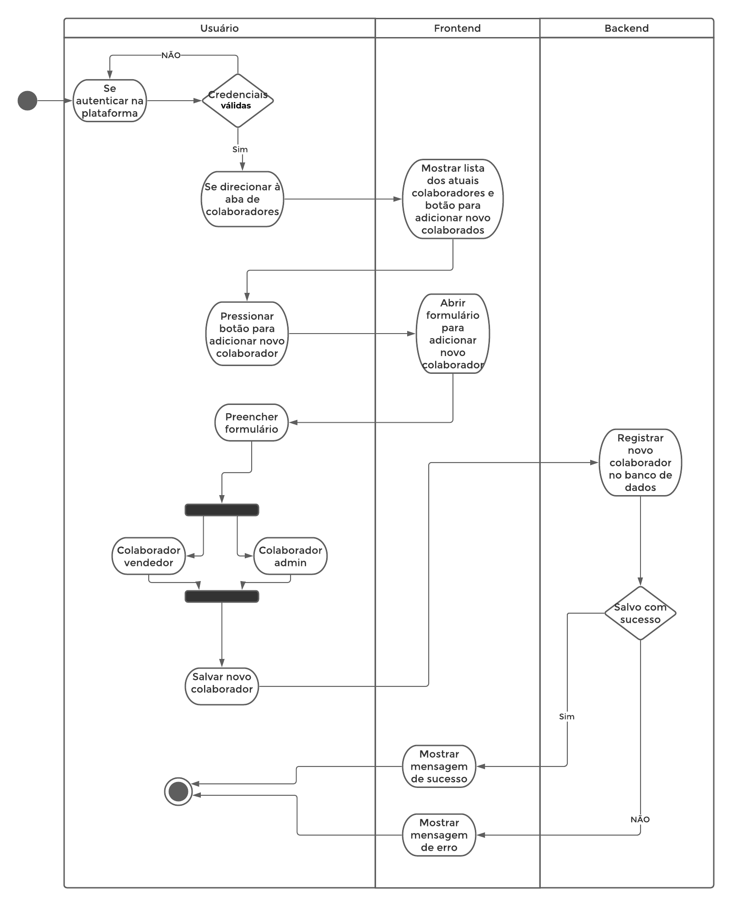

# Diagrama de Classes
**Este artefato foi produzido durante o dia 3 da Diagrams Sprint, para saber mais sobre a metodologia e como ela foi feita, clique aqui: _[Diagrams Sprint](Modeling/Diagrams/Diagrams.md)_**

Diagramas de atividade são considerados diagramas de comportamento, pois descrevem o que é necessário acontecer no sistema sendo modelado. Eles ajudam a unir as pessoas das áreas de negócios e de desenvolvimento de uma organização para entender o mesmo processo e comportamento

## Histórico de Revisões
| Data | Versão | Descrição | Autor(es) |
|:----:|:------:|:---------:|:---------:|
| 24/09/2020 | 1.0 | Reunião para debate sobre os diagramas | Gabriel Alves, Gabriel Davi, Micaella Gouviea, Pedro Igor e Sofia Patrocínio |
| 24/09/2020 | 1.1 | Confecção dos diagramas de prazo de validade | Sofia Patrocínio|
| 25/09/2020 | 1.2 | Confecção dos demais diagramas de atividade | Gabriel Davi|
| 28/09/2020 | 1.3 | Documentação dos diagramas | Gabriel Davi|

## Realização
Os diagramas foi produzido pelo [Lucichart](https://www.lucidchart.com/). Eles descrevem ações consideradas enscênciais para o nosso sistema detalhados em fluxos que podem se dividir entre raias de responsabilidade. 
## Diagramas

### Prazo de validade (V.0)

<a href="https://unbarqdsw.github.io/2020.1_G12_Stock/assets/pdf/diagramas/atividade/Diagrama_atividade_prazoValidade.pdf">Arquivo em PDF</a>

### Feedback(V.0)

<a href="https://unbarqdsw.github.io/2020.1_G12_Stock/assets/pdf/diagramas/atividade/Diagrama_atividade_feedback.pdf">Arquivo em PDF</a>

### Consultar produto(V.0)

<a href="https://unbarqdsw.github.io/2020.1_G12_Stock/assets/pdf/diagramas/atividade/Diagrama_atividade_consultarProduto.pdf">Arquivo em PDF</a>

### Autenticar no sistema(V.0)

<a href="https://unbarqdsw.github.io/2020.1_G12_Stock/assets/pdf/diagramas/atividade/Diagrama_atividade_autenticacao.pdf">Arquivo em PDF</a>

### Adicionar produto(V.0)

<a href="https://unbarqdsw.github.io/2020.1_G12_Stock/assets/pdf/diagramas/atividade/Diagrama_atividade_addProduto.pdf">Arquivo em PDF</a>

### Adicionar colaborador(V.0)

## Referências
* O que é um diagrama de atividade: <https://www.lucidchart.com/pages/pt/o-que-e-diagrama-de-atividades-uml>. Último acesso em 28/09/2020.
