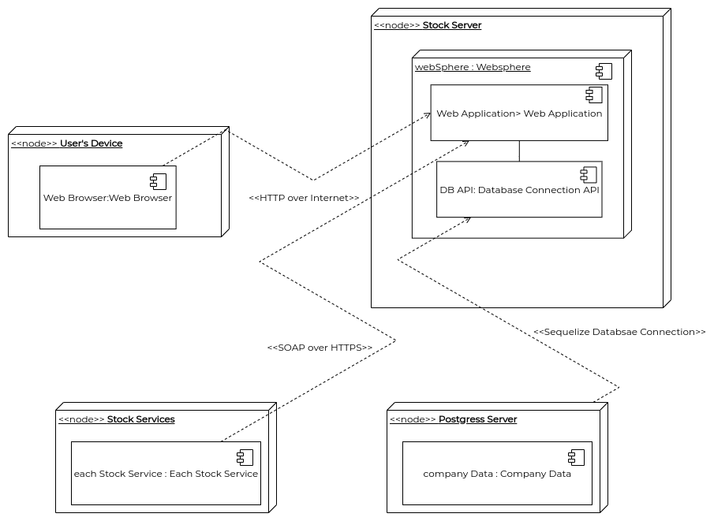

# Diagrama de Implementação

Diagramas de implementação servem para dar um outra visão sistemica em um nível de abstração geral. É possível visualizar como cada um dos agentes participantes da aplicação (usuário, dispositivo do usuário, site) se interagem e por quais caminhos é realizada esta interação.

## Histórico de Revisões
| Data | Versão | Descrição | Autor(es) |
|:----:|:------:|:---------:|:---------:|
| 17/11/2020 | 1.0 | Confecção do diagrama com base no documento de arquitetura. | Pedro Igor |

## Realização
O diagrama foi produzido pelo [draw.io](https://draw.io). O Diagrama descreve cada um dos agentes participantes da aplicação e assim como suas formas de interação.

## Diagrama

<a href="https://unbarqdsw.github.io/2020.1_G12_Stock/assets/pdf/diagramas/implantacao/Diagrama_de_Implementacao.pdf">Arquivo em PDF</a>

## Referências
  - IBM: Diagramas de implementação: <https://www.ibm.com/support/knowledgecenter/pt-br/SS5JSH_9.5.0/com.ibm.xtools.modeler.doc/topics/cdepd.html>. Último acesso em 17/11/2020
  - Documentação da aplicação Pax: <https://pax-app.github.io/Wiki/#/docs/DS/dinamica-e-seminario-4-b/DAS>. Último acesso em 17/11/2020