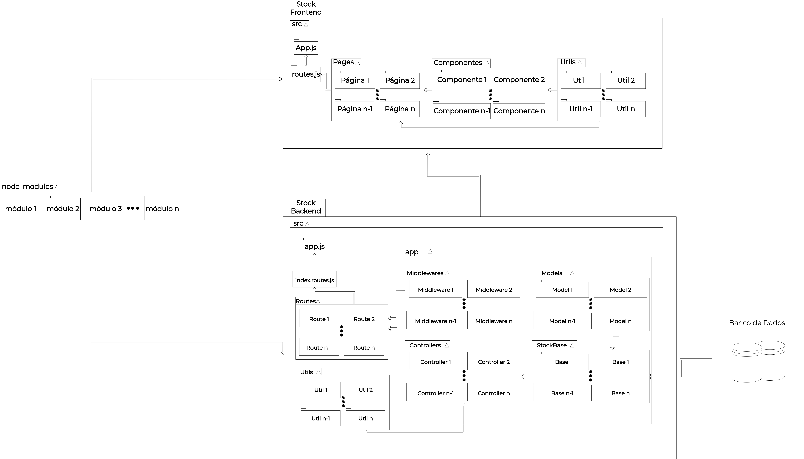
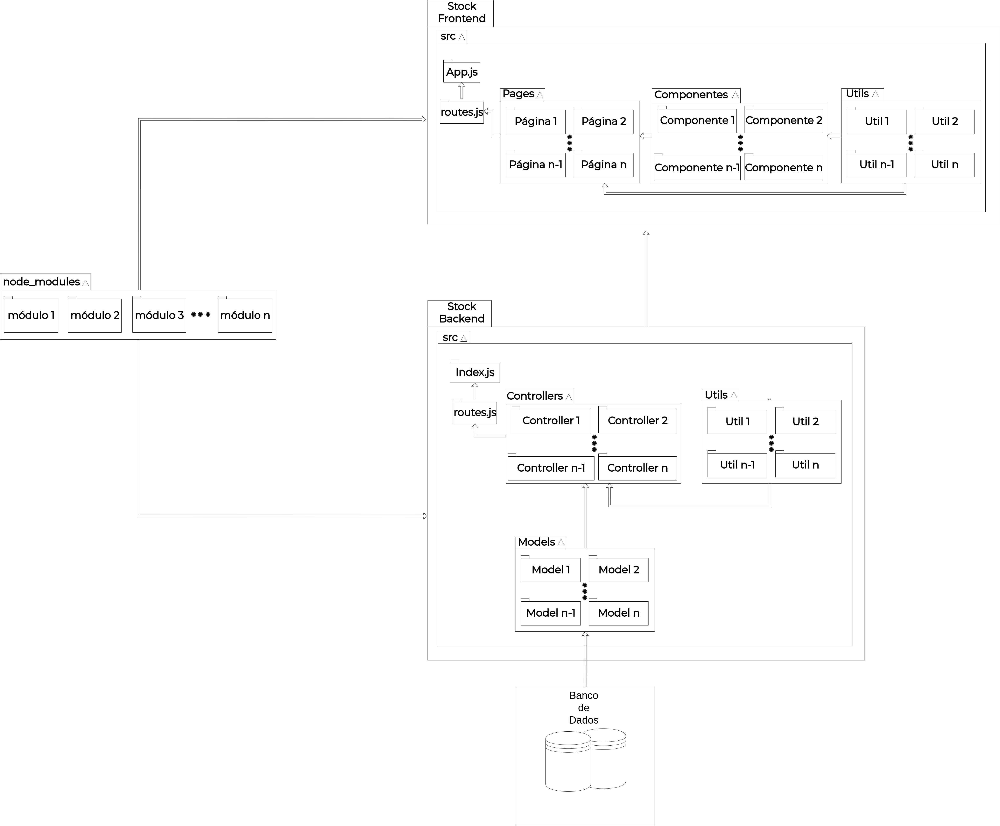
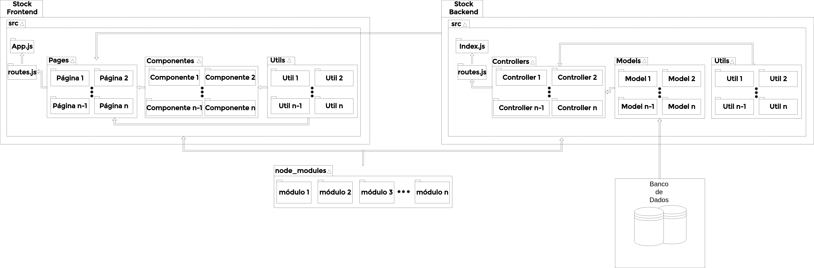

# Diagrama de Pacotes
**Este artefato foi produzido durante o dia 2 da Diagrams Sprint, para saber mais sobre a metodologia e como ela foi feita, clique aqui: _[Diagrams Sprint](Modeling/Diagrams/Diagrams.md)_**

O Diagrama de Pacotes tem por finalidade demonstrar a estrutura de diretórios e arquivos de um projeto. A princípio foi feita uma divisão entre Front-end e Back-end para análise individual de cada um deles. Em seguida foram feitas ligações por meio de setas que simbolizam comunicação entre cada pacote.

## Histórico de Revisões
| Data | Versão | Descrição | Autor(es) |
|:----:|:------:|:---------:|:---------:|
| 23/09/2020 | 1.0 | Criação do esboço do diagrama. | Gabriel Alves, Gabriel Davi, Micaella Gouveia, Pedro Igor e Sofia Patrocínio |
| 25/09/2020 | 1.1 | Criação do documento. | Pedro Igor |
| 25/09/2020 | 1.2 | Finalização e adição do Diagrama. | Pedro Igor |
| 14/10/2020 | 1.3 | Adição de uma segunda versão mostrando os níveis da aplicação. | Pedro Igor |
| 24/10/2020 | 1.4 | Atualização do diagrama conforme padrões implementados (Diagrama V.2)| Micaella Gouveia e Sofia Patrocínio|

## Realização

O diagrama foi produzido pelo [Draw.io](https://draw.io). Nele há todas os subsistemas contendo seus pacotes, fazendo a relação, além da representação dos níveis entre os pacotes por meio de setas.

## Diagrama

### Diagrama de Pacotes(V.2)

<a href="https://unbarqdsw.github.io/2020.1_G12_Stock/assets/pdf/diagramas/pacotes/DiagramaPacotesV2.pdf">Arquivo em PDF</a>  

### Diagrama de Pacotes(V.1)

<a href="https://unbarqdsw.github.io/2020.1_G12_Stock/assets/pdf/diagramas/pacotes/DiagramaPacotesV1.pdf">Arquivo em PDF</a>  

<audio controls>
  <source src="https://unbarqdsw.github.io/2020.1_G12_Stock/assets/audios/diagramas/pacotes/Diagrama_de_Pacotes.wav" type="audio/mpeg">
</audio>

### Diagrama de Pacotes(V.0)

<a href="https://unbarqdsw.github.io/2020.1_G12_Stock/assets/pdf/diagramas/pacotes/DiagramaPacotesV0.pdf">Arquivo em PDF</a>

## Referências
Micreiros - Diagramas Estruturais da UML: Diagrama de Pacotes. <https://micreiros.com/diagrama-de-pacotes/>. Último Acesso em 25/09/2020.