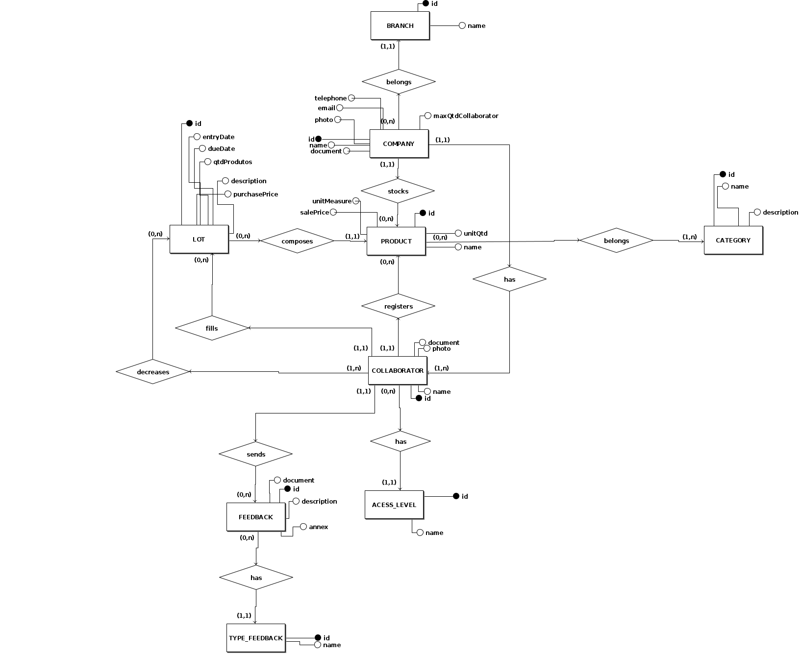

# Projeto Banco de Dados
**Este artefato foi produzido durante o dia 2 da Diagrams Sprint, para saber mais sobre a metodologia e como ela foi feita, clique aqui: _[Diagrams Sprint](Modeling/Diagrams/Diagrams.md)_**

O Projeto de banco de dados tem por finalidade, modelar todo o banco de dados do sistema com suas respectivas tabelas e relacionamento. Nesse documento é apresentado por um MER Modelo Entidade Relacionamento, DER Diagrama Entidade Relacionamento, DL Diagrama Lógico e o seu respectivo Dicionário de Dados.

## Histórico de Revisões
| Data | Versão | Descrição | Autor(es) |
|:----:|:------:|:---------:|:---------:|
| 23/09/2020 | 1.0 | Criação das classes e seus atributos | Gabriel Alves, Gabriel Davi, Micaella Gouviea, Pedro Igor e Sofia Patrocínio |
| 25/09/2020 | 1.1 | Criação dos diagramas relacionamento e lógico | Gabriel Alves |

## Modelo Entidade Relacionamento (MER)

### Entidades

COMPANY (name, document, branch, telephone, email, photo, maxQtdCollaborator, registerDate)

BRANCH(id, name)

PRODUCT (id, name, category, unitQtd, unitMeasure, salePrice)

LOT (id, entryDate, dueDate, qtdProdutos, description, purchasePrice)

CATEGORY (id, name, description)

COLLABORATOR (id, name, document, acessLevel, photo)

ACESS_LEVEL (id, name)

FEEDBACK (id, type, description, document, annex)

TYPE_FEEDBACK (id, name)

### Relacionamentos

Company - stocks - Product
Uma company pode estocar nenhum ou vários produtos e um produto pode ser estocado por uma e no máximo uma company.  
**Cardinalidade -> 1:n**

Company - belongs - Branch
Uma company pertence a uma e somente uma branch e uma branch pode possuir nenhuma ou várias Companys. 
**Cardinalidade -> n:1**

Company - has - COLLABORATOR
Uma company possui um ou vários colaboradores e um colaborador pertence a uma e somente uma company. 
**Cardinalidade -> 1:n**

Lot - composes - Product
Um lote pode compor um e no máximo um produto e um produto pode ser composto por nenhum ou vários lots. 
**Cardinalidade -> n:1**

Product - belongs - Category
Um produto pode pertencer a um ou a várias categorias e uma categoria pode ser de nenhum ou vários produtos. 
**Cardinalidade -> n:m**

COLLABORATOR - fills - Lot
Um colaborador pode popular nenhum ou vários lotes e um lote pode ser populado por um e apenas um colaborador. 
**Cardinalidade -> 1:n**

COLLABORATOR - registers - Product
Um colaborador pode registrar nenhum ou vários produtos e um produto pode ser registrado por um e apenas um colaborador. 
**Cardinalidade -> 1:n**

COLLABORATOR - decreases - Lot
Um colaborador pode decrementar nenhum ou vários lotes e um lote pode ser decrementado por um ou vários colaboradores. 
**Cardinalidade -> n:m**

FEEDBACK - has - TYPE_FEEDBACK
Um feedback pode possuir um e no máximo um tipo de feedback e um tipo de feedback pode possuir nenhum ou vários feedbacks. 
**Cardinalidade -> n:1**

COLLABORATOR - sends - FEEDBACK
Um colaborador pode enviar nenhum ou vários feedbacks e um feedback pode ser enviado por um e apenas um colaborador. 
**Cardinalidade -> 1:n**

COLLABORATOR - has - ACESS_LEVE
Um colaborador pode ter um e somente um nível de acesso e um nível de acesso pode ter nenhum ou vários colaboradores. 
**Cardinalidade -> n:1**

## Diagrama Entidade Relacionamento (DER)

## Diagrama Lógico

