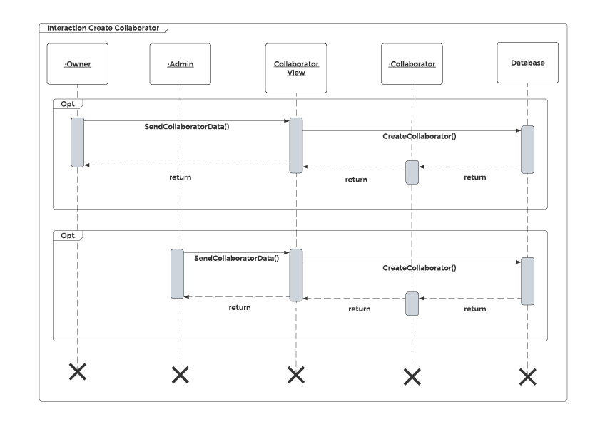
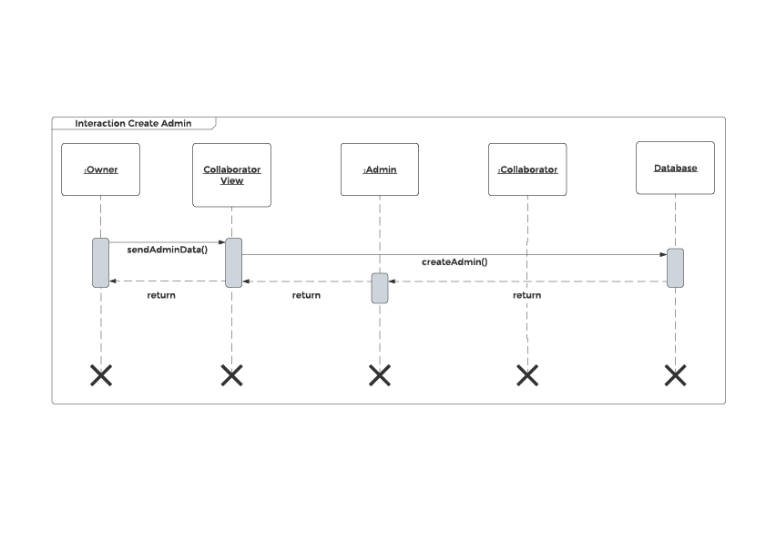
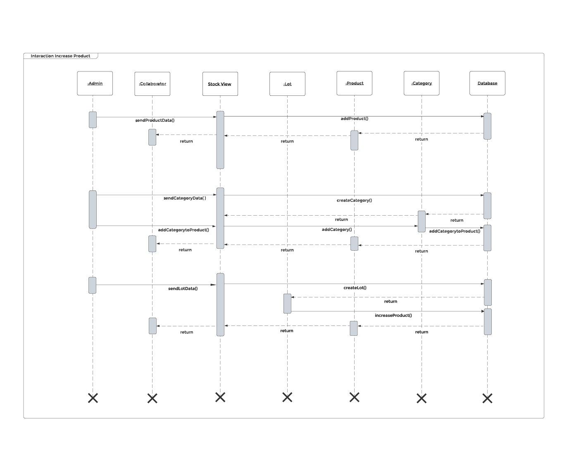
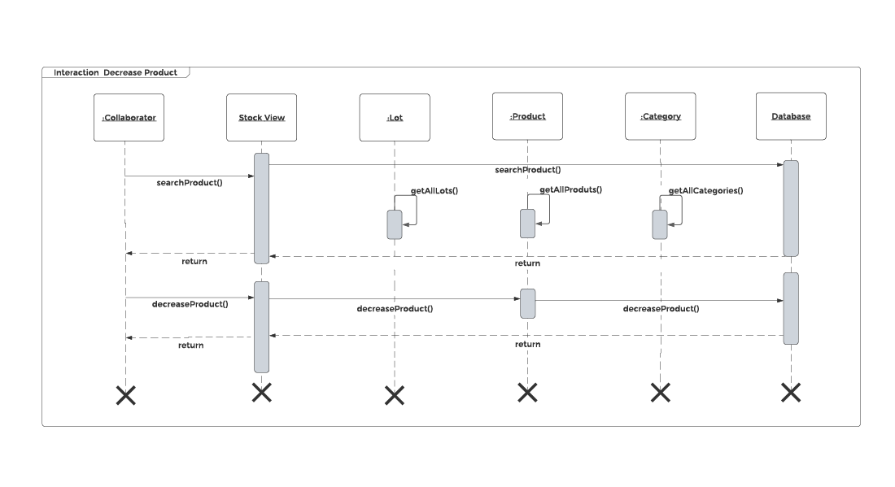
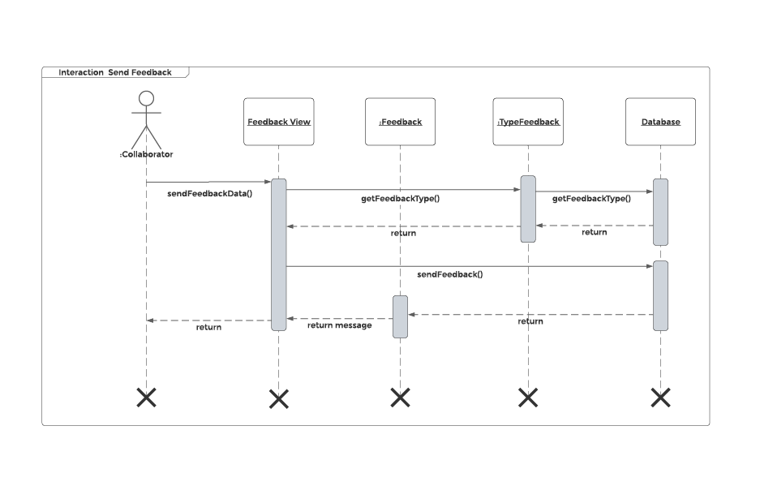

# Diagrama de Sequência
**Este artefato foi produzido durante o dia 4 da Diagrams Sprint, para saber mais sobre a metodologia e como ela foi feita, clique aqui: _[Diagrams Sprint](Modeling/Diagrams/Diagrams.md)_**

O diagrama de sequência mostra as interações entre os objetos e as mensagens trocadas entre eles. Enfatiza a ordem temporal do ciclo de vida dos objetos.

Simbolização:
- Entidades: Retângulo
- Controller, API, Web Service: Steriotype 
- Ciclo de vida de um objeto: Life line (Vertical)
- Mensagem: Métodos 
- Caixinha: Ação em Execução
- Linha pontilhada: Retono - mensagem (opcional)
- Linha continua com seta cheia: mensagem síncrona
- Chaves: restrições
- Caixa: várias ações que ocorrem, sem detalhamento

Para representar uma instância específica da classe:
data:Stock
- data: instância
- Stock: classe 

Representar ação:
- Começo da ocorrência - Linha continua com seta cheia
- Execução - Caixa de ativação
- Final da ocorrência - Linha pontilhada com seta simples 

## Histórico de Revisões
| Data | Versão | Descrição | Autor(es) |
|:----:|:------:|:---------:|:---------:|
| 24/09/2020 | 1.0 | Adição da explicação sobre diagrama de sequência | Sofia Patrocínio |
| 25/09/2020 | 1.1 | Criação das relações entre classes | Gabriel Davi, Micaella Gouveia, Pedro Igor e Sofia Patrocínio |
| 28/09/2020 | 1.2 | Criação dos diagramas | Sofia Patrocínio |
| 28/09/2020 | 1.3 | Adição dos áudios e linkagem dos léxicos | Sofia Patrocínio |

## Realização
O diagrama foi produzido pelo [LucidChart](https://www.lucidchart.com/). Nele há quadro, objetos, linhas de vida e setas na direção da comunicação, bem como mensagens trocadas.

## Diagramas

* **Criação de Colaborador**

<a href="https://unbarqdsw.github.io/2020.1_G12_Stock/assets/pdf/diagramas/sequencia/CreateCollaborator.pdf">Arquivo em PDF</a>

<audio controls>
  <source src="https://unbarqdsw.github.io/2020.1_G12_Stock/assets/audios/diagramas/sequencia/CreateCollaborator.m4a" type="audio/mpeg">
</audio>

* **Criação de [Administradores](Modeling/objeto?id=Admin)**

<a href="https://unbarqdsw.github.io/2020.1_G12_Stock/assets/pdf/diagramas/sequencia/CreateAdmin.pdf">Arquivo em PDF</a>

<audio controls>
  <source src="https://unbarqdsw.github.io/2020.1_G12_Stock/assets/audios/diagramas/sequencia/CreateAdmin.m4a" type="audio/mpeg">
</audio>

* **[Adição](Modeling/verbo?id=Cadastrar-Produto) de [Produto](Modeling/objeto?id=Produto) ao Estoque**

<a href="https://unbarqdsw.github.io/2020.1_G12_Stock/assets/pdf/diagramas/sequencia/IncreaseProduct.pdf">Arquivo em PDF</a>

<audio controls>
  <source src="https://unbarqdsw.github.io/2020.1_G12_Stock/assets/audios/diagramas/sequencia/IncreaseProduct.m4a" type="audio/mpeg">
</audio>

* **[Baixa](Modeling/verbo?id=Baixa-em-Produto) de [Produto](Modeling/objeto?id=Produto)**

<a href="https://unbarqdsw.github.io/2020.1_G12_Stock/assets/pdf/diagramas/sequencia/ProductSale.pdf">Arquivo em PDF</a>

<audio controls>
  <source src="https://unbarqdsw.github.io/2020.1_G12_Stock/assets/audios/diagramas/sequencia/ProductSale.m4a" type="audio/mpeg">
</audio>

* **Envio de [Feedback](/Modeling/verbo?id=feedback)**

<a href="https://unbarqdsw.github.io/2020.1_G12_Stock/assets/pdf/diagramas/sequencia/SendFeedback.pdf">Arquivo em PDF</a>

<audio controls>
  <source src="https://unbarqdsw.github.io/2020.1_G12_Stock/assets/audios/diagramas/sequencia/SendFeedback.m4a" type="audio/mpeg">
</audio>

## Referências
- ENGENHARIA DE SOFTWARE Prof. Ricardo Rodrigues Barcelar MODELAGEM DE SISTEMAS ORIENTADA A OBJETOS COM UML. Disponível em: <https://docplayer.com.br/7303694-Engenharia-de-software-prof-ricardo-rodrigues-barcelar-http-www-ricardobarcelar-com-br.html>. Último acesso em 23/09/2020.
- Activity Diagrams. Disponível em: <https://www.uml-diagrams.org/sequence-diagrams.html>. Último acesso em 23/09/2020.