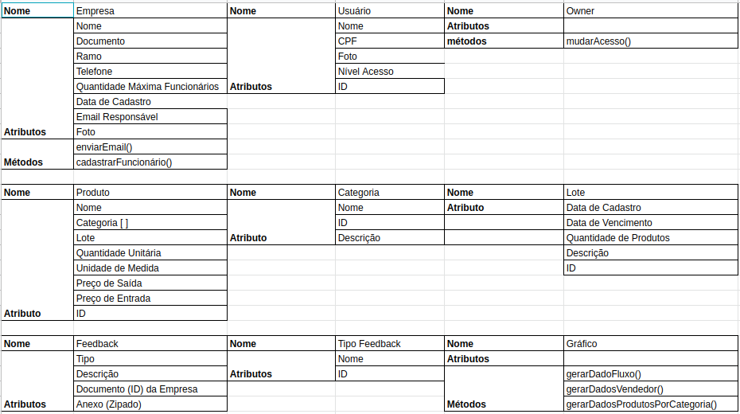
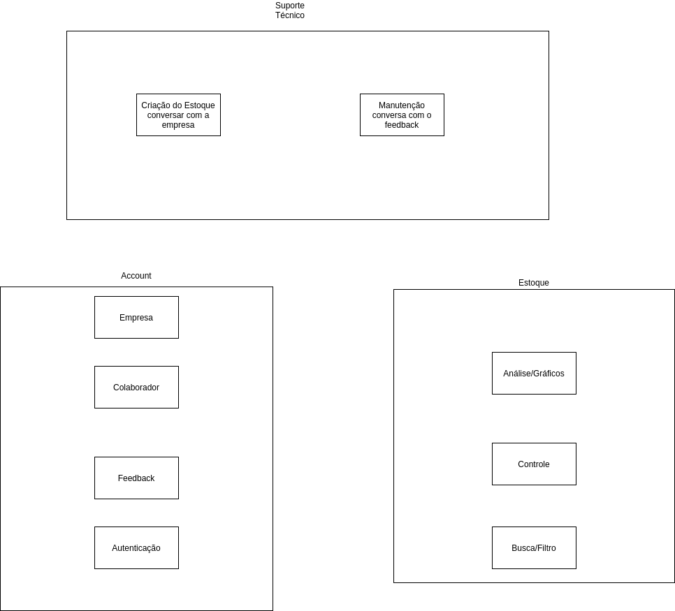

# Dia 1 - Diagrama de Classes e Diagrama de Componentes

| Horário | Duração | Mediador(a) | Participantes |
|---------|---------|-------------|---------------|
| 12:00 | 02:30 | Micaella Gouveia | Todos os membros |

## Histórico de Revisões

| Data | Versão | Descrição | Autor(es) |
|:----:|:------:|:---------:|:---------:|
| 23/09/2020 | 1.0 | Criação do documento | Micaella Gouveia |
| 24/09/2020 | 1.1 | Adição do relato e documentos produzidos | Micaella Gouveia |
| 27/09/2020 | 1.2 | Adição dos vídeos | Micaella Gouveia |

## Relato da Mediadora

Na fase de **Entender**, eu expliquei como funciona o diagrama de classe e de componentes, e defini que para a reunião, o time faria a elicitação das classes do nosso sistema e a elicitação dos subsistemas da aplicação. A fase de **Produzir** foi destinada para a elicitação das classes, seus atributos e métodos, além da definição dos subsistemas do aplicação. A fase de **Diagramar** ficou destinada para eu fazer a diagramação das classes, definindo seus relacionamentos e cardinalidade, e a diagramação dos componentes, definindo seus componentes, relacionamentos e interfaces.

### Documentação produzida: 
* [Diagrama de Classes](Modeling/Diagrams/Classes.md) 
* [Diagrama de Componentes](Modeling/Diagrams/Componentes.md)

## Gravações Disponíveis

<iframe allowFullScreen="allowFullScreen" src="https://www.youtube.com/embed/9K5zTdbEiOc?ecver=1&amp;iv_load_policy=3&amp;rel=0&amp;yt:stretch=16:9&amp;autohide=1&amp;color=red&amp;width=560&amp;width=560" width="560" height="315" allowtransparency="true" frameborder="0">
<a  id="uJLPWJNS" href="https://wildernesswood.co.uk/mattress-recycling-is-a-scam/">recycling of mattress</a>

<a  id="uJLPWJNS" href="https://www.ihertfordshire.co.uk">iHertfordshire UK</a>
<small>Powered by <a href="https://youtubevideoembed.com/ ">Embed YouTube Video</a></small></iframe>

<iframe allowFullScreen="allowFullScreen" src="https://www.youtube.com/embed/hqOMW12nWpQ?ecver=1&amp;iv_load_policy=3&amp;rel=0&amp;yt:stretch=16:9&amp;autohide=1&amp;color=red&amp;width=560&amp;width=560" width="560" height="315" allowtransparency="true" frameborder="0">
<a  id="uJLPWJNS" href="https://wildernesswood.co.uk/mattress-recycling-is-a-scam/">recycling of mattress</a>

<a  id="uJLPWJNS" href="https://www.ihertfordshire.co.uk">iHertfordshire UK</a>
<small>Powered by <a href="https://youtubevideoembed.com/ ">Embed YouTube Video</a></small></iframe>

## Documentos produzidos durante a reunião

* Classes

* Componentes

