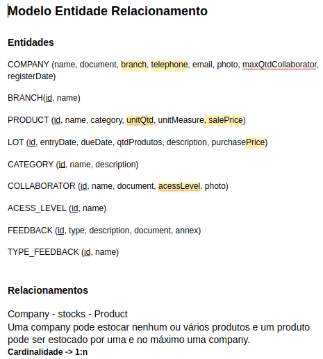
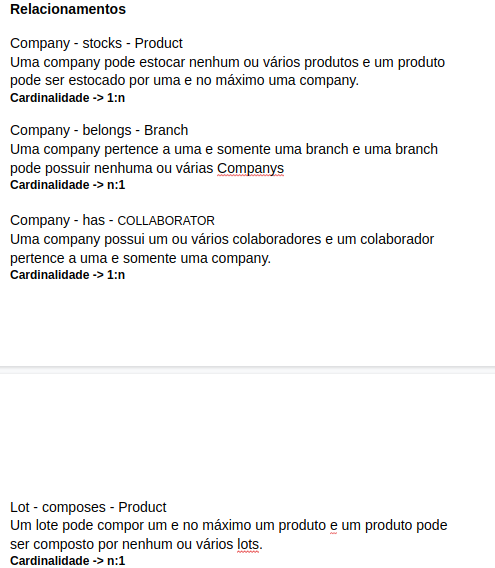
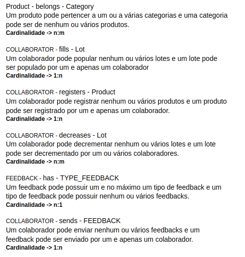
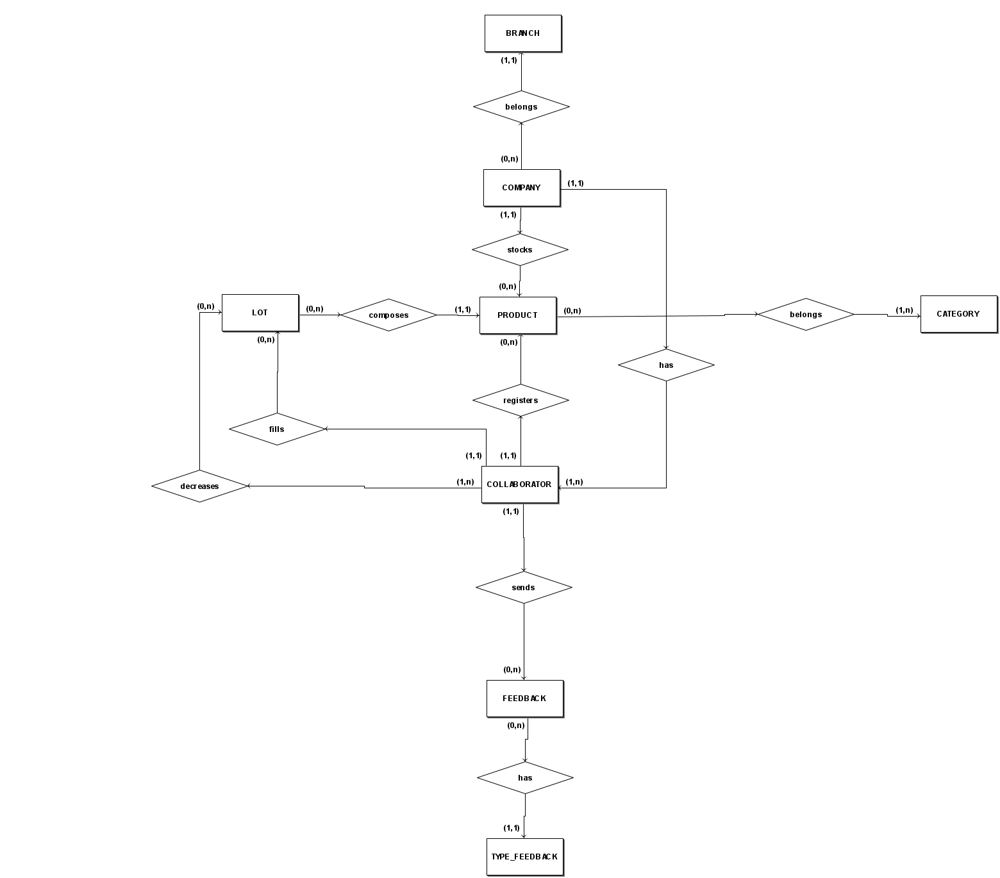
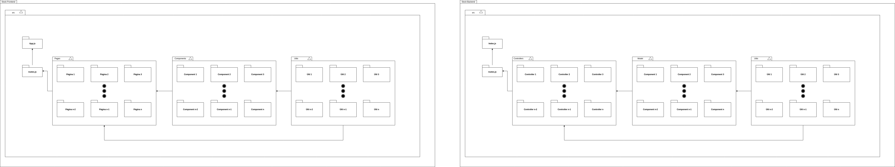

# Dia 2 - Diagrama de Entidade de Relacionamento e Diagrama de Pacotes

| Horário | Duração | Mediador(a) | Participantes |
|---------|---------|-------------|---------------|
| 14:00 | 02:30 | Gabriel Alves e Pedro Igor | Todos os membros |

## Histórico de Revisões

| Data | Versão | Descrição | Autor(es) |
|:----:|:------:|:---------:|:---------:|
| 24/09/2020 | 1.0 | Criação do documento | Micaella Gouveia |
| 25/09/2020 | 1.1 | Inserção do relato e adição da documentação produzida durante a reunião | Pedro Igor |
| 27/09/2020 | 1.2 | Adição dos vídeos | Micaella Gouveia |

## Relato do Mediador

Na fase de **entender**, foi feita uma explicação geral dos diagramas e seus objetivos, visto que nem todos os integrantes do grupo haviam tido contato com a confecção dos diagramas. Na fase de **produzir**, foi produzido o documento precedente ao DER(Diagrama Entidade Relacionamento), o MER(Modelo Entidade Relacionamento). O MER foi baseado no diagrama confeccionado no dia anterior, o [Diagrama de classes](Modeling/Diagrams/Classes.md), e além disso serviu como forma de melhorar o diagrama do dia anterior. Para o diagrama de pacotes foi feita uma análise de projetos prontos das tecnologias que serão utilizadas no projeto e criada uma estrutura para o projeto. **Diagramar** foi destinada a finalizar os diagramas iniciados em reunião. Para o DER foram adicionados os atributos às entidades e gerado o diagrama lógico. Para o Diagrama de Pacotes foram melhorados alguns detalhes no design.

### Documentação produzida:
 - [Diagrama Entidade Relacionamento](Modeling/Diagrams/EntidadeRelacionamento.md)
 - [Pacotes](Modeling/Diagrams/Pacotes.md)

## Gravações Disponíveis

<iframe allowFullScreen="allowFullScreen" src="https://www.youtube.com/embed/G3uSXJnHsc0?ecver=1&amp;iv_load_policy=3&amp;yt:stretch=16:9&amp;autohide=1&amp;color=red&amp;width=560&amp;width=560" width="560" height="315" allowtransparency="true" frameborder="0">
<a  id="x4Kmoha6" href="https://www.rockpamperscissors.co.uk/a-new-one-on-me/">Emma hybrid</a>

<a  id="x4Kmoha6" href="https://www.earth-essentials.co.uk/is-buying-a-mattress-the-worst-thing-possible-for-your-health/">VOCs</a>
<small>Powered by <a href="https://youtubevideoembed.com/ ">Embed YouTube Video</a></small></iframe>

<iframe allowFullScreen="allowFullScreen" src="https://www.youtube.com/embed/0D_vQnNvpxg?ecver=1&amp;iv_load_policy=3&amp;yt:stretch=16:9&amp;autohide=1&amp;color=red&amp;width=560&amp;width=560" width="560" height="315" allowtransparency="true" frameborder="0">
<a  id="x4Kmoha6" href="https://www.rockpamperscissors.co.uk/a-new-one-on-me/">Emma hybrid</a>

<a  id="x4Kmoha6" href="https://www.earth-essentials.co.uk/is-buying-a-mattress-the-worst-thing-possible-for-your-health/">VOCs</a>
<small>Powered by <a href="https://youtubevideoembed.com/ ">Embed YouTube Video</a></small></iframe>

## Documentos produzidos durante a reunião
## MER
  
  
  

## DER
 

## Diagrama de Pacotes
 

# Referências

- Software para Diagramação do Modelo Entidade Relacionamento - brModelo <http://www.sis4.com/brModelo/>. Último acesso em 25/09/2020 
