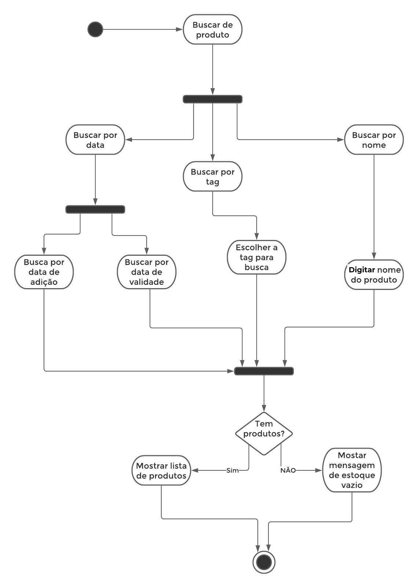

# Dia 3 - Diagrama de Atividades e Diagrama de Estados
| Horário | Duração | Mediador(a) | Participantes |
|---------|---------|-------------|---------------|
| 08:00 | 02:00 | Gabriel Davi | Gabriel Davi, Micaella Gouveia, Pedro Igor e Sofia Patrocínio |

## Histórico de Revisões

| Data | Versão | Descrição | Autor(es) |
|:----:|:------:|:---------:|:---------:|
| 24/09/2020 | 1.0 | Criação do documento | Micaella Gouveia |
| 27/09/2020 | 1.1 | Documentação do que foi realizado no dia | Gabriel Davi |
| 27/09/2020 | 1.2 | Adição dos vídeos | Micaella Gouveia |

## Relato do mediador
Na fase de **Entender**, foi feita uma explicação geral dos diagramas e seus objetivos, visto que nem todos os integrantes do grupo haviam tido contato com a confecção dos diagramas. Na fase de **Produzir**, foi produzido um documento inicial que iria descrever os diagramas de estado e atividade. Nossos diagramas de atividade foram produzidos a partir de uma discussão do grupo do que consideravam ações mais importantes do sistema. Já o de estado, foi discutido quais entidades teriam diferentes estados para serem representados por diagramas. **Diagramar** foi destinada a finalizar os diagramas iniciados em reunião.

### Documentação produzida: 

[Diagrama de estado](Modeling/Diagrams/Estado.md)

[Diagrama de atividade](Modeling/Diagrams/Atividades.md)

## Gravações Disponíveis

<iframe allowFullScreen="allowFullScreen" src="https://www.youtube.com/embed/exVmFBLwd94?ecver=1&amp;iv_load_policy=3&amp;yt:stretch=16:9&amp;autohide=1&amp;color=red&amp;width=560&amp;width=560" width="560" height="315" allowtransparency="true" frameborder="0">
<a  id="x4Kmoha6" href="https://www.rockpamperscissors.co.uk/a-new-one-on-me/">Emma hybrid</a>

<a  id="x4Kmoha6" href="https://www.earth-essentials.co.uk/is-buying-a-mattress-the-worst-thing-possible-for-your-health/">VOCs</a>
<small>Powered by <a href="https://youtubevideoembed.com/ ">Embed YouTube Video</a></small></iframe>

<iframe allowFullScreen="allowFullScreen" src="https://www.youtube.com/embed/u_LasW_UMA8?ecver=1&amp;iv_load_policy=3&amp;rel=0&amp;yt:stretch=16:9&amp;autohide=1&amp;color=red&amp;width=560&amp;width=560" width="560" height="315" allowtransparency="true" frameborder="0">
<a  id="uJLPWJNS" href="https://wildernesswood.co.uk/mattress-recycling-is-a-scam/">recycling of mattress</a>

<a  id="uJLPWJNS" href="https://www.ihertfordshire.co.uk">iHertfordshire UK</a>
<small>Powered by <a href="https://youtubevideoembed.com/ ">Embed YouTube Video</a></small></iframe>

## Documentos produzidos durante a reunião

### Estado

### Atividade

