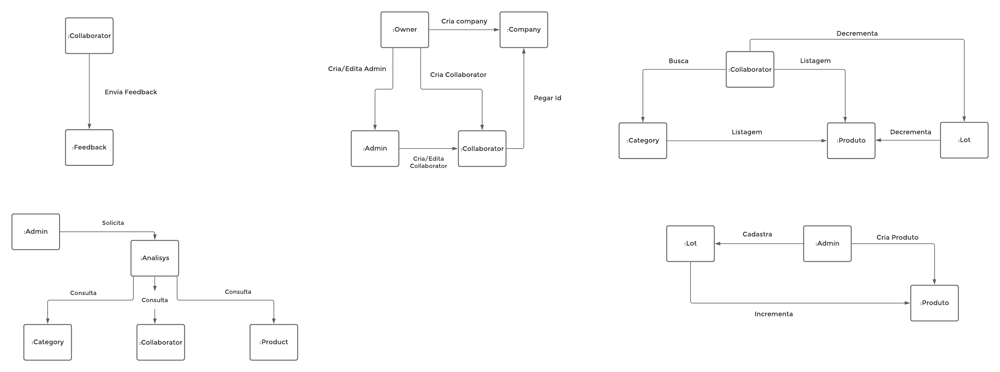

# Dia 4 - Diagrama de Sequência e Diagrama de Comunicação
| Horário | Duração | Mediador(a) | Participantes |
|---------|---------|-------------|---------------|
| 08:00 | 01:00 | Sofia Patrocínio | Gabriel Davi, Micaella Gouveia, Pedro Igor e Sofia Patrocínio |

## Histórico de Revisões

| Data | Versão | Descrição | Autor(es) |
|:----:|:------:|:---------:|:---------:|
| 24/09/2020 | 1.0 | Criação do documento | Micaella Gouveia |
| 26/09/2020 | 1.1 | Adição do relato e documentos produzidos | Sofia Patrocínio |

## Relato da Mediadora

Na fase de **Entender**, eu expliquei como funciona os diagramas de sequência e comunicação, e defini que para a reunião, seria necessário enterdermos as interações entre os objetos, pois ambos diagramas demostram essa relação. A fase de **Produzir** foi destinada para enterdemos como os objetos se relacionam e mensagens trocadas entre eles. A fase de **Diagramar** ficou destinada para eu fazer a diagramação dos diagramas com base na documentação produzida durante a reunião e assim validá-lo com os membros.

### Documentação produzida: 
* [Diagrama de Sequência](Modeling/Diagrams/Sequência.md) 
* [Diagrama de Comunicação](Modeling/Diagrams/Comunicação.md)

## Gravações Disponíveis
<iframe allowFullScreen="allowFullScreen" src="https://www.youtube.com/embed/hN8elTLEmcs?ecver=1&amp;iv_load_policy=3&amp;yt:stretch=16:9&amp;autohide=1&amp;color=red&amp;width=560&amp;width=560" width="560" height="315" allowtransparency="true" frameborder="0">
<a rel="" id="wAoY6RGX" href="https://www.ihertfordshire.co.uk/2020/05/28/heres-what-the-average-house-in-hertfordshire-actually-looks-like-without-photos/">herts</a>

<a rel="" id="wAoY6RGX" href="https://www.rockpamperscissors.co.uk/a-new-one-on-me/">really stinks</a>
<small>Powered by <a href="https://youtubevideoembed.com/ ">Embed YouTube Video</a></small></iframe>

## Documentos produzidos durante a reunião
