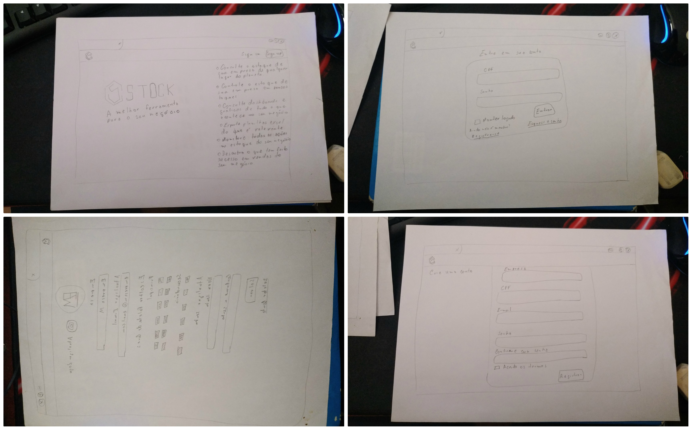
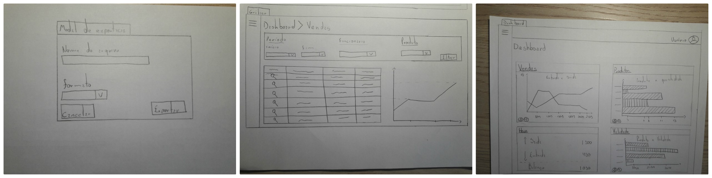
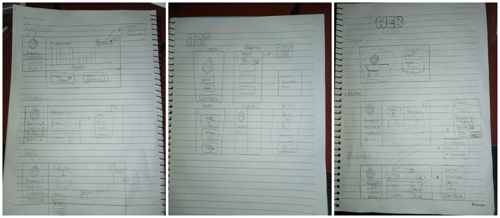
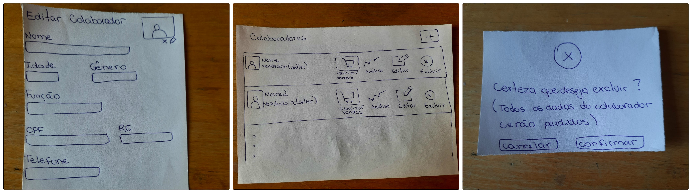
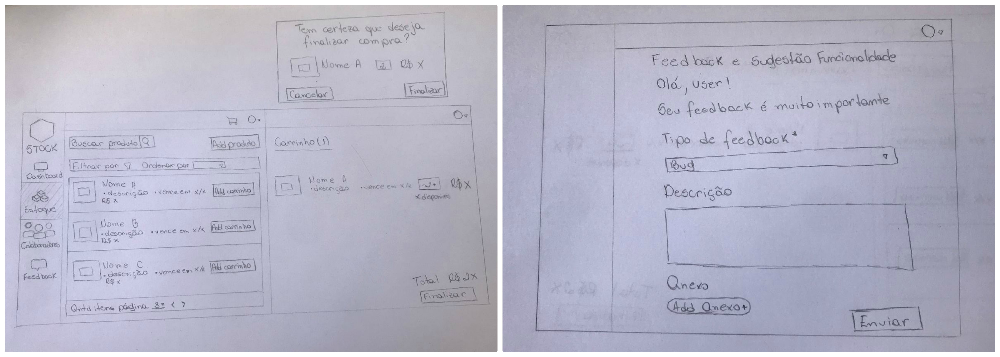

# Protótipo de Baixa Fidelidade

Os [protótipos](Modeling/objeto?id=protótipo) de baixa fidelidade são [protótipos](Modeling/objeto?id=protótipo) desenhados no papel. Eles visam definir a interação do [usuário](Modeling/objeto?id=usuário) com a aplicação de forma simples, sem preocupações com elementos ligados ao design. Por causa da sua simplicidade, muitas vezes ele é utilizado para ajudar na definição do projeto e no levantamento dos requisitos do produto.

## Históricos de Revisões

|    Data    | Versão |                  Descrição                   |                     Autor(es)                     |
| :--------: | :----: | :------------------------------------------: | :-----------------------------------------------: |
| 16/09/2020 |  1.0   |  Abertura do documento de baixa fidelidade   |          Gabriel Davi e Sofia Patrocínio          |
| 16/09/2020 |  1.1   | Adição da introdução e documentos produzidos |        Micaella Gouveia e Sofia Patrocínio        |
| 16/09/2020 |  1.2   |             Linkagem dos léxicos             | Gabriel Davi, Micaella Gouveia e Sofia Patrocínio |
| 17/09/2020 |  1.3  |       Adição do léxico de feedback     | Gabriel Davi |

## Metodologia

Para o projeto, cada membro do time ficou responsável em desenvolver uma funcionalidade definida anteriormente. Essa divisão foi feita da seguinte forma:

**1. [Usuário](Modeling/objeto?id=usuário)**:

Membro Responsável: Pedro Igor

- Tela Inicial
- Tela de Login
- Tela de Cadastro
- Tela de perfil de [Usuário](Modeling/objeto?id=usuário)(editar informações)

**2. Dashboard (primeira página após efetuar login)**:

Membro Responsável: Gabriel Alves

- Modal de exportar os dados (dados de venda, planilhas)
- Gráficos (pode ser por período: diário, semanal, mensal; por [tags](Modeling/objeto?id=Tag) ou funcionários)

**3. Lista de [Estoque](Modeling/verbo?id=Controle-de-Estoque)**:

Membro Responsável: Gabriel Davi

- Modal para [cadastro](Modeling/verbo?id=Cadastrar-Produto) de produto
- Modal para [importar](Modeling/verbo?id=Importação) planilha

**4. Colaboradores (Apenas para Admin ou Owner)**:

Membro Responsável: Micaella Gouveia

- Página de Colaboradores
- Modal para criar/editar colaborador
- Opção de remover colaborador

**5. Venda e [Feedback](Modeling/verbo?id=feedback)**:

Membro Responsável: Sofia Patrocínio

- Tela de [feedback](Modeling/verbo?id=feedback) que o [usuário](Modeling/objeto?id=usuário) fará para reportar [bug](Modeling/objeto?id=Bug), dificuldades
- Analisar questão da venda, retirada de produto

## Protótipos Produzidos

1. Pedro Igor

2. Gabriel Alves

3. Gabriel Davi

4. Micaella Gouveia

5. Sofia Patrocínio

## Gravações Disponíveis

## Referências

- Fidelidade de [Protótipos](Modeling/objeto?id=protótipo): <https://www.vitaminaweb.com.br/fidelidade-de-prototipos-baixa-media-ou-alta/>. Último acesso em 16/09/2020.
