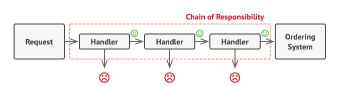
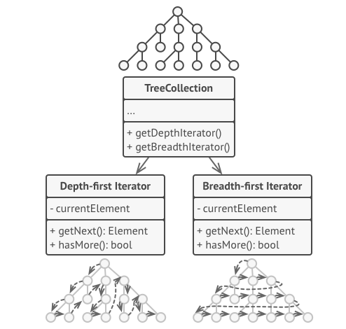

# Estudo Dirigido - GoF Comportamental

## Padrão de Projeto
No desenvolvimento de Software é usual que os desenvolvedores acumulem soluções para os problemas que resolvem com frequência, e essas soluções são difíceis de serem desenvolvidas e podem aumentar a produtividade, qualidade e uniformidade do software. Dessa forma surgiram os padrões de projeto.

Esse padrão foi descrito por Christopher Alexander, como: "Cada padrão descreve um problema que ocorre repetidas vezes em nosso ambiente, e então descreve o núcleo da solução para esse problema, de forma que você possa utilizar essa solução milhões de vezes sem usá-la do mesmo modo duas vezes" (CHRISTOPHER ALEXANDER, 1977). 
Além de Christopher, Gamma definiu Padrões de Software da sequinte forma: "descrevem soluções para produtos frequentes no desenvolvimento de software." (Gamma 95)

## GoF Comportamental
O padrão GoF Comportamental resumidamente atua sobre qual o comportamento das entidades, ou seja, quais são as responsabilidades que são atribuidas a cada uma das entidades.

## Histórico de Revisões
| Data | Versão | Descrição | Autor(es) |
|:----:|:------:|:---------:|:---------:|
| 02/10/2020 | 1.0 | Criação do documento | Gabriel Alves |
| 16/10/2020 | 1.1 | Adição do Padrão Cadeia de Resposabilidades | Micaella Gouveia |
| 19/10/2020 | 1.2 | Adição do Padrão Iterator | Micaella Gouveia |

## Strategy

Permite que você defina uma família de algoritmos, coloque-os em classes separadas, e faça os objetos deles intercambiáveis. Em situações rotineiras no desenvolvimento de software, ocorre ocasiões onde se vê necessário uma gama de soluções/algoritmos para um problema específico, como por exemplo, uma ordenação. Existem diversos algoritmos de ordenação e cada um atua de forma otimizada para um contexto específico no software. Com isso, é necessário permitir de maneira simples a variação dos algoritmos utilizados na resolução de um problema específico.

Esse padrão é facilmente implementado utilizando as classes abstratas e/ou interfaces da programação orientada a objetos. O contexto relaciona-se com a parte mais abstrata, onde ainda não se sabe o como deve ser feito, apenas com quem. Dessa forma, cabe a camada mais concreta a implementação do método em sí, fornecendo uma escalabilidade maior ao software, onde novas soluções para aquele contexto são facilmente acopladas ao sistema.

O Strategy geralmente descreve diferentes maneiras de fazer a mesma coisa, permitindo que você troque esses algoritmos dentro de uma única classe contexto. Ele trabalha a nível de objeto, permitindo que você troque os comportamentos durante a execução.

Segue um exemplo de um diagrama de classes, aplicado esse padrão. No contexto de uma compra em site de e-commerce.

### Pontos Positivos
- O software passa a ser extremamente escalável, pois a inserção de uma nova funcionalidade ligada a uma **strategy** passa a ser simples, além de não interferir nas outras soluções concretas já implementadas.
- A manutenção do código passa a ser mais simples, pois os erro erros são encontrados de maneira mais veloz, indo diretamente em sua respectiva **strategy** e em sua respectiva camada de implementação.

### Pontos Negativos
- Vários níveis de abstração, pode se fazer necessário em determinado contexto, porém isso poderá impactar significativamente na performance da aplicação.

### É possível adaptar a nossa forma de organização de projeto com esse padrão?
Sim, porém tem que avaliar quais serão as **strategies** e quantas camadas de abstração cada uma terá, pois impactará no desempenho do sistema.

### Quais documentos necessitam de refatoração para implementação deste padrão?
Principalmente Diagrama de Classes e o Projeto de Banco de Dados.

## Template Method

Define o esqueleto de um algoritmo na superclasse mas deixa as subclasses sobrescreverem etapas específicas do algoritmo sem modificar sua estrutura. O **Template Method** foi pensado sobre uma ótica de processos, onde as etapas desse processo definem o coração desse padrão. Com isso, é definido os passos de maneira imutável, pois independentes de como eles serão implementados sempre ocorrerão na mesma ordem. 
Para cada tipo de situação a formas diferentes de se resolver, porém cada uma delas obedece a mesma ordem das etapas. 
Os participantes do **Template Method** são as classes abstratas, onde simbolizam os processos e definem qual será a ordem de cada etapa. E as classes concretas, onde irão implementar como farão cada etapa.

Para exemplificar, imagine uma fábrica de carros, onde as etapas do processo de fabricação é o mesmo, porém como é feito cada etapa varia para cada modelo de carro. Dessa forma o diagrama de classe ficaria da seguinte forma:

### Pontos Positivos
- Com o **template method** existe a garantia de que as classes filhas irão respeitar a ordem de cada uma das etapas do processo.

### Pontos Negativos
- Limitado a problemas ligados a processos, pouco abrangente.

### É possível adaptar a nossa forma de organização de projeto com esse padrão?
Não vejo processos no projeto em que haja necessidade de respeitar uma ordem específica de execução das etapas.

### Quais documentos necessitam de refatoração para implementação deste padrão?
Diagrama de classes.

## State
De maneira similar com o **strategy** o **state** faz uma alteração de acordo com um contexto, porém ao invés de alterar um comportamento ele altera um estado. 
Pegando o exemplo do próprio Stock, o contexto seria a entrada e saída dos produtos do estoque e os estados seriam alterados conforme a quantidade de produtos fosse variando. Dessa forma, uma possível representação no diagrama de classes ficaria assim: 

### Pontos Positivos
- Os estados podem ser melhor codificados sem a necessidade de ficar duplicando código em cada item do estoque.
### Pontos Negativos
-

### É possível adaptar a nossa forma de organização de projeto com esse padrão?
Sim, perfeitamente aplicável ao nosso projeto.

### Quais documentos necessitam de refatoração para implementação deste padrão?
Diagrama de classes.

## Visitor
O Visitor é um padrão de projeto comportamental que permite que você separe algoritmos dos objetos nos quais eles operam. O padrão Visitor sugere que você coloque o novo comportamento em uma classe separada chamada visitante, ao invés de tentar integrá-lo em classes já existentes. O objeto original que teve que fazer o comportamento é agora passado para um dos métodos da visitante como um argumento, desde que o método acesse todos os dados necessários contidos dentro do objeto.

- Visitor (AbstractVisitor)
    - Declara uma operação de visita para cada classe de ElementoConcreto na estrutura de objetos
        - O nome da operação identifica a classe que está chamando o Visitor (ex. visitBreaker())
        - Desta forma, o Visitor sabe a classe concreta do elemento sendo visitado e pode acessar este objeto por sua interface

- ConcreteVisitor (AuditVisitor)
    - Implementa cada operação declarada pelo Visitor. Cada operação implementa uma fragmento do algoritmo definido para a classe correspondente de objetos na estrutura
    - O ConcreteVisitor pode acumular estado durante a varredura da estrutura de objetos

- Element (Element)
    - Define uma operação accept() que recebe um Visitor 

- ConcreteElement (Breaker)
    - Implementa uma operação accept() que recebe um Visitor e chama a operação de visita apropriada deste Visitor
        - Exemplo: visitBreaker()

- Object Structure
    - Pode enumerar seus elementos
    - Pode prover uma interface de mais alto nível para que o Visitor visite os elementos
    - É frequentemente um Composite mas pode ser uma coleção simples 

### Pontos Positivos
- Visitor permite adicionar novas operações com facilidade
- Princípio de responsabilidade única. Você pode mover múltiplas versões do mesmo comportamento para dentro da mesma classe.
- Princípio aberto/fechado. Você pode introduzir um novo comportamento que pode funcionar com objetos de diferentes classes sem mudar essas classes.

### Pontos Negativos
- Você precisa atualizar todos os visitantes a cada vez que a classe é adicionada ou removida da hierarquia de elementos.
- Visitantes podem não ter seu acesso permitido para campos e métodos privados dos elementos que eles deveriam estar trabalhando.

### É possível adaptar a nossa forma de organização de projeto com esse padrão?
Sim, caso precisemos fazer uma operação em todos os elementos de uma estrutura de objetos complexo.

### Quais documentos necessitam de refatoração para implementação deste padrão?
Diagrama de classes.

## Chain of Responsibility
Padrão que permite passar solicitações ao longo de uma cadeia de manipuladores. Ao receber uma solicitação, cada manipulador decide processar a solicitação ou passá-la para o próximo manipulador na cadeia. Ele evita o acoplamento do remetente de uma solicitação ao seu destinatários, dando a mais de um objeto a chance de tratar a solicitação. Encadeia os objetos receptores e passa a solicitação ao longo da cadeia até que um objeto a trate.

Essa cadeia de objetos ficam responsáveis em fazer o tratamento dos dados da requisição. O Express utiliza um padrão de projeto chamado Middleware, que é uma versão da Cadeia de Responsabilidade.

Ele é utilizado quando:
1. Seu sistema precisa processar um requisição em várias etapas diferentes e você não quer criar uma ordem rígida para o processamento. O padrão permite que você altere a ordem dos objetos na cadeia facilmente, mesmo assim mantendo uma ordem específica.
2. É essencial ter o princípio da responsabilidade única para o tratamento de dados. Cada objeto fica responsável por tratar apenas a parte que lhe couber.
3. Você quer que os objetos responsáveis pelo tratamento de requisição possam variar em tempo de execução.

### Pontos Positivos
* Aplica o princípio da responsabilidade única.
* Aplica o princípio do aberto e fechado.
* Permite que você altere a cadeia de objetos e a ordem das chamadas facilmente.

### Pontos Negativos
* É comum uma requisição passar por toda a cadeia e não ser tratada.

### É possível adaptar a nossa forma de organização de projeto com esse padrão?
Sim, e acho que seria a melhor opção para o caso da hierarquia dos usuários. Um problema que estamos enfrentando é ter diferentes classes para cada tipo de usuário, mas ao salvar no banco, podemos salvar como um único tipo de usuário. Neste caso, poderíamos implementar apenas uma classe de usuário que possui um atributo de nível de acesso, e nas rotas aplicaríamos as verificações necessárias para dar acesso para o tipo de usuário credenciado.

Essas rotas podem se aplicar tanto para acesso à páginas, como a página de colaboradores, quanto para funcionalidades específicas, como adicionar um novo usuário (que só é permitida para Admin e Owner), gerar gráficos de análise, entre outros.

### Quais documentos necessitam de refatoração para implementação deste padrão?
Principalmente o Diagrama de classes, Diagramas de Casos de Uso. Os diagramas de comunicação e atividades possuem as especificações dos usuários, mas acho que não seria necessário modificar, pois essas especificações continuarão existindo, o que mudará será apenas a dependência entre as classes, que não exisitirá mais.

## Iterator

Permite percorrer os elementos de uma coleção sem expor sua representação subjacente (lista, pilha, árvore etc.). A ideia principal do padrão é extrair o comportamento de passagem de uma coleção para um objeto separado denominado iterador .

Além de implementar o algoritmo em si, um objeto iterador encapsula todos os detalhes do percurso, como a posição atual e quantos elementos faltam para o final. Por causa disso, vários iteradores podem passar pela mesma coleção ao mesmo tempo, independentemente uns dos outros. Todos os iteradores devem implementar a mesma interface. Isso torna o código do cliente compatível com qualquer tipo de coleção ou qualquer algoritmo de passagem, desde que haja um iterador adequado. Se você precisa de uma maneira especial de percorrer uma coleção, basta criar uma nova classe iteradora, sem ter que alterar a coleção ou o cliente.

### Pontos Positivos
* Aplica o princípio da responsabilidade única.
* Aplica o princípio de aberto/fechado.
* Possibilidade de iterar na mesma coleção em paralelo pois cada objeto possui seu próprio estado de iteração.

### Pontos Negativos
* Aplicar o padrão pode ser um exagero se o aplicativo funcionar com coleções simples.
* Usá-lo pode ser menos eficiente do que passar por elementos de algumas coleções especializadas diretamente.

### É possível adaptar a nossa forma de organização de projeto com esse padrão?
Sim, é possível utilizá-lo para a listagem de produtos e seus filtros de categoria, preço, enter outros.

### Quais documentos necessitam de refatoração para implementação deste padrão?
Por possuir uma interface e relação com uma classe, é necessário modificar o diagrama de Classes.

## Referências
- GOFS COMPORTAMENTAIS - **Milene Serrano** - Disponível em: <https://aprender3.unb.br/pluginfile.php/26810/mod_label/intro/Arquitetura%20e%20Desenho%20de%20Software%20-%20Aula%20GoFs%20Estruturais%20-%20Profa.%20Milene.pdf>. Último acesso em 02/10/2020.

- BRIZENO, Marcos - Classificação dos Padrões de Projeto GoF. Disponível em: <https://brizeno.wordpress.com/2011/12/12/classificacao-dos-padroes-de-projeto-gof/#:~:text=Ent%C3%A3o%20vamos%20falar%20um%20pouco,que%20motivam%20a%20categoriza%C3%A7%C3%A3o%20deles>. Último acesso em 02/10/2020.

- BRAGA, Rosana - Análise e Projeto Orientados a Objetos. Disponível em: <https://edisciplinas.usp.br/pluginfile.php/2284032/mod_resource/content/1/Aula15_SingletonIteratorStateObserverComposite.pdf>. Último acesso em: 03/10/2020.

- Chain of Responsibility. Disponível em: <https://refactoring.guru/design-patterns/chain-of-responsibility>. Último acesso em: 16/10/2020.

- Chain Of Responsibility Teoria. Disponível em: <https://www.youtube.com/watch?v=AdzLq9FVTXs&ab_channel=Ot%C3%A1vioMiranda>. Último acesso em 16/10/2020.

- Iterator. Disponível em: <https://refactoring.guru/design-patterns/iterator>. Último acesso em 19/10/2020.