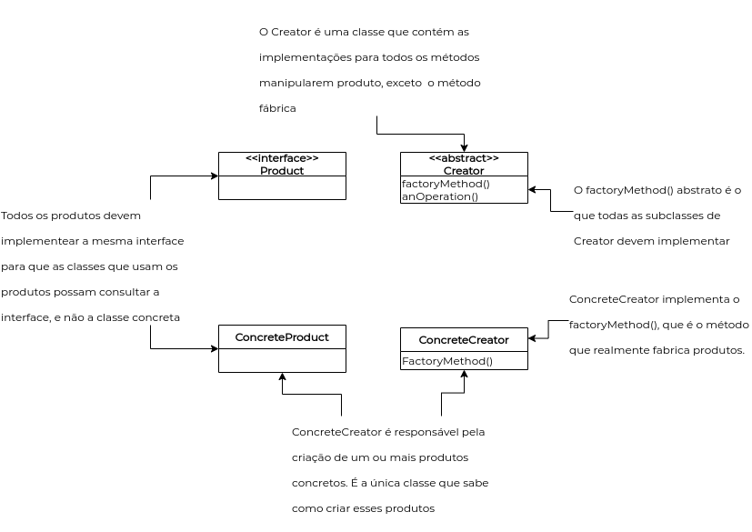
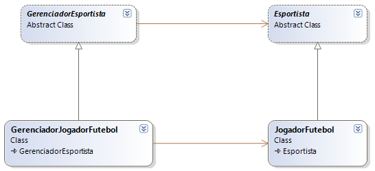
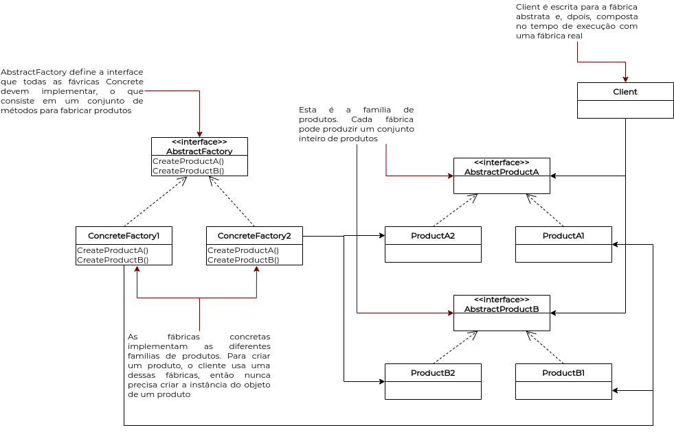

# Estudo Dirigido - GoF Criacional

Um dos fatores que afetam o custo de manutenção/evolução de um sistema é a forma como os objetos são criados. Os padrões de projeto criacionais têm o objetivo de controlar como as classes do projeto serão criadas, evitando o uso descontrolado de novas instâncias. Padrões desse tipo acabam alterando a estrutura do projeto no nível de classes. Serão apresentados alguns dos padrões de projeto GOF(Gang of Four) Criacionais, como o Factory Method, Abstract Factory, entre outros.

## Histórico de Revisões
| Data | Versão | Descrição | Autor(es) |
|:----:|:------:|:---------:|:---------:|
| 02/10/2020 | 1.0 | Criação do documento e inserção dos estudos de Factory Method. | Micaella Gouveia |
| 02/10/2020 | 1.1 | Inserção dos estudos de Abstract Factory. | Micaella Gouveia |

## Factory Method

O padrão Factory Method define uma interface para criar um objeto, mas permite às classes decidir qual classe instanciar. Ele permite a uma classe deferir a instanciação para subclasses. Deve-se usar, principalmente, quando uma classe não pode antecipar ou conhecer a classe dos objetos que deve criar e quando uma classe quer suas subclasses para especificar os objetos que cria.

As classes nesse diagrama são:

1. **Product**: Define a interface para objetos que o método de fábrica cria. *(Exemplo: Documento)*
    - Define atributos e métodos. Esses últimos abstratos ou programados de forma mais genérica, para um conjunto de objetos, os quais serão criados pelo factoryMethod().
2. **ConcreteProduct**: implementa a interface Product. *(Exemplo:Relatório, Currículo)*
    - Estende Product, especializamdo o que foi definido na superclasse.
3. **Creator**(também chamada de Factory pois cria os objetos de Product): declara o método factoryMethod() que retorna um objeto de Product. Pode chamar o método gerador para criar objetos do Product. *(Exemplo: Página)*
    - Declara o factoryMethod(), o qual retorna um objeto do tipo Product. Pode definir também um implementação default do factoryMethod() que retorna um objeto ConcreteProduct default. Pode ainda chamar um factoryMethod() para criar um objeto de Product.
4. **ConcreteCreator**: sobrescreve o método gerador para criar objetos ConcreteProduct. *(Exemplo: PáginaDeHabilidades, PaginaProfissional, ...)*
    - Sobrescreve o factory method para retornar uma instância de ConcreteProduct.

Esse método funciona como uma fébrica, oferecendo um modo de encapsular as instanciações de tipos concretos.

A grande vantagem deste padrão é a possibilidade de especialização posterior a criação do objeto e muito além disso, permissão para que essa especialização possa ser alterada como é possível visualizar no diagrama a seguir.

Ao instanciar um objeto da classe JogadorFutebol, ainda que de forma inocente, estaríamos criando uma dependência concreta e de difícil remoção. Utilizando uma classe FactoryMethod é possível modificar um objeto da classe JogadorFutebol para que seja objeto da classe JogadorTenis, por exemplo. Essa arquitetura determina a responsabilidade por criar determinados objetos o que reduz o acoplamento e nos direciona a utilização do princípiio da responsabilidade única. No exemplo, é criado um esportista e este pode praticar qualquer tipo de esporte sem dependência específica de sua classe.

### Pontos Positivos

- Seu principal ponto positivo é o desligamento da implementação do produto de seu uso. Se você alterar a implementação de um produto, não irá afetar sua Creator, pois a Creator não está fortemente ligada a nenhuma ConcreteProduct.
- Elimina a necessidade de montar um código em função a uma classe específica. No nosso exemplo de aplicação, o código só lida com uma interface chamada Product.
- Esse padrão de projeto dá maior flexibilidade para as classes, pois cria um objeto em uma classe que utiliza o Factory Method é melhor que fazê-lo em separado, funcionando, assim, como uma conexão para que uma das subclasses forneça uma versão estendida de um objeto.
- Possibilidade de alteração da classe que implementa um objeto para um outro que faz parte da mesma generalização. No nosso contexto, seria possível alterar a classe que implementa um usuário. Um hora ele poderia ser Owner, em outro momento Admin e ainda Seller. 

### Pontos Negativos

- Especializar uma classe apenas para instanciar um objeto de uma subclasse de outra superclasse pode se revelar bastante improdutivo.

### É possível adaptar a nossa forma de organização de projeto com esse padrão?

É possível, porém não acredito que seja a melhor escolha. Se transformarmos nossa classe colaborator em uma fábrica, e dela partir a criação de Collaborator, Admin e Owner, teríamos uma fábrica de colaboradores com tipos específicos. Porém no nosso caso, Owner possui os atributos e métodos de Admin, que possui os atributos e métodos de Collaborator, e separá-los no mesmo nível de hierarquia não seria eficiente, pois estaríamos duplicando código. Além de que as classes Admin e Owner possui métodos específicos que demandam associações com outras classes, como Analisys, e essa associação não pode ser trazida para o nível de Collaborator.

### Quais documentos necessitam de refatoração para implementação deste padrão?

Principalmente o Diagrama de Classes, pois as relações e interfaces teriam a lógica de fábrica.

## Abstract Method

Fornece uma interface para criar famílias de objetos relacionados ou dependentes sem especificar suas classes concretas. (Famílias de produtos seriam as hierarquias).

Os participantes nesse diagrama são:

- **AbstractFactory**: Declara uma interface para operações de criação de produtos quaisquer. *(Ex: FábricaContinente)*
- **ConcreteFactory**: Implementa as operações que criam objetos de produtos concretos (específicos). *(Ex: FábricaAfrica, FabricaAmerica)*
- **AbstractProduct**: Declara uma interface para um tipo de objeto produto. *(Ex: Hérbivoro, Carnívoro)*
- **Product**: Define um objeto produto a ser criado pela fábrica concreta correspondente, a qual implementa a interface declarada em AbstractProduct. *(Ex: Leão, Lobo)*
- **Client**: Usa as interfaces declaradas em AbstractFactory e AbstractProduct. *(Ex: MundoAnimal)*

***O Factory Method usa classes para criar instâncias e o Abstract Factory usa objetos.***
***Os dois criam objetos, porém o Factory Method faz pela composição de objetos e o Abstract Factory faz por meio da herança.***

* Geralmente os métodos de uma Abstract Factory são implementados como métodos factory. O trabalho de uma Abstract Factory é **definir uma interface para criar um conjunto de produtos**. Cada método nessa interface é responsável pela criação de um produto concreto, e é implementado uma subclasse responsável da Abstract Factory para fornecer essas implementações.

Pode-ser considerar o Abstract Method uma camada extra de abstração do Factory Method. Utilizando o mesmo exemplo da classe JogadorFutebol, imagine que é também de nosso interesse saber o time em que esse jogador joga por meio de classes Flamengo ou Juventus, por exemplo. Jogadores mudam de time constantemente e este fato não os diferencia ao serem selecionados para preencher a seleção de um país. Sendo assim, um seleção de todos os jogadores instanciados deve ser formada por jogadores de todos os times cadastrados. No entanto, no momento que o nosso interesse é por jogadores de determinado time, essa formação também deve ser possível.

De forma geral este padrão abstrai determinadas classes específicas sem desconsiderá-las. Essas classes existem e estão disponíveis para uso caso necessário.

### Pontos Positivos
- Além dos pontos positivos da Factory Method, sua principal vantagem é a criação de famílias, de conjunto de produtos por meio de uma hierarquia.

### Pontos Negativos

- Além dos pontos negativos da Factory Method, a Abstract Method demanda uma maior organização das interfaces e subclasses, sendo bem mais complexo que o Factory Method.

### É possível adaptar a nossa forma de organização de projeto com esse padrão?

É possível, mas não acredito ser a melhor escolha. Ela retira o problema da hierarquia que o Factory Method encontrava, e para os casos das categorias e lotes de produtos, pode existir uma boa implementação do Abstract Method, mas não acredito que para o caso da hierarquia de usuários é possível utilizá-la, pois sua maior vantagem é lidar com vários tipos de produtos, que no caso seriam os usuários, partindo do pressuposto que o cliente não sabe quem quer criar. Mas no nosso caso, há poucos tipos de usuários com métodos muito bem definidos e para a nosso contexto essa criação de usuário não será algo indefinido ou complexo.

### Quais documentos necessitam de refatoração para implementação deste padrão?

Principalmente o Diagrama de Classes, pois as relações e interfaces teriam a lógica de fábrica abstrata.

## Referências
- Livro: Use a Cabeça! Padrões de Projetos - **Elisabeth Freeman, Eric Freeman**, Editora Alta Books, Ano 2007 2ª Edição
* Introdução aos padrões criacionais:<https://www.devmedia.com.br/introducao-aos-padroes-criacionais-abstract-factory-factory-method-prototype-e-singleton/21249>. Último acesso em 02/10/2020.
* Vídeo aulas da professora Milene (acesso restrito para os alunos da disciplina). Último acesso em 02/10/2020.