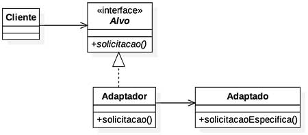
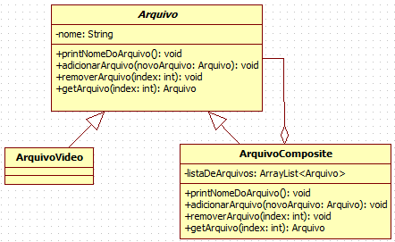

# Estudo Dirigido - GoF Estrutural 1

Um dos fatores que afetam o custo de manutenção/evolução de um sistema é a dependência gerada na interação entre os objetos desse sistema. Os padrões de projeto estruturais tem o objetivo de diminiuir essa dependência entre os objetos. Padrões desse tipo acabam alterando a estrutura do projeto no nível de classes. Será apresentado de dois padrões de projeto GOF(Gang of Four) Estruturais, o Adapter e o Composite.

## Adapter
Um objeto adapter é capaz de ser substituído por outro que desempenha as mesmas tarefas, porém com interfaces diferentes, isto é, como o próprio nome sugere, é adaptativo. Este padrão é bastante utilizado há algum tempo para pequenas adaptações de um modelo até mesmo em andamento. Esta característica possibilita maior flexibilidade e menor dependência. 
Na prática, um objeto que será servido por um segundo objeto que oferece tarefas complexas, pode passar por problemas ao ter este objeto servidor substituído. 
Para evitar problemas no objeto a ser servido, que não tem o objetivo de, por si só, ser complexo, é criado então um objeto intermediador. Este objeto intermediador simplifica, ou filtra, o que está sendo enviado pelo objeto servidor que foi substituído de forma que o objeto a ser servido nem mesmo sofre alterações. Desta forma é possível incrementar, em desempenho, níveis mais baixos sem afetar, em código, os níveis mais altos. 

    

 

Como é possível visualizar no diagrama, a classe "Alvo" realiza solicitações a classe "Adaptado". Neste padrão de projeto, a classe "Adaptado" pode ser substituída por outra classe implementada por outra interface que desempenha as mesmas tarefas sem que seja modificada a classe "Alvo". A classe "Adaptador" realiza as alterações necessárias para que tudo esteja compreensível a classe "Alvo".

### Pontos positivos

- Permite atualizações catastróficas sem aumento de complexidade em níveis superiores.

- Permite atualizações com o projeto em andamento.

- Facilita manutenção por permitir mais de uma forma de implementar a mesma funcionalidade.

### Pontos negativos

- Excesso de classes e implementações para projetos relativamente pequenos.

- Domínio de todo o fluxo e comunicação entre os componentes para a implementação de uma classe Adapter.

### É possível adaptar a nossa forma de organização de projeto com este padrão?
Sim, é possível. A implementação parece ser simples e, aparentemente, é necessário subdividir ao máximo determinada ação de forma que seja possível adaptar as subdivisões do fluxo. Dessa forma, uma tarefa A é subdivida em 3 tarefas A, B, C onde há uma tarefa responsável por alimentar, outra por filtrar e ainda outra por simplesmente ser alimentada.

### Quais documentos necessitam de refatoração para implementação deste padrão?
Como ainda não iniciamos a parte prática do projeto não é necessário alterações em código. Mas como a implementação de diagramas referentes ao código já foram implementados em sprints anteriores, é necessária revisão dos diagramas:

- Diagrama de Classes: Identificação de tarefas complexas realizadas por algumas classes e substituição por tarefas com mediação de classes Adapter.

- Diagrama de Sequência: Inserção das classes Adapter mediadoras definidas no diagrama de classes. Não parece ter modificações estruturais graves, apenas passos extras na execução de métodos.

- Diagrama de Comunicação: Inserção das classes Adapter mediadoras definidas no diagrama de classes. Não parece ter modificações estruturais graves, apenas passos extras na comunicação entre classes. Pode não ser necessária refatoração se for considerado um nível mais prático na elaboração deste diagrama.

## Composite
Cada objeto de um conjunto de objetos composite que fazem parte de uma relação todo-parte são tratados sem distinção. O objetivo é que por mais que haja complexidade e diferença entre cada um dos objetos, em determinado nível estejam todos sem distinção no nível analisado. 
Na prática, uma interface, ou até mesmo uma classe abstrata, é implementada por diversas outras classes que são tratadas sem distinção. No entanto, uma dessas classes tem a capacidade de inserir ou remover outras classes nesse nível de implementação. Esta classe, com estes métodos, é determinada composite pois tem a capacidade de compor as classes que implementam a classe inicial.

    

 

Como é possível visualizar no diagrama, a classe "Arquivo" pode ser implementada por diversas outras classes de tipos diferentes de arquivos. Todas as classes que implementam a classe principal estão, nesta abstração, em um mesmo nível. No entanto, a classe "ArquivoComposite" tem a capacidade de adicionar e remover classes que estão neste mesmo nível de abstração e também implementam a classe principal. Não há distinções entre as classes resultantes da classe Composite.

## Referências
- Livro: Use a Cabeça! Padrões de Projetos - **Elisabeth Freeman, Eric Freeman**, Editora Alta Books, Ano 2007 2ª Edição

- Site: **Thiengo** - Visão geral do livro "Use a Cabeça! Padrões de Projetos - Elisabeth, Eric Freeman" - <https://www.thiengo.com.br/use-a-cabeca-padroes-de-projetos> Último acesso em 02/10/2020.

- Site: **Thiengo** - Padrões de projeto Adapter - <https://www.thiengo.com.br/padrao-de-projeto-adapter> Último acesso em 02/10/2020

- **Marcos Brizeno**: Mão na massa - Composite - <https://brizeno.wordpress.com/category/padroes-de-projeto/composite/> Último acesso em 02/10/2020