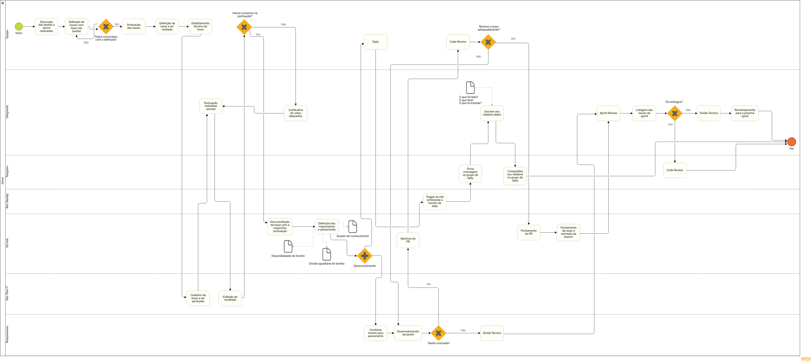
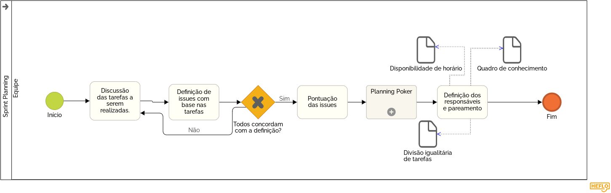
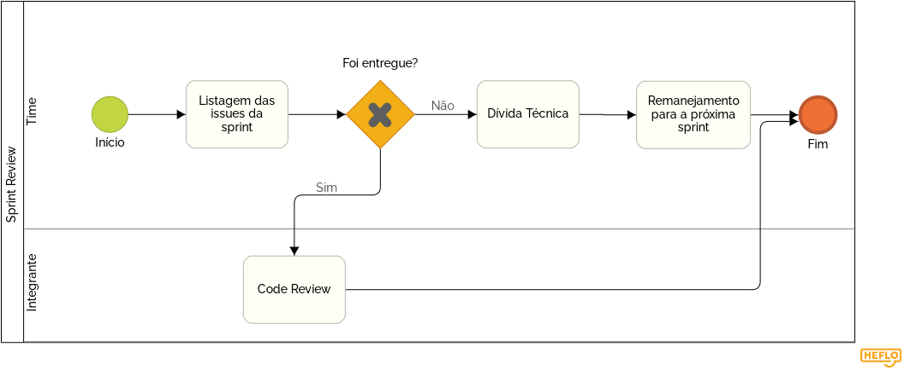
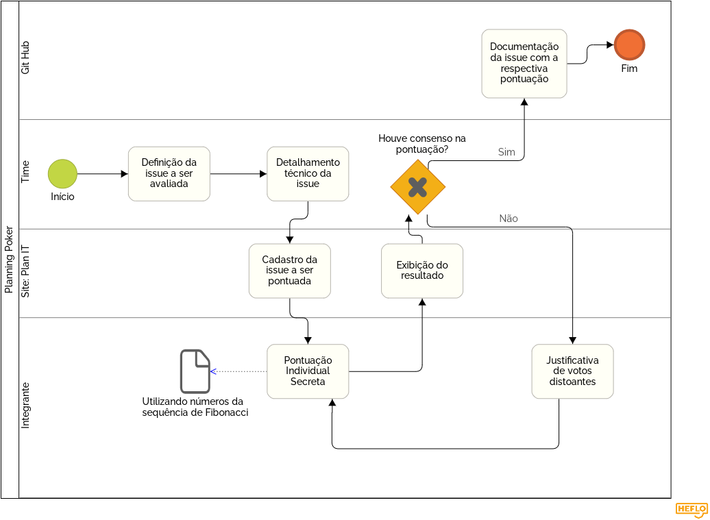
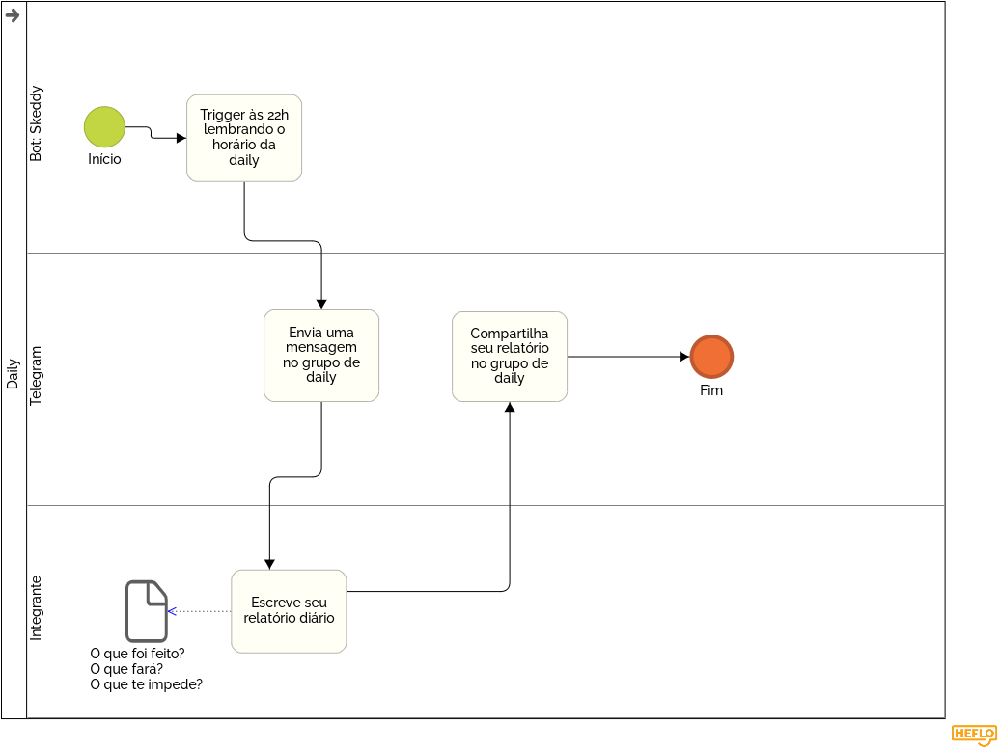
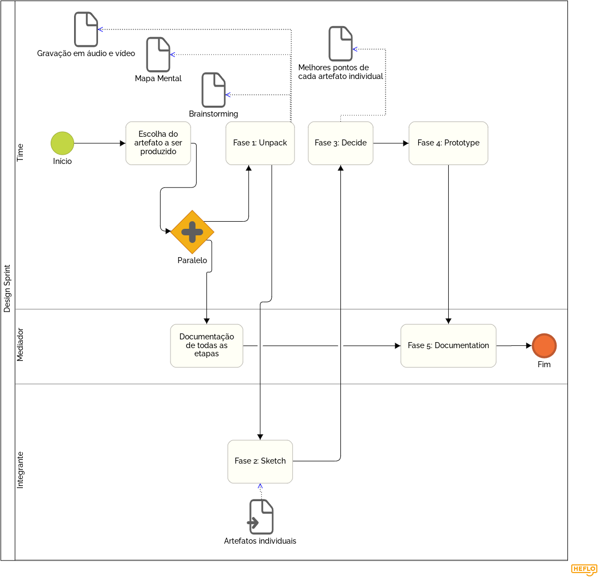

# Modelagem BPMN

BPMN (Business Process Model and Notation) é um conjunto de padrões gráficos e simbólicos utilizados para a representação e modelagem simplicada de processos.

Por meio da notação foi possível diagramar as metologias utilizadas no desenvolvimento da aplicação Stock. Foram criados alguns diagramas que envolvem o processo inteiro, assim como diagramas de subprocessos para que fosse possível compreender até mesmo processos que eram subentendidos na aplicação das metodologias.

Como o grupo a princípio não utiliza papéis da metodologia Scrum, Project Owner, Scrum Master, Dev Ops, etc.., os agentes, de forma geral, foram o time inteiro trabalhando em equipe por meio de reuniões, integrantes que tiveram algumas participações individuais além de algumas duplas ou trios em pareamentos.

## Histórico de Revisões

|    Data    | Versão |                              Descrição                              |             Autor(es)      |
| :--------: | :----: | :-----------------------------------------------------------------: | :------------------------: |
| 11/09/2020 |  1.0   |    Criação do documento e breve introdução da técnica aplicada.     |             Pedro Igor     |
| 11/09/2020 |  1.1   |                      Inserção de 6 Diagramas.                       | Gabriel Davi, Pedro Igor, Micaella |
| 11/09/2020 |  1.2   |                       Adição de referências.                        |             Pedro Igor     |
| 11/09/2020 |  1.3   | Adição dos áudios explicativos do Desenvolvimento e Planning Poker. |        Micaella Gouveia    |
| 11/09/2020 |  1.4   |  Adição dos áudios explicativos do Sprint Review e Design Sprint.   |            Gabriel Davi    |
| 11/09/2020 |  1.5   |  Adição dos áudios explicativos do Sprint Planning e Daily.         |         Pedro Igor         |
| 15/09/2020 |  1.6   | Inserção do diagrama geral (união 5 dos diagramas já adicionados).  |         Pedro Igor         |

## Geral

<a href="https://unbarqdsw.github.io/2020.1_G12_Stock/assets/pdf/bpmn/Geral.pdf">Download em PDF</a>

## Sprint Planning

### Áudio explicativo sobre Sprint Planning

- Autor: Pedro Igor

<audio controls>
  <source src="https://unbarqdsw.github.io/2020.1_G12_Stock/assets/audios/bpmn/bpmnSprintPlanning.wav" type="audio/mpeg">
</audio>

## Desenvolvimento

### Áudio explicativo sobre o Desenvolvimento

- Autora: Micaella Gouveia

<audio controls>
  <source src="https://unbarqdsw.github.io/2020.1_G12_Stock/assets/audios/bpmn/bpmnDesenvolvimento.m4a" type="audio/mpeg">
</audio>

## Sprint Review

### Áudio explicativo sobre Sprint Review

- Autor: Gabriel Davi

<audio controls>
  <source src="https://unbarqdsw.github.io/2020.1_G12_Stock/assets/audios/bpmn/bpmnSprintReview.m4a" type="audio/mpeg">
</audio>

## Planning Poker

### Áudio explicativo sobre o Planning Poker

- Autora: Micaella Gouveia

<audio controls>
  <source src="https://unbarqdsw.github.io/2020.1_G12_Stock/assets/audios/bpmn/bpmnPlanningPoker.m4a" type="audio/mpeg">
</audio>

## Daily

### Áudio explicativo sobre Daily

- Autor: Pedro Igor

<audio controls>
  <source src="https://unbarqdsw.github.io/2020.1_G12_Stock/assets/audios/bpmn/bpmnDaily.wav" type="audio/mpeg">
</audio>

## Design Sprint(Adaptação)

#### Para mais detalhes sobre a adaptação dessa metodologia, acesse [Design Sprint](DesignSprint/DesignSprint.md?id=design-sprint).

### Áudio explicativo sobre Design Sprint

- Autor: Gabriel Davi

<audio controls>
  <source src="https://unbarqdsw.github.io/2020.1_G12_Stock/assets/audios/bpmn/bpmnDesignSprint.m4a" type="audio/mpeg">
</audio>

## Referências

HEFLO: Business Process Model and Notation - <https://www.heflo.com/pt-br/definicoes/o-que-e-business-process-model-notation/> Acesso em 11/09/2020  
HEFLO: Ferramenta para criação de diagramas BPMN - <https://www.heflo.com/pt-br/tour-heflo-bpm/> Acesso em 11/09/2020
