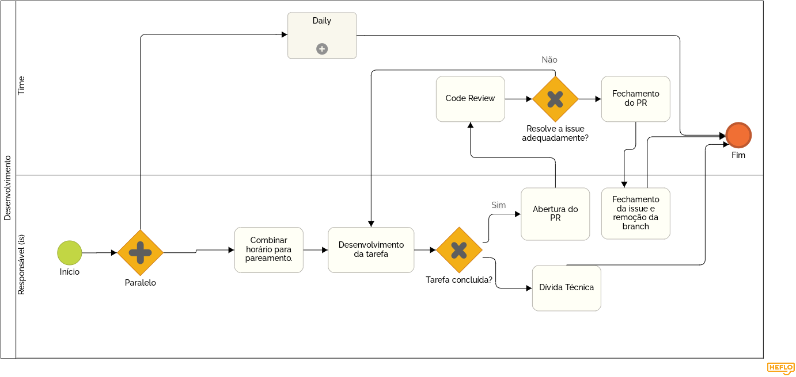

# Modelagem BPMN

BPMN (Business Process Model and Notation) é um conjunto de padrões gráficos e simbólicos utilizados para a representação e modelagem simplicada de processos.

Por meio da notação foi possível diagramar as metologias utilizadas no desenvolvimento da aplicação Stock. Foram criados alguns diagramas que envolvem o processo inteiro, assim como diagramas de subprocessos para que fosse possível compreender até mesmo processos que eram subentendidos na aplicação das metodologias.

Como o grupo a princípio não utiliza papéis da metodologia Scrum, Project Owner, Scrum Master, Dev Ops, etc.., os agentes, de forma geral, foram o time inteiro trabalhando em equipe por meio de reuniões, integrantes que tiveram algumas participações individuais além de algumas duplas ou trios em pareamentos.

## Histórico de Revisões

|    Data    | Versão |                                     Descrição                                      |    Autor(es)     |
| :--------: | :----: | :--------------------------------------------------------------------------------: | :--------------: |
| 11/09/2020 | 1.0 | Criação do documento e breve introdução da técnica aplicada. | Pedro Igor |
| 11/09/2020 | 1.1 | Inserção de 6 Diagramas. | Gabriel Davi, Pedro Igor, Micaella |
| 11/09/2020 | 1.2 | Adição de referências. | Pedro Igor |

## Sprint Planning

## Desenvolvimento

## Sprint Review

## Planning Poker

## Daily

## Design Sprint

## Referências
HEFLO: Business Process Model and Notation - <https://www.heflo.com/pt-br/definicoes/o-que-e-business-process-model-notation/> Acesso em 11/09/2020  
HEFLO: Ferramenta para criação de diagramas BPMN - <https://www.heflo.com/pt-br/tour-heflo-bpm/> Acesso em 11/09/2020