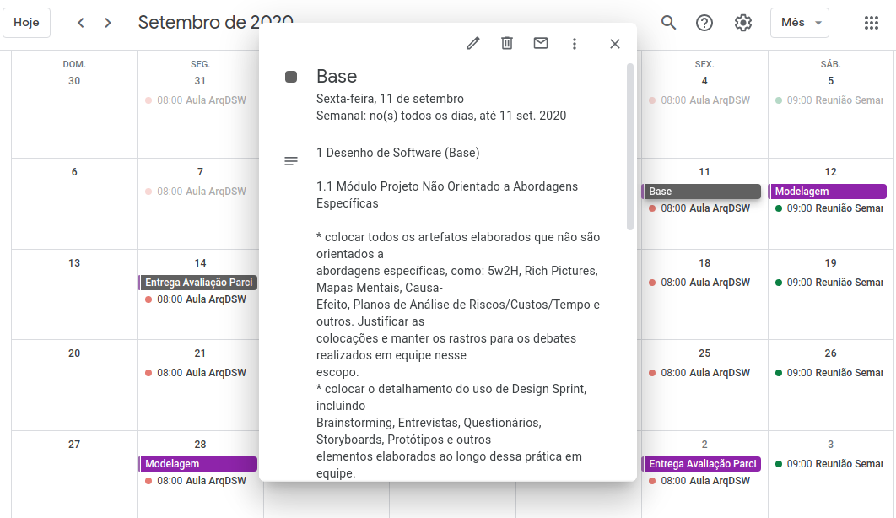

# Planejamento Sprint 0
**Período: 23/08/2020 a 29/08/2020** 
**Data da Reunião: 22/08/2020**

## [Issues](Modeling/objeto?id=Issue) 
|Número |  [Issue](Modeling/objeto?id=Issue)  | Pontuação | Participantes|
| - | - | - | - |
| [**#1**](https://github.com/UnBArqDsw/2020.1_G12_Stock/issues/1) | [Rich Picture](preTraceability/RichPicture.md)   | Sem  | Todos  |
| [**#2**](https://github.com/UnBArqDsw/2020.1_G12_Stock/issues/2) | [Mapa Mental](preTraceability/MapaMental.md) | Sem | Todos |
| [**#3**](https://github.com/UnBArqDsw/2020.1_G12_Stock/issues/3) | [5W2H](preTraceability/5W2H.md) | Sem | Todos |
| [**#4**](https://github.com/UnBArqDsw/2020.1_G12_Stock/issues/4) | [Identidade Visual](Product/ManualId.md) | Sem | Sofia |
| [**#5**](https://github.com/UnBArqDsw/2020.1_G12_Stock/issues/5) | [Brainstorming](Elicitation/Brainstorming.md) | Sem | Pedro |
| [**#6**](https://github.com/UnBArqDsw/2020.1_G12_Stock/issues/6) | [Questionário](Elicitation/Questionario.md) | Sem | Pedro e Gabriel Alves |
| [**#7**](https://github.com/UnBArqDsw/2020.1_G12_Stock/issues/7) | [Causa-Efeito](preTraceability/causaEfeito.md), [Plano de Análise de Risco/Custo/Tempo](preTraceability/PlanAnaliseRiscos.md)  | Sem | Micaella |
| [**#8**](https://github.com/UnBArqDsw/2020.1_G12_Stock/issues/8) | [Documento de Visão](Product/DocVisão.md) | Sem | Micaella e Sofia |
| [**#9**](https://github.com/UnBArqDsw/2020.1_G12_Stock/issues/9) | [Entrevista](Elicitation/Entrevista.md) | Sem | Gabriel Davi |
| [**#10**](https://github.com/UnBArqDsw/2020.1_G12_Stock/issues/10) | [StoryBoards](Elicitation/StoryBoard) | Sem | Gabriel Davi|
| [**#11**](https://github.com/UnBArqDsw/2020.1_G12_Stock/issues/11) | [Argumentação](preTraceability/Argumentacao.md) | Sem | Pedro e Gabriel Alves |
| [**#12**](https://github.com/UnBArqDsw/2020.1_G12_Stock/issues/12) | Docsify e [ZenHub](https://github.com/UnBArqDsw/2020.1_G12_Stock/tree/master#workspaces/stock-5f46b149cedde3001802fff1/board?repos=289488039) | Sem | Gabriel Davi e Micaella |

## Pontuação : Sem pontuação

## Quadro de Distribuição de Pontos
Este quadro divide a pontuação das [issues](Modeling/objeto?id=Issue) com a quantidade de participantes, para ter a noção da distribuição de pontos por pessoa, evitando a sobrecarga de tarefas para algum membro.

*Como nesta Sprint as metodologias não tinham sido definidas, não foi feita a pontuação das [issues](Modeling/objeto?id=Issue).*

## Relato
* Na semana anterior à Sprint 0, o grupo já havia sido formado e a ideia geral do projeto também. Antes da reunião, as alunas Micaella Gouveia e Sofia Patrocínio fizeram um levantamento dos artefatos que poderiam ser produzidos durante a Sprint 0, tendo como base as diretrizes propostas pela professora Milene. Elas criaram um Google Calendar com as datas das entregas e datas de avaliações em pares, contendo tudo o que foi solicitado pela professora para cada entrega.

*Exemplo da organização feita pelo Google Calendar*

* O  que foi discutido que poderia ser feito e as pessoas responsáveis:

| Tarefa | Resposável
| - | - |
| [Rich Picture](preTraceability/RichPicture.md) | Todos
| [Mapa Mental](preTraceability/MapaMental.md) | Todos
| [5W2H](preTraceability/5W2H.md) (documentar) | Gabriel Alves
| [Identidade Visual](Product/ManualId.md) | Sofia
| [Brainstorming](Elicitation/Brainstorming.md) (documentar) | Pedro Igor
| [Causa-Efeito](preTraceability/causaEfeito.md) (estudo) | Micaella 
| [Plano de Análise de Risco/Custo/Tempo](preTraceability/PlanAnaliseRiscos.md) (estudo) | Micaella 
| [Questionário](Elicitation/Questionario.md) | Pedro Igor e Gabriel
| [Documento de Visão](Product/DocVisão.md) | Sofia
| [Entrevista](Elicitation/Entrevista.md) | Gabriel Davi
| [Storyboards](Elicitation/StoryBoard) | Gabriel Davi
| [Argumentação](preTraceability/Argumentacao.md) | Pedro Igor e Gabriel Alves

* Como a ideia geral ja havia sido decidida, o aluno Gabriel Davi apresentou dois [Rich Pictures](preTraceability/RichPicture.md) que tinha feito e mostrou durante a reunião.
* Durante a reunião, o time decidiu escolher o nome da aplicação, para já ser feito o [Manual de Identidade Visual](Product/ManualId.md). Definição do Nome: Stock.
* Foi realizado o Brainstormig inicial do projeto.

## Gravações Disponíveis
* Decisão do Nome:

<iframe allowFullScreen="allowFullScreen" src="https://www.youtube.com/embed/LIIm4z8s4JU?ecver=1&amp;iv_load_policy=3&amp;yt:stretch=16:9&amp;autohide=1&amp;color=red&amp;width=560&amp;width=560" width="560" height="315" allowtransparency="true" frameborder="0">
<a  id="RXWVoIsA" href="https://www.rockpamperscissors.co.uk/a-new-one-on-me/">Emma hybrid</a>

<a  id="RXWVoIsA" href="https://www.rockpamperscissors.co.uk/a-new-one-on-me/">https://www.rockpamperscissors.co.uk/a-new-one-on-me/</a>
<small>Powered by <a href="https://youtubevideoembed.com/ ">Embed YouTube Video</a></small></iframe>

* Apresentação dos Rich Pictures (Gabriel Davi):

<iframe allowFullScreen="allowFullScreen" src="https://www.youtube.com/embed/iwk9n6-1Aw4?ecver=1&amp;iv_load_policy=3&amp;yt:stretch=16:9&amp;autohide=1&amp;color=red&amp;width=560&amp;width=560" width="560" height="315" allowtransparency="true" frameborder="0">
<a  id="RXWVoIsA" href="https://www.rockpamperscissors.co.uk/a-new-one-on-me/">Emma hybrid</a>

<a  id="RXWVoIsA" href="https://www.rockpamperscissors.co.uk/a-new-one-on-me/">https://www.rockpamperscissors.co.uk/a-new-one-on-me/</a>
<small>Powered by <a href="https://youtubevideoembed.com/ ">Embed YouTube Video</a></small></iframe>

* Brainstorming:

<iframe allowFullScreen="allowFullScreen" src="https://www.youtube.com/embed/AQ_4sSgTy5c?ecver=1&amp;iv_load_policy=3&amp;yt:stretch=16:9&amp;autohide=1&amp;color=red&amp;width=560&amp;width=560" width="560" height="315" allowtransparency="true" frameborder="0">
<a  id="RXWVoIsA" href="https://www.rockpamperscissors.co.uk/a-new-one-on-me/">Emma hybrid</a>

<a  id="RXWVoIsA" href="https://www.rockpamperscissors.co.uk/a-new-one-on-me/">https://www.rockpamperscissors.co.uk/a-new-one-on-me/</a>
<small>Powered by <a href="https://youtubevideoembed.com/ ">Embed YouTube Video</a></small></iframe>

