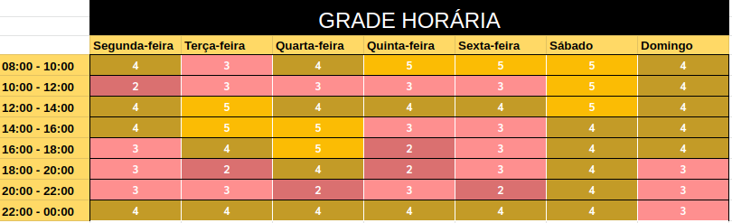

# Planejamento Sprint 4

**Período: 20/09/2020 a 28/09/2020** 
**Data da Reunião: 19/09/2020**

## Issues

| Número | [Issue](Modeling/objeto?id=Issue) | Pontuação | Participantes |
|--------|-----------------------------------|-----------|---------------|
| [**#74**](https://github.com/UnBArqDsw/2020.1_G12_Stock/issues/74) | [Protótipo de média fidelidade](Product/PrototipoMedia.md) | 13 | Micaella, Sofia e Gabriel Davi |
| [**#86**](https://github.com/UnBArqDsw/2020.1_G12_Stock/issues/86) | NRF | 5 | Gabriel Alves e Gabriel Davi |
| [**#87**](https://github.com/UnBArqDsw/2020.1_G12_Stock/issues/87) | [Especificação Suplementar](Modeling/EspecificacaoSuplementar.md)    | 3 | Pedro Igor |
| [**#88**](https://github.com/UnBArqDsw/2020.1_G12_Stock/issues/88) | Diagrama de classe e Diagrama de componentes | 13 | Todos |
| [**#89**](https://github.com/UnBArqDsw/2020.1_G12_Stock/issues/89) | Diagrama de Sequência e Diagrama de Comunicação | 8 | Todos |
| [**#90**](https://github.com/UnBArqDsw/2020.1_G12_Stock/issues/90) | Diagrama Atividades e Diagrama de Estado | 5 | Todos |
| [**#91**](https://github.com/UnBArqDsw/2020.1_G12_Stock/issues/74) | Entidade relacionamento de banco de dados e Diagrama de Pacote | 13 | Todos |
| [**#92**](https://github.com/UnBArqDsw/2020.1_G12_Stock/issues/92) | React :) | 8 | Gabriel Davi |
| [**#93**](https://github.com/UnBArqDsw/2020.1_G12_Stock/issues/93) | Casos de uso e diagrama de casos de uso | 5 | - |
| [**#94**](https://github.com/UnBArqDsw/2020.1_G12_Stock/issues/94) | Protótipo de alta fidelidade | 8 | Micaella Gouveia e Sofia Patrocínio |

## Pontuação: 60

## Quadro de Distribuição de Pontos

Este quadro divide a pontuação das [issues](Modeling/objeto?id=Issue) com a quantidade de participantes, para ter a noção da distribuição de pontos por pessoa, evitando a sobrecarga de tarefas para algum membro.

| Participante | Distribuiçao por Pontuação de [Issue](Modeling/objeto?id=Issue) e Partipantes | Pontuação Média |
|--------------|-------------------------------------------------------------------------------|-----------------|
| Gabriel Alves | 6,5  + 1,05 + 3,75 + 1| 12 |
| Gabriel Davi | 6,5  +  0,8  + 1,25 + 4 | 13 |
| Micaella Gouveia | 6,5  + 2,1 + 4 + 1| 13 |
| Pedro Igor | 6,5  + 1,05 + 3  + 1 | 12 |
| Sofia Patrocínio | 6,5 + 1,3  + 4 + 1 | 13 |

## Data de Entrega para Issues

Nesta Sprint, para não haver sobrecarga de tarefas, foi definido data de entrega para todas as issues. Esta Sprint é a última antes da segunda entrega, sendo imprescindível que todas sejam entregues a tempo, sem haver dívidas técnicas.

| Número | [Issue](Modeling/objeto?id=Issue) | Data de Entrega |
|--------|-----------------------------------|-----------------|
| [**#74**](https://github.com/UnBArqDsw/2020.1_G12_Stock/issues/74) | [Protótipo de média fidelidade](Product/PrototipoMedia.md) | Segunda-feira (21/09/2020) |
| [**#86**](https://github.com/UnBArqDsw/2020.1_G12_Stock/issues/86) | NRF | Segunda-feira (21/09/2020) |
| [**#87**](https://github.com/UnBArqDsw/2020.1_G12_Stock/issues/87) | [Especificação Suplementar](Modeling/EspecificacaoSuplementar.md)   |Segunda-feira (21/09/2020) |
| [**#88**](https://github.com/UnBArqDsw/2020.1_G12_Stock/issues/88) | Diagrama de classe e Diagrama de componentes | Quinta-feira (24/09/2020) |
| [**#91**](https://github.com/UnBArqDsw/2020.1_G12_Stock/issues/74) | Entidade relacionamento de banco de dados e Diagrama de Pacote | Sexta-feira (25/09/2020)
| [**#89**](https://github.com/UnBArqDsw/2020.1_G12_Stock/issues/89) | Diagrama de Sequência e Diagrama de Comunicação | Sábado (26/09/2020)
| [**#90**](https://github.com/UnBArqDsw/2020.1_G12_Stock/issues/90) | Diagrama Atividades e Diagrama de Estado | Domingo (27/08/2020)

## Relato

- Nesta Sprint ficou decidido que haverá a produção do [Protótipo](Modeling/objeto?id=protótipo) de  Alta fidelidade, porém ainda sem testes.
- Nesta reunião dividimos os artefatos que tinhamos definido para a Sprint 4, atribuíndo responsáveis, dias de produção e entrega.

**Segunda-feira**:
- [Protótipo de média fidelidade](Product/PrototipoMedia.md) (dívida técnica)
- NFR 
- [Especificação Suplementar](Modeling/EspecificacaoSuplementar.md)   

### **Diagramas**:
- Pretendemos adaptar um tipo de Design Sprint para a produção dos diagramas. Todo dia faremos dois diagramas, e a cada dia um membro ficará reponsável em mediar a reunião e finalizar o documento de diagramas do dia.

|Dia |Data da Reunião | Horário da Reunião |Diagramas | Responsável pela documentação
| - | -| -| - | - |
| 1 | Terça-feira  (22/09/2020) |12:00 |Classe e Componentes | Micaella|
| 2 | Quarta-feira  (23/09/2020) |14:00 |Entidade relacionamento de banco de dados e Pacotes | Gabriel Alves e Pedro Igor |
| 3 | Quinta-feira   (24/09/2020) |8:00 |Sequência e Comunicação | Sofia Patrocínio
| 4 | Sexta-feira  (25/09/2020) | 8:00 |Atividades e Estado | Gabriel Davi

- Esta responsabilidade de cada membro definiu a distribuição de pontos para cada membro. Para melhor dividir a pontuação, fizemos o somatório da pontuação dos diagramas e dividimos por 6. Cada membro recebeu essa pontuação de participação, e para a produção do artefato, o membro responsável recebeu 1/6 da pontuação da issue que ficou responsável em documentar.

### [**OmniStock**](Project/Omnistock.md)
- Além disso, teremos um [treinamento de React](Project/Omnistock.md) liderado pelo membro Gabriel Davi :)

- **Definição dos dias de treinamento**:

| Dia | Data | Horário |
| - | - | - |
| 1 | Terça-feira (22/09/2020) | 14:00 |
| 2 | Quarta-feira (23/09/2020) | 16:00 |
| 3 | Sexta-feira (25/09/2020) | 22:00 |
| 4 | Sábado (26/08/2020) | 9:00 |

#### **Horários**
- Os dias e horários do [treinamento de React](Project/Omnistock.md) e produção dos diagramas foram decidos a partir de um heaheatmap feito pelos membros.

*Heatmap para definição dos horários das reuniões e treinamento*

## Gravações Disponíveis

- Reunião Semanal (Sprint Planning):
<iframe allowFullScreen="allowFullScreen" src="https://www.youtube.com/embed/Gbn02ZM1Yio?ecver=1&amp;iv_load_policy=3&amp;rel=0&amp;yt:stretch=16:9&amp;autohide=1&amp;color=red&amp;width=560&amp;width=560" width="560" height="315" allowtransparency="true" frameborder="0">
<a  id="uJLPWJNS" href="https://wildernesswood.co.uk/mattress-recycling-is-a-scam/">recycling of mattress</a>

<a  id="uJLPWJNS" href="https://www.ihertfordshire.co.uk">iHertfordshire UK</a>
<small>Powered by <a href="https://youtubevideoembed.com/ ">Embed YouTube Video</a></small></iframe>

- Planning Poker (Pontuação das [issues](Modeling/objeto?id=Issue)):
<iframe allowFullScreen="allowFullScreen" src="https://www.youtube.com/embed/jOSvgG4vcjA?ecver=1&amp;iv_load_policy=3&amp;rel=0&amp;yt:stretch=16:9&amp;autohide=1&amp;color=red&amp;width=560&amp;width=560" width="560" height="315" allowtransparency="true" frameborder="0">
<a  id="uJLPWJNS" href="https://wildernesswood.co.uk/mattress-recycling-is-a-scam/">recycling of mattress</a>

<a  id="uJLPWJNS" href="https://www.ihertfordshire.co.uk">iHertfordshire UK</a>
<small>Powered by <a href="https://youtubevideoembed.com/ ">Embed YouTube Video</a></small></iframe>

