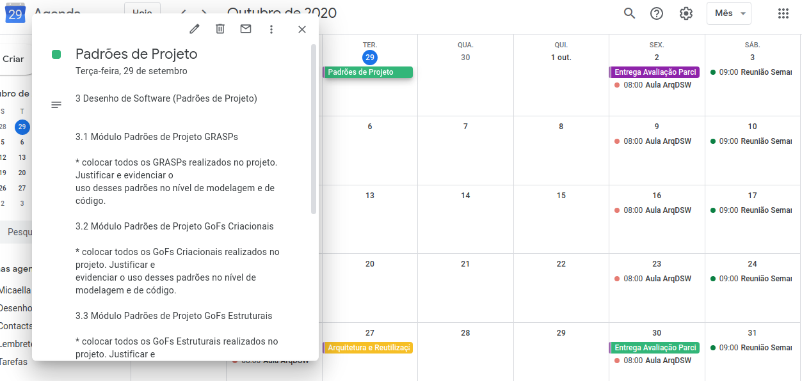

# Planejamento Sprint 4

**Período: 29/09/2020 a 03/10/2020** 
**Data da Reunião: 29/09/2020**

## Issues

| Número | [Issue](Modeling/objeto?id=Issue) | Pontuação | Participantes |
|--------|-----------------------------------|-----------|---------------|
| [**#93**](https://github.com/UnBArqDsw/2020.1_G12_Stock/issues/93) | Casos de Uso e Diagrama de Casos de Uso | 5 | Gabriel Davi, Micaella Gouveia e Pedro Igor | 
| [**#113**](https://github.com/UnBArqDsw/2020.1_G12_Stock/issues/113) | Estudo - GRASP | 8 | Sofia | - |
| [**#114**](https://github.com/UnBArqDsw/2020.1_G12_Stock/issues/114) | Estudo - GoF Criacional | 5 | Micaella Gouveia |
| [**#115**](https://github.com/UnBArqDsw/2020.1_G12_Stock/issues/115) | Estudo - GoF Estrutural 1 | 3 | Pedro Igor |
| [**#116**](https://github.com/UnBArqDsw/2020.1_G12_Stock/issues/116) | Estudo - GoF Estrutural 2 | 3 | Gabriel Davi | 
| [**#117**](https://github.com/UnBArqDsw/2020.1_G12_Stock/issues/117) | Estudo - GoF Comportamental | 5 | Gabriel Alves | 
| [**#118**](https://github.com/UnBArqDsw/2020.1_G12_Stock/issues/118) | Dockerização do Backend e Frontend | 8 | Pedro Igor e Gabriel Davi |
| [**#119**](https://github.com/UnBArqDsw/2020.1_G12_Stock/issues/119) | Documento de escolha das tecnologias | 3 | Gabriel Alves | 

## Pontuação: 40
## Quadro de Distribuição de Pontos

Este quadro divide a pontuação das [issues](Modeling/objeto?id=Issue) com a quantidade de participantes, para ter a noção da distribuição de pontos por pessoa, evitando a sobrecarga de tarefas para algum membro.

| Participante | Distribuiçao por Pontuação de [Issue](Modeling/objeto?id=Issue) e Partipantes | Pontuação Média |
|--------------|-------------------------------------------------------------------------------|-----------------|
| Gabriel Alves | 3 + 5 | 8 |
| Gabriel Davi | 4 + 3 + 1,25 | 8 |
| Micaella Gouveia | 5 + 2,5 | 8 |
| Pedro Igor | 4 + 3 + 1,25 | 8 |
| Sofia Patrocínio | 8 | 8 |

## Data de Entrega para Issues

Nesta Sprint, para não haver sobrecarga de tarefas, foi definido data de entrega para algumas issues.

| Número | [Issue](Modeling/objeto?id=Issue) | Data de Entrega |
|--------|-----------------------------------|-----------------|
| [**#119**](https://github.com/UnBArqDsw/2020.1_G12_Stock/issues/119) | Documento de escolha das tecnologias | Quinta-feira (01/10/2020)|
| [**#118**](https://github.com/UnBArqDsw/2020.1_G12_Stock/issues/118) | Dockerização do Backend e Frontend | Quinta-feira (01/10/2020) |
| [**#93**](https://github.com/UnBArqDsw/2020.1_G12_Stock/issues/93) | Casos de Uso e Diagrama de Casos de Uso | Quinta-feira (01/10/2020) |

## Relato
* Nesta reunião, o grupo elencou tudo o que deveria ser feito para a terceira entrega. Utilizamos nossa agenda no Google Calendar.

*Organização feita pelo Google Calendar*

* Para essa Sprint, vamos começar a ambientação dos nossos repositórios de Backend e Frontend, assim como documentar as tecnologias que iremos utilizar.
* Notamos que esse Módulo 3 será novidade para todos os membros, então decidimos dedicar essa Sprint para estudo dos padrões de projeto. Cada membro ficou responsável em estudar um módulo de padrão de projeto, sendo este estudo essencial para a próxima reunião, em que decidiremos quais os padrões podemos utilizar no nosso projeto e estudar mais estes padrões definidos.

#### **3 Desenho de Software (Padrões de Projeto)**

* **3.1 Módulo Padrões de Projeto GRASPs**
    * Criador
    * Especialista
    * Demais

* **3.2 Módulo Padrões de Projeto GoFs Criacionais**
    - Factory Method
    - Abstract Factory
    - Demais

* **3.3 Módulo Padrões de Projeto GoFs Estruturais**
    - Adapter
    - Composite
    - Flyweight
    - Demais

* **3.4 Módulo Padrões de Projeto GoFs Comportamentais**
    - Stategy
    - Template Method
    - Demais

## Gravações Disponíveis

- Reunião Semanal (Sprint Planning e Planning Poker):
<iframe allowFullScreen="allowFullScreen" src="https://www.youtube.com/embed/KCNe4Rre5JA?ecver=1&amp;iv_load_policy=3&amp;yt:stretch=16:9&amp;autohide=1&amp;color=red&amp;width=560&amp;width=560" width="560" height="315" allowtransparency="true" frameborder="0">
<a  id="x4Kmoha6" href="https://www.rockpamperscissors.co.uk/a-new-one-on-me/">Emma hybrid</a>

<a  id="x4Kmoha6" href="https://www.earth-essentials.co.uk/is-buying-a-mattress-the-worst-thing-possible-for-your-health/">VOCs</a>
<small>Powered by <a href="https://youtubevideoembed.com/ ">Embed YouTube Video</a></small></iframe>
