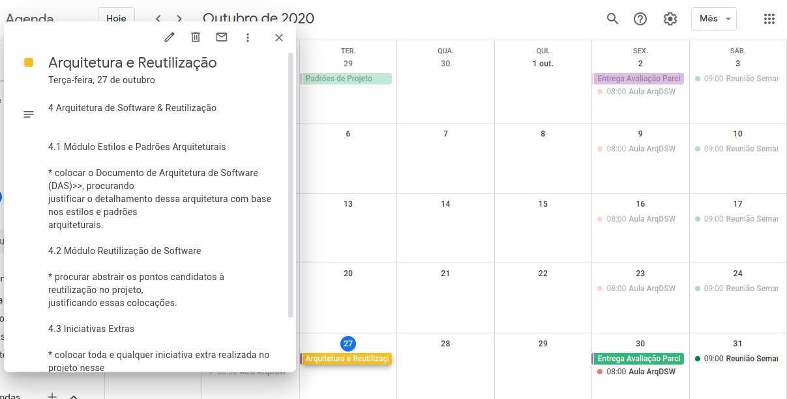

# Planejamento Sprint 9

**Período: 27/10/2020 a 01/11/2020** 
**Data da Reunião: 27/10/2020**

## Issues
| Número                                                             | [Issue](Modeling/objeto?id=Issue)                                                                                                             | Pontuação | Participantes           |
| ------------------------------------------------------------------ | --------------------------------------------------------------------------------------------------------------------------------------------- | --------- | ----------------------- |
| [**#176**](https://github.com/UnBArqDsw/2020.1_G12_Stock/issues/176)  | US01 - Cadastro da empresa  | 8 | Micaella Gouveia e Pedro Igor  |
| [**#177**](https://github.com/UnBArqDsw/2020.1_G12_Stock/issues/177)  | Elaboração tela inicial  | 5 | Sofia Patrocínio |
| [**#178**](https://github.com/UnBArqDsw/2020.1_G12_Stock/issues/178)  | Criação sidebar e navbar  | 5 | Gabriel Davi |
| [**#179**](https://github.com/UnBArqDsw/2020.1_G12_Stock/issues/179)  | Estudo de Módulo Visão Geral ArqSoft & DAS  | 3   | Gabriel Davi  |
|  [**#180**](https://github.com/UnBArqDsw/2020.1_G12_Stock/issues/180) | Estudo de Módulo Estilos e Padrões Arquiteturais (Partes I e II)  | 3 |  Micaella Gouveia |
|  [**#181**](https://github.com/UnBArqDsw/2020.1_G12_Stock/issues/181) | Estudo de Módulo Estilos e Padrões Arquiteturais (Partes III e IV)  | 3 | Pedro Igor  |
|  [**#182**](https://github.com/UnBArqDsw/2020.1_G12_Stock/issues/182) | Estudo de Módulo Reutilização de Software (Framework)  | 3 | Sofia Patrocínio |
|  [**#183**](https://github.com/UnBArqDsw/2020.1_G12_Stock/issues/183) | Evolução protótipo  | 3 | Gabriel Davi e Pedro Igor  |

## Pontuação: 33

## Quadro de Distribuição de Pontos

Este quadro divide a pontuação das [issues](Modeling/objeto?id=Issue) com a quantidade de participantes, para ter a noção da distribuição de pontos por pessoa, evitando a sobrecarga de tarefas para algum membro.

| Participante | Distribuição por Pontuação de [Issue](Modeling/objeto?id=Issue) e Participantes | Pontuação Média |
|--------------|-------------------------------------------------------------------------------|-----------------|
| Gabriel Alves | 0 | 0 |
| Gabriel Davi | 5 + 1.5 + 3 | 9.5 |
| Micaella Gouveia | 4 + 3 | 7 |
| Pedro Igor | 4 + 3 + 1.5 | 8.5 |
| Sofia Patrocínio | 5 + 3 | 8 |

## Relato

* Essa semana será destinada também para estudo de Arquitetura de Software & Reutilização

- Módulo Visão Geral ArqSoft & DAS;
- Módulo Estilos e Padrões Arquiteturais (Partes I e II);
- Módulo Estilos e Padrões Arquiteturais (Partes III e IV), e
- Módulo Reutilização de Software (Framework).

## Gravações Disponíveis

- Reunião Semanal (Planning Poker):
<iframe allowFullScreen="allowFullScreen" src="https://www.youtube.com/embed/Sum53JtJipA?ecver=1&amp;iv_load_policy=3&amp;yt:stretch=16:9&amp;autohide=1&amp;color=red&amp;width=560&amp;width=560" width="560" height="315" allowtransparency="true" frameborder="0">
<a rel="" id="40Zrek4A" href="https://www.earth-essentials.co.uk/is-buying-a-mattress-the-worst-thing-possible-for-your-health/">bad for you</a>

<a rel="" id="40Zrek4A" href="https://www.abcmoney.co.uk/2020/10/08/how-has-covid-19-affected-used-car-prices-two-experts-give-their-opinion">affected car resale</a>
<small>Powered by <a href="https://youtubevideoembed.com/ ">Embed YouTube Video</a></small></iframe>

- Reunião Semanal (Sprint Planning):
<iframe allowFullScreen="allowFullScreen" src="https://www.youtube.com/embed/kMcKUFTgfIM?ecver=1&amp;iv_load_policy=3&amp;yt:stretch=16:9&amp;autohide=1&amp;color=red&amp;width=560&amp;width=560" width="560" height="315" allowtransparency="true" frameborder="0">
<a rel="" id="40Zrek4A" href="https://www.earth-essentials.co.uk/is-buying-a-mattress-the-worst-thing-possible-for-your-health/">bad for you</a>

<a rel="" id="40Zrek4A" href="https://www.abcmoney.co.uk/2020/10/08/how-has-covid-19-affected-used-car-prices-two-experts-give-their-opinion">affected car resale</a>
<small>Powered by <a href="https://youtubevideoembed.com/ ">Embed YouTube Video</a></small></iframe>
