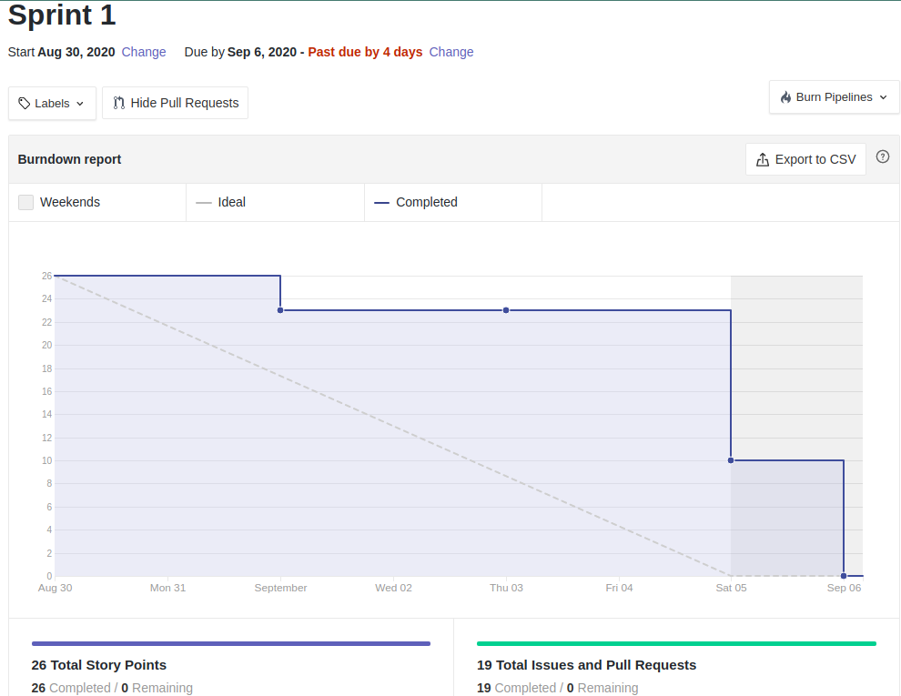
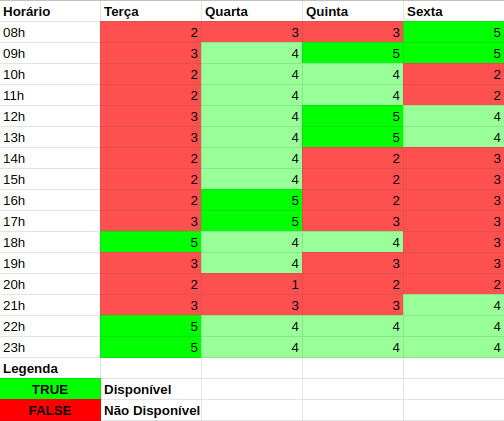

# Resultado Sprint 1

**Período: 30/08/2020 a 05/08/2020** 
**Data da Reunião: 05/08/2020**

## Issues Entregues

| Número                                                           | [Issue](Modeling/objeto?id=Issue)                                             | Pontuação | Participantes |
| ---------------------------------------------------------------- | ----------------------------------------------------------------------------- | --------- | ------------- |
| [**#5**](https://github.com/UnBArqDsw/2020.1_G12_Stock/issues/5) | [Brainstorming](Elicitation/Brainstorming.md)                                 | 3         | Pedro Igor    |
| [**#7**](https://github.com/UnBArqDsw/2020.1_G12_Stock/issues/7) | [Plano de Análise de Risco/Custo/Tempo](preTraceability/PlanAnaliseRiscos.md) | 8         | Todos         |
| [**#8**](https://github.com/UnBArqDsw/2020.1_G12_Stock/issues/8) | [Documento de Visão](Product/DocVisão.md)                                     | 5         | Todos         |

## Pontuação: 16

## Dívida Técnica

| Número                                                             | [Issue](Modeling/objeto?id=Issue) | Pontuação | Participantes |
| ------------------------------------------------------------------ | --------------------------------- | --------- | ------------- |
| [**#6**](https://github.com/UnBArqDsw/2020.1_G12_Stock/issues/6)   | Questionário                      | 2         | Todos         |
| [**#16**](https://github.com/UnBArqDsw/2020.1_G12_Stock/issues/16) | Estimativas                       | 8         | Todos         |
| [**#29**](https://github.com/UnBArqDsw/2020.1_G12_Stock/issues/29) | Design Sprint                     | Sem       | Todos         |
| [**#31**](https://github.com/UnBArqDsw/2020.1_G12_Stock/issues/31) | Causa-Efeito                      | Sem       | Todos         |

## Quadro de Conhecimento

_Métrica ainda não tinha sido definida nesta Sprint._

## Burndown

## Velocity

_Métrica ainda não tinha sido definida nesta Sprint._

## Observações

- A issue [#29](https://github.com/UnBArqDsw/2020.1_G12_Stock/issues/29) foi definida durante a Sprint 1 com o objetivo de documentar a técnica e os dias de produção.
- Com o processo da [Design Sprint](DesignSprint/designSprint.md), os artefatos que foram realizados por último necessitaram de mais tempo para a finalização do documento, tornando as [issues](Modeling/objeto?id=Issue) dívidas técnicas.
- Para decisão dos horários das reuniões foi necessário fazer um heatmap com os horários disponíveis de cada membro na semana específica.

_Heatmap para decisão dos horários das reuniões da Design Sprint_
