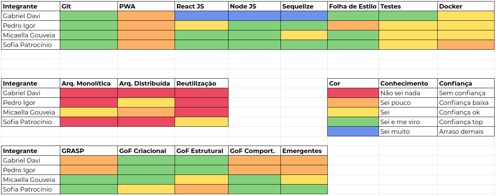
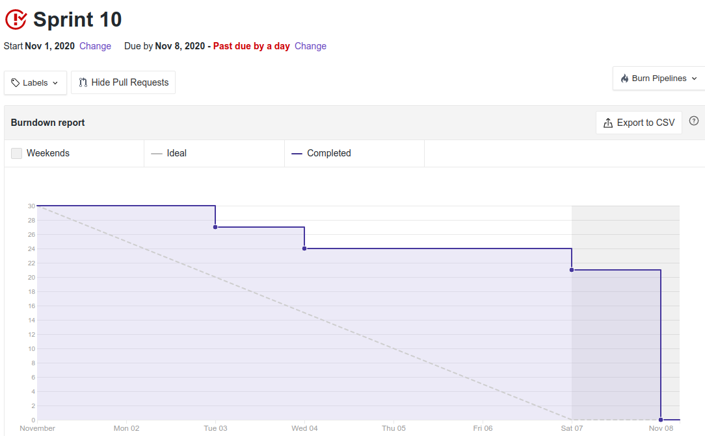
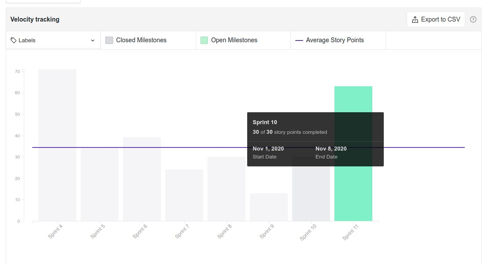

# Resultado Sprint 10

**Período: 02/11/2020 a 07/11/2020** 
**Data da Reunião: 07/11/2020**

## Issues Entregues
| Número                                                             | [Issue](Modeling/objeto?id=Issue)                                                                                                             | Pontuação | Participantes           |
| ------------------------------------------------------------------ | --------------------------------------------------------------------------------------------------------------------------------------------- | --------- | ----------------------- |
| [**#186**](https://github.com/UnBArqDsw/2020.1_G12_Stock/issues/186)  | US03 - Criação de conta de colaboradores  | 8 | Micaella Gouveia e Sofia Patrocínio |
| [**#187**](https://github.com/UnBArqDsw/2020.1_G12_Stock/issues/187)  | US05 - Adição e remoção de colaboradores  | 5 | Micaella Gouveia e Sofia Patrocínio |
|  [**#180**](https://github.com/UnBArqDsw/2020.1_G12_Stock/issues/180) | Estudo de Módulo Estilos e Padrões Arquiteturais (Partes I e II)  | 3 |  Micaella Gouveia |
|  [**#181**](https://github.com/UnBArqDsw/2020.1_G12_Stock/issues/181) | Estudo de Módulo Estilos e Padrões Arquiteturais (Partes IV)  | 3 | Pedro Igor  |
|  [**#182**](https://github.com/UnBArqDsw/2020.1_G12_Stock/issues/182) | Estudo de Módulo Reutilização de Software (Framework) | 3 | Sofia Patrocínio |

## Pontuação: 23

## Dívida Técnica
| Número | [Issue](Modeling/objeto?id=Issue) | Pontuação | Participantes |
|--------|-----------------------------------|-----------|---------------|
| [**#188**](https://github.com/UnBArqDsw/2020.1_G12_Stock/issues/188)  | US07 - Cadastro de produtos  | 8 | Gabriel Davi e Pedro Igor |
| [**#189**](https://github.com/UnBArqDsw/2020.1_G12_Stock/issues/189)  | US08 - Adição de categorias aos produtos  | 5 | Gabriel Davi e Pedro Igor |
| [**#179**](https://github.com/UnBArqDsw/2020.1_G12_Stock/issues/179)  | Estudo de Módulo Estilos e Padrões Arquiteturais (Parte III)  | 3   | Gabriel Davi  |

## Quadro de Conhecimento

## Burndown

## Velocity

## Observações
* O membro Gabriel Davi estava muito atarefado com outros projetos.
* Os membros estão sentindo desgaste do fim do semestre.