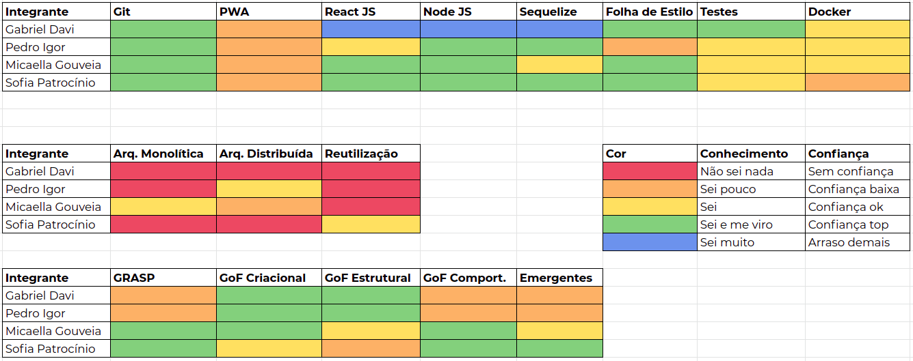
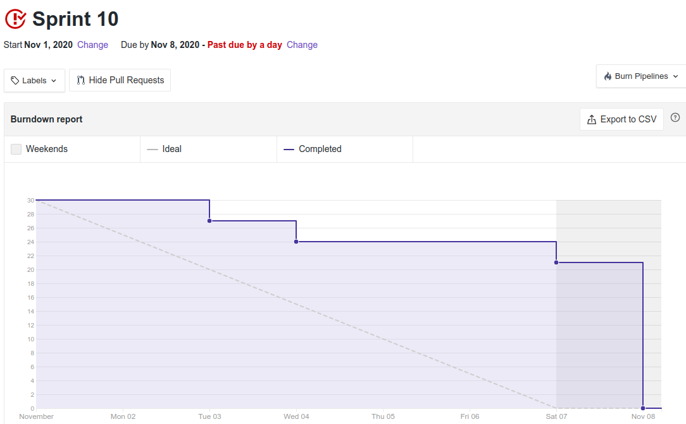
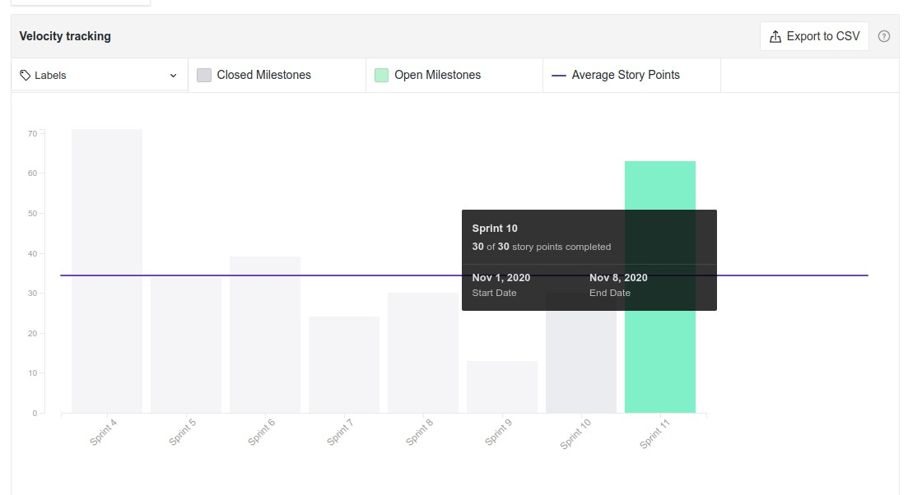

# Resultado Sprint 11

**Período: 08/11/2020 a 14/11/2020** 
**Data da Reunião: 14/10/2020**

## Issues Entregues
| Número | [Issue](Modeling/objeto?id=Issue) | Pontuação | Participantes |
|--------|-----------------------------------|-----------|---------------|
| [**#194**](https://github.com/UnBArqDsw/2020.1_G12_Stock/issues/194) | US09 - Remover itens do controle de estoque | 5 | Pedro Igor |
| [**#195**](https://github.com/UnBArqDsw/2020.1_G12_Stock/issues/195) | US11 - Que a atualização dos dados seja feita assim que houver alguma modificação no controle do estoque | 5 | Gabriel Davi |
| [**#196**](https://github.com/UnBArqDsw/2020.1_G12_Stock/issues/196) | US04 - Editar o nível de acesso de um colaborador | 3 | Micaella Gouveia e Sofia Patrocínio |
| [**#197**](https://github.com/UnBArqDsw/2020.1_G12_Stock/issues/197) | US18 - Consultar itens presentes no meu estoque | 5 | Gabriel Davi |
| [**#198**](https://github.com/UnBArqDsw/2020.1_G12_Stock/issues/198) | US34 - Consultar um log de remoção e adição de item ao estoque | 8 | Sofia Patrocínio |
| [**#199**](https://github.com/UnBArqDsw/2020.1_G12_Stock/issues/199) | Filtrar produtos US19 - Filtro por categoria e US20 - Filtro por preço | 5 | Micaella Gouveia |

## Pontuação: 31

## Dívida Técnica
| Número | [Issue](Modeling/objeto?id=Issue) | Pontuação | Participantes |
|--------|-----------------------------------|-----------|---------------|
| [**#200**](https://github.com/UnBArqDsw/2020.1_G12_Stock/issues/188) | Documentar Reutilização de Software | 8 | Micaella Gouveia e Sofia Patrocínio |
| [**#201**](https://github.com/UnBArqDsw/2020.1_G12_Stock/issues/188) | Documentar DAS - Padrões de projeto utilizados, diagramas e tecnologias | 8 | Gabriel Davi e Pedro Igor |

## Quadro de Conhecimento

## Burndown

## Velocity

## Observações
* A membra Micaella se sentiu muito atarefada e não conseguiu fazer tudo o que estava responsável pois seu cachorro adoeceu durante a semana.