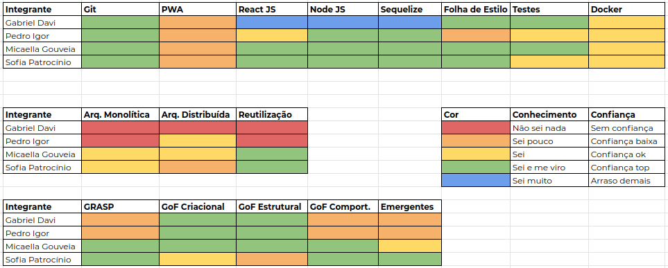
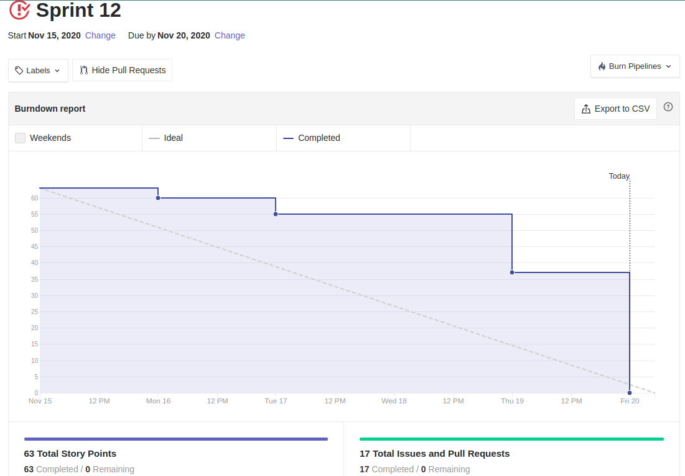
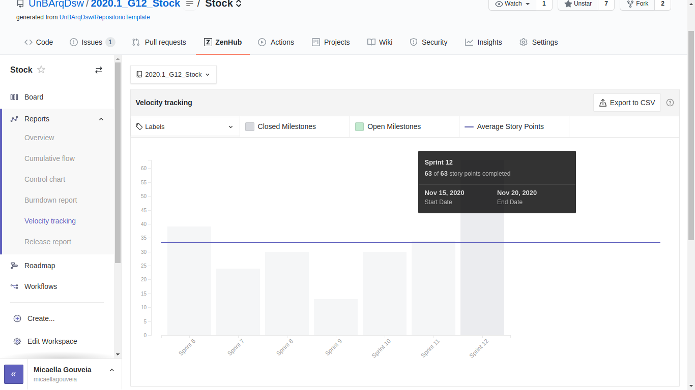
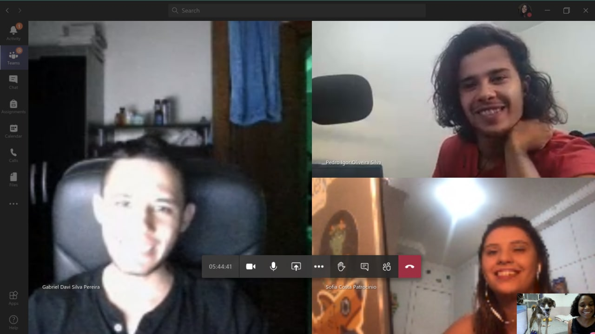

# Resultado Sprint 12

**Período: 15/11/2020 a 20/11/2020** 
**Data da Reunião: 20/11/2020**

## Issues Entregues
| Número | [Issue](Modeling/objeto?id=Issue) | Pontuação | Participantes |
|--------|-----------------------------------|-----------|---------------|
| [**#200**](https://github.com/UnBArqDsw/2020.1_G12_Stock/issues/200) | Documentar Reutilização de Software | 8 | Todos |
| [**#201**](https://github.com/UnBArqDsw/2020.1_G12_Stock/issues/201) | Documentar DAS - Padrões de projeto utilizados, diagramas e tecnologias | 8 | Todos |
| [**#205**](https://github.com/UnBArqDsw/2020.1_G12_Stock/issues/205) | US28 - Gráfico de Fluxo de Saída | 5 | Sofia Patrocínio |
| [**#206**](https://github.com/UnBArqDsw/2020.1_G12_Stock/issues/206) | US29 - Gráfico de Vendas por Semana | 5 | Gabriel Davi |
| [**#207**](https://github.com/UnBArqDsw/2020.1_G12_Stock/issues/207) | US30 - Gráfico Produtos por Categorias | 5 | Micaella Gouveia |
| [**#208**](https://github.com/UnBArqDsw/2020.1_G12_Stock/issues/208) | Acesso à funcionalidades privadas | 3 | Pedro Igor |
| [**#209**](https://github.com/UnBArqDsw/2020.1_G12_Stock/issues/209) | Busca por colaborador na página de histórico | 3 | Gabriel Davi |
| [**#210**](https://github.com/UnBArqDsw/2020.1_G12_Stock/issues/210) | Refatoração da responsividade | 5 | Gabriel Davi e Sofia Patrocínio |
| [**#211**](https://github.com/UnBArqDsw/2020.1_G12_Stock/issues/210) | Tratamento de erros do usuário | 8 | Micaella  Gouveia e Pedro Igor |

## Pontuação: 63

## Quadro de Conhecimento

## Burndown

## Velocity

## Observações
**Foi nossa última entrega e tinha que ter o registro da nossa equipe :)**

